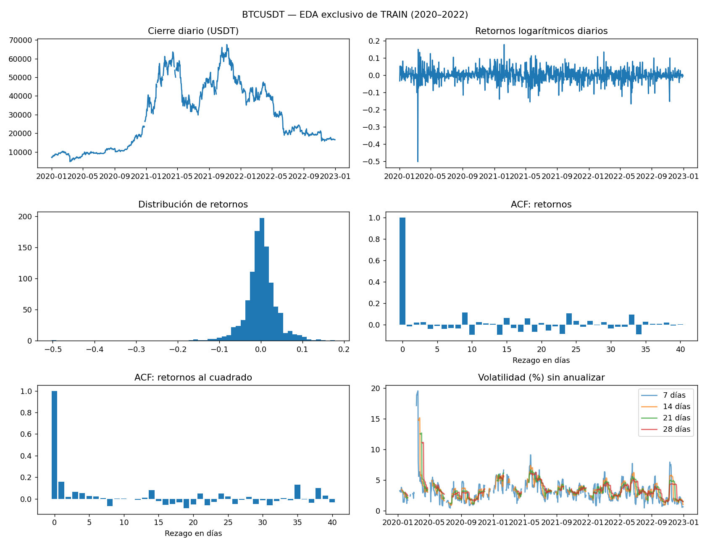
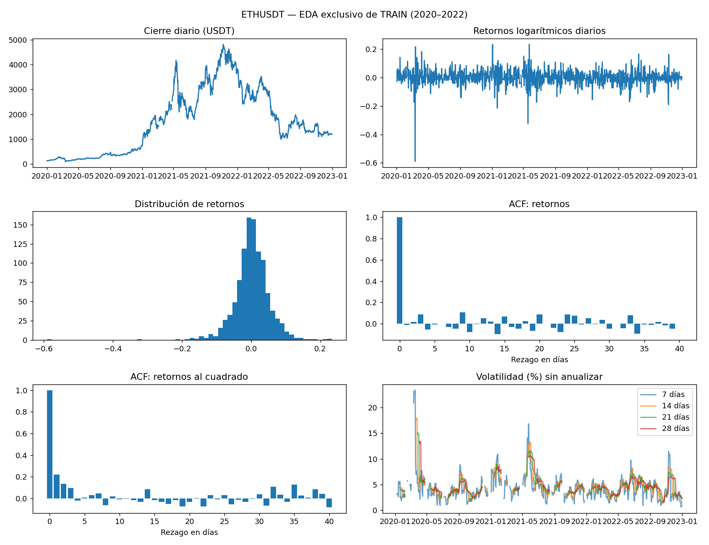
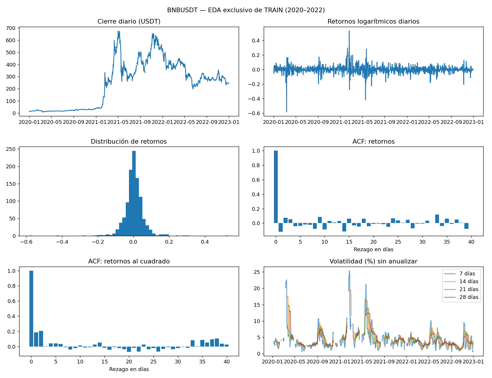
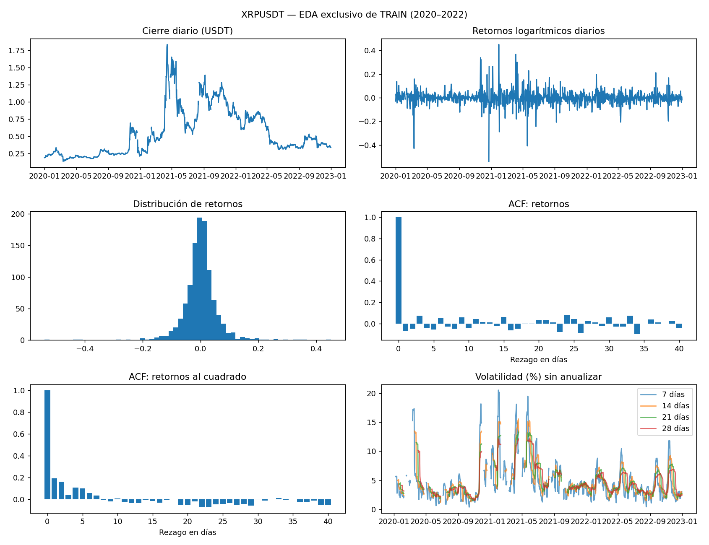

# 2. EDA y preprocesamiento

## Alcance del análisis exploratorio

Las estadísticas y visualizaciones exploratorias usan exclusivamente **TRAIN, 2020–2022**.
La auditoría de cobertura puede revisar las fechas de todo el periodo; la elección de modelos no utiliza los valores de test.
Las series de precios muestran niveles y cambios temporales; sus retornos facilitan comparar movimientos relativos.
Las colas del histograma y la curtosis describen valores extremos, sin justificar su eliminación automática.
La ACF de retornos explora dependencia lineal; la ACF de retornos al cuadrado explora persistencia de la variabilidad,
pero no constituye por sí sola una prueba concluyente de heterocedasticidad.

Las ACF se calculan sobre el tramo diario continuo más largo del entrenamiento; no se concatenan observaciones
a ambos lados de un hueco. Sus fechas y tamaños quedan en `results/eda_acf.csv`.

## BTCUSDT

| variable | count | mean | std | min | 50% | max | missing | skew | kurtosis |
| --- | --- | --- | --- | --- | --- | --- | --- | --- | --- |
| close | 1081.00000 | 28862.44140 | 17083.81957 | 4800.00000 | 23643.51000 | 67525.83000 | 15 | 0.36489 | -1.15240 |
| log_return | 1065.00000 | 0.00038 | 0.03971 | -0.50261 | 0.00087 | 0.17845 | 31 | -1.95642 | 25.58945 |
| volatility_7 | 976.00000 | 3.17853 | 1.96218 | 0.43520 | 2.89263 | 19.57627 | 120 | 3.96171 | 28.37271 |
| volatility_14 | 884.00000 | 3.35884 | 1.63034 | 0.87618 | 3.20791 | 15.17771 | 212 | 3.02425 | 18.47960 |
| volatility_21 | 801.00000 | 3.40866 | 1.44302 | 1.09977 | 3.16183 | 12.69333 | 295 | 2.42404 | 12.67952 |
| volatility_28 | 730.00000 | 3.44318 | 1.29730 | 1.36851 | 3.20585 | 11.16072 | 366 | 2.15545 | 10.20235 |

La media de retornos es 0.000378 y su desviación estándar 0.039714. La asimetría es -1.956 y el exceso de curtosis 25.589; estos valores caracterizan la distribución observada y no implican normalidad ni estabilidad futura.

## ETHUSDT

| variable | count | mean | std | min | 50% | max | missing | skew | kurtosis |
| --- | --- | --- | --- | --- | --- | --- | --- | --- | --- |
| close | 1081.00000 | 1692.95479 | 1272.04258 | 107.82000 | 1539.23000 | 4807.98000 | 15 | 0.48193 | -0.85070 |
| log_return | 1065.00000 | 0.00152 | 0.05313 | -0.59053 | 0.00230 | 0.23375 | 31 | -1.47818 | 16.91452 |
| volatility_7 | 976.00000 | 4.28781 | 2.57821 | 0.61682 | 3.77963 | 23.38139 | 120 | 3.41199 | 19.53106 |
| volatility_14 | 884.00000 | 4.55382 | 2.18307 | 1.34845 | 4.14700 | 18.07005 | 212 | 2.65584 | 11.49130 |
| volatility_21 | 801.00000 | 4.66390 | 1.97897 | 1.64780 | 4.29785 | 15.17037 | 295 | 2.13825 | 6.97287 |
| volatility_28 | 730.00000 | 4.71657 | 1.79845 | 1.65339 | 4.35982 | 13.44850 | 366 | 1.96044 | 5.62749 |

La media de retornos es 0.001524 y su desviación estándar 0.053129. La asimetría es -1.478 y el exceso de curtosis 16.915; estos valores caracterizan la distribución observada y no implican normalidad ni estabilidad futura.

## BNBUSDT

| variable | count | mean | std | min | 50% | max | missing | skew | kurtosis |
| --- | --- | --- | --- | --- | --- | --- | --- | --- | --- |
| close | 1081.00000 | 241.72318 | 189.16759 | 9.25660 | 275.29910 | 676.15000 | 15 | 0.17435 | -1.12532 |
| log_return | 1065.00000 | 0.00210 | 0.05713 | -0.58229 | 0.00185 | 0.53240 | 31 | -0.48898 | 22.00942 |
| volatility_7 | 976.00000 | 4.14377 | 3.28630 | 0.59552 | 3.26421 | 25.40933 | 120 | 3.46093 | 15.78578 |
| volatility_14 | 884.00000 | 4.33939 | 2.80593 | 0.91763 | 3.68401 | 19.59613 | 212 | 2.92822 | 10.83273 |
| volatility_21 | 801.00000 | 4.34264 | 2.36380 | 1.33462 | 3.61360 | 16.29287 | 295 | 2.34598 | 6.97701 |
| volatility_28 | 730.00000 | 4.37462 | 2.18682 | 1.38018 | 3.77054 | 13.14880 | 366 | 2.06525 | 5.21256 |

La media de retornos es 0.002099 y su desviación estándar 0.057126. La asimetría es -0.489 y el exceso de curtosis 22.009; estos valores caracterizan la distribución observada y no implican normalidad ni estabilidad futura.

## XRPUSDT

| variable | count | mean | std | min | 50% | max | missing | skew | kurtosis |
| --- | --- | --- | --- | --- | --- | --- | --- | --- | --- |
| close | 1082.00000 | 0.54522 | 0.34219 | 0.13549 | 0.41859 | 1.83468 | 14 | 1.04624 | 0.41661 |
| log_return | 1067.00000 | 0.00016 | 0.06264 | -0.53866 | 0.00117 | 0.45010 | 29 | -0.21497 | 15.06237 |
| volatility_7 | 984.00000 | 4.49944 | 3.33442 | 0.39290 | 3.62195 | 20.52249 | 112 | 2.29344 | 6.05212 |
| volatility_14 | 899.00000 | 4.69817 | 2.95830 | 1.18135 | 3.79401 | 15.57726 | 197 | 1.87008 | 3.34578 |
| volatility_21 | 823.00000 | 4.69801 | 2.62819 | 1.47990 | 3.79201 | 13.30515 | 273 | 1.63647 | 2.25952 |
| volatility_28 | 759.00000 | 4.70956 | 2.38427 | 1.52902 | 3.83551 | 12.16509 | 337 | 1.50826 | 1.85270 |

La media de retornos es 0.000157 y su desviación estándar 0.062640. La asimetría es -0.215 y el exceso de curtosis 15.062; estos valores caracterizan la distribución observada y no implican normalidad ni estabilidad futura.

## Construcción de entradas y objetivos

Con el pronóstico emitido al terminar el día t:

$$r_t=\log(P_t/P_{t-1}),\qquad
\sigma_t^{(w)}=100\sqrt{\frac1w\sum_{j=0}^{w-1}(r_{t-j}-\bar r_t^{(w)})^2}.$$

La fórmula usa `ddof=0`, retornos diarios y porcentaje, sin anualizar. Requiere w+1 cierres consecutivos.
Se adopta el índice de fin de ventana: el retorno del día t ya se conoce al emitir la predicción.

$$X_t^{(L)}=(P_{t-L+1},\ldots,P_t),\quad
y_t^{(w)}=(\sigma_{t+1}^{(w)},\ldots,\sigma_{t+7}^{(w)}).$$

L y w recorren independientemente {7,14,21,28}. Son 16 combinaciones por activo.
Cada salida es una volatilidad histórica móvil observada en una fecha futura, no una volatilidad calculada
exclusivamente con retornos posteriores al origen. Para w>7, una parte importante de los retornos que forman
las salidas ya es conocida en t; esto facilita persistencia y explica parte de la dependencia entre horizontes.

El máximo historial común exige 29 cierres, por el objetivo/persistencia de 28 retornos. Se usa la misma
máscara de disponibilidad entre activos y las 16 combinaciones, evitando ventajas por evaluar en fechas distintas.
El escalado de entradas y de las siete salidas se ajusta dentro de cada entrenamiento; las métricas se calculan
después de invertir el escalado de la variable objetivo. No se aplica PCA ni eliminación de valores extremos.
