> **Referencia histórica:** estudio anterior 2020–2025 con entradas diarias. Consulte el [estudio vigente de tres años](07_estudio_minuto.md).

# 4. Resultados por objetivo, entrada y activo

Las tablas corresponden a TEST. La elección de parámetros e inputs se hizo con validación. Los gráficos mejor/mediano/peor por error test son ilustraciones posteriores a la evaluación, no selección de modelos. BDS dispone solo de 8–9 residuos por fold: sus valores p asintóticos se muestran para completar el diagnóstico, pero no sostienen conclusiones fiables sobre independencia.

## BTCUSDT: volatilidad de 7 días

Entrada elegida con validación: **14 días**, C=10, epsilon=0.01.

| input_window | model | mape | mae | rmse | mse |
| --- | --- | --- | --- | --- | --- |
| 7 | Persistence | 28.62813 | 0.61096 | 0.84373 | 0.82921 |
| 7 | SVR | 196.09366 | 3.39028 | 3.74374 | 16.20657 |
| 14 | Persistence | 28.62813 | 0.61096 | 0.84373 | 0.82921 |
| 14 | SVR | 238.94632 | 4.08789 | 4.79559 | 23.69417 |
| 21 | Persistence | 28.62813 | 0.61096 | 0.84373 | 0.82921 |
| 21 | SVR | 227.63512 | 3.83468 | 4.57273 | 22.04546 |
| 28 | Persistence | 28.62813 | 0.61096 | 0.84373 | 0.82921 |
| 28 | SVR | 202.71817 | 3.32658 | 3.67698 | 14.77012 |

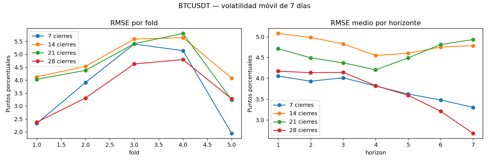

### Entrada de 7 días

| fold | n | mape | mae | rmse | mse | bds_pvalue |
| --- | --- | --- | --- | --- | --- | --- |
| 1 | 9 | 114.76358 | 2.12910 | 2.32628 | 5.46261 | 0.13256 |
| 2 | 9 | 197.46554 | 3.45320 | 3.91089 | 15.34172 | No estimable |
| 3 | 8 | 289.72552 | 5.02707 | 5.39743 | 29.53762 | 0.00000 |
| 4 | 8 | 283.22249 | 4.64561 | 5.14192 | 26.90675 | 0.00000 |
| 5 | 8 | 95.29115 | 1.69642 | 1.94220 | 3.78415 | 0.00000 |
| Mean ± Std | 8.40000 ± 0.54772 | 196.09366 ± 91.01644 | 3.39028 ± 1.47637 | 3.74374 ± 1.57894 | 16.20657 ± 11.86073 | 0.03314 ± 0.06628 |

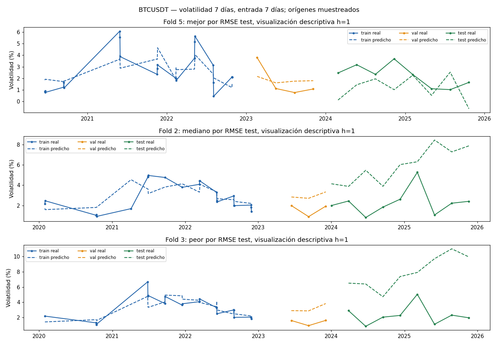

### Entrada de 14 días

| fold | n | mape | mae | rmse | mse | bds_pvalue |
| --- | --- | --- | --- | --- | --- | --- |
| 1 | 9 | 184.29718 | 3.48711 | 4.12467 | 17.45248 | 0.00000 |
| 2 | 9 | 209.81536 | 3.80088 | 4.53671 | 20.69103 | 0.00000 |
| 3 | 8 | 286.96285 | 5.04751 | 5.59086 | 31.34169 | 0.00000 |
| 4 | 8 | 299.32596 | 4.99401 | 5.64437 | 31.91651 | 0.00000 |
| 5 | 8 | 214.33025 | 3.10996 | 4.08134 | 17.06913 | 0.00000 |
| Mean ± Std | 8.40000 ± 0.54772 | 238.94632 ± 50.97151 | 4.08789 ± 0.88622 | 4.79559 ± 0.77139 | 23.69417 ± 7.38174 | 0.00000 ± 0.00000 |

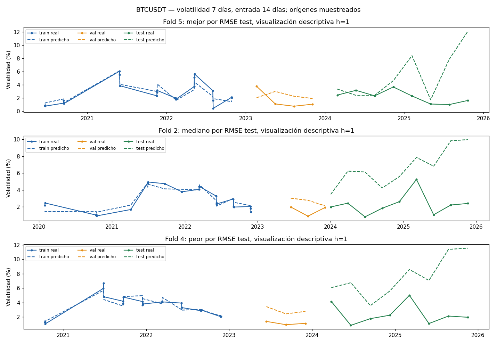

### Entrada de 21 días

| fold | n | mape | mae | rmse | mse | bds_pvalue |
| --- | --- | --- | --- | --- | --- | --- |
| 1 | 9 | 181.97938 | 3.31340 | 4.03380 | 16.86400 | No estimable |
| 2 | 9 | 199.73514 | 3.49567 | 4.37925 | 19.36919 | 0.00000 |
| 3 | 8 | 276.90249 | 4.69454 | 5.40992 | 29.53336 | 0.00000 |
| 4 | 8 | 310.24654 | 5.01659 | 5.80584 | 33.78016 | 0.00000 |
| 5 | 8 | 169.31202 | 2.65319 | 3.23484 | 10.68058 | 0.00000 |
| Mean ± Std | 8.40000 ± 0.54772 | 227.63512 ± 62.28234 | 3.83468 ± 0.98980 | 4.57273 ± 1.04155 | 22.04546 ± 9.44646 | 0.00000 ± 0.00000 |

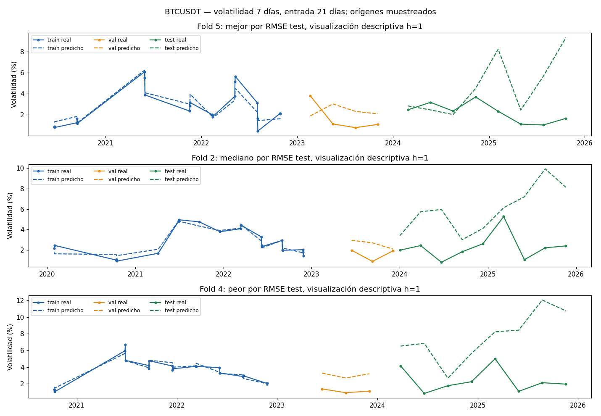

### Entrada de 28 días

| fold | n | mape | mae | rmse | mse | bds_pvalue |
| --- | --- | --- | --- | --- | --- | --- |
| 1 | 9 | 118.19943 | 2.07446 | 2.37352 | 5.74770 | No estimable |
| 2 | 9 | 170.67712 | 2.98418 | 3.31031 | 11.43529 | 0.00000 |
| 3 | 8 | 253.83687 | 4.36360 | 4.62841 | 22.32978 | 0.00000 |
| 4 | 8 | 269.83683 | 4.49852 | 4.79477 | 23.57446 | 0.00000 |
| 5 | 8 | 201.04062 | 2.71215 | 3.27789 | 10.76336 | 0.00000 |
| Mean ± Std | 8.40000 ± 0.54772 | 202.71817 ± 61.82818 | 3.32658 ± 1.06200 | 3.67698 ± 1.01826 | 14.77012 ± 7.79814 | 0.00000 ± 0.00000 |

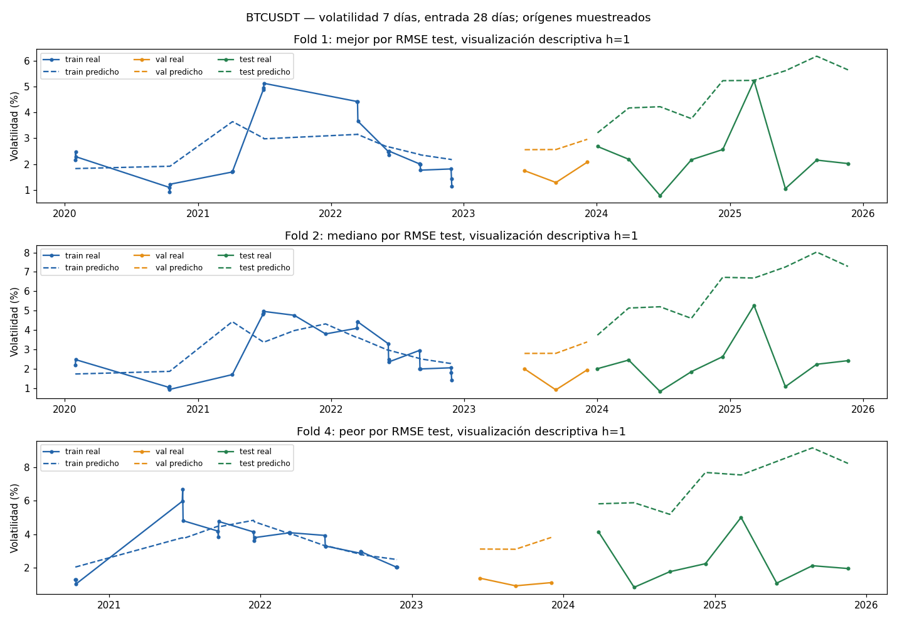

Con la entrada seleccionada, RMSE SVR=4.79559 frente a Persistence=0.84373. SVR no mejora la referencia en este resumen de test. No se extrapola esta diferencia a significancia estadística ni a objetivos de otra ventana.

## BTCUSDT: volatilidad de 14 días

Entrada elegida con validación: **14 días**, C=10, epsilon=0.1.

| input_window | model | mape | mae | rmse | mse |
| --- | --- | --- | --- | --- | --- |
| 7 | Persistence | 12.80161 | 0.29466 | 0.37277 | 0.19610 |
| 7 | SVR | 156.92988 | 2.94583 | 3.31747 | 11.54326 |
| 14 | Persistence | 12.80161 | 0.29466 | 0.37277 | 0.19610 |
| 14 | SVR | 225.34267 | 4.42641 | 5.14443 | 26.92081 |
| 21 | Persistence | 12.80161 | 0.29466 | 0.37277 | 0.19610 |
| 21 | SVR | 216.57840 | 4.18133 | 5.01147 | 26.10930 |
| 28 | Persistence | 12.80161 | 0.29466 | 0.37277 | 0.19610 |
| 28 | SVR | 184.00368 | 3.52221 | 3.91848 | 15.92800 |

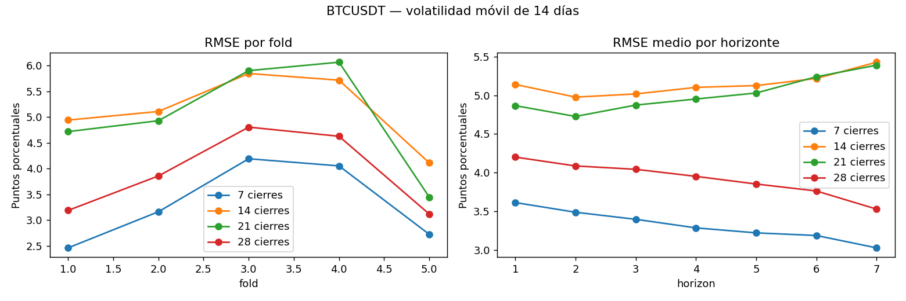

### Entrada de 7 días

| fold | n | mape | mae | rmse | mse | bds_pvalue |
| --- | --- | --- | --- | --- | --- | --- |
| 1 | 9 | 112.27363 | 2.13205 | 2.46053 | 6.15506 | No estimable |
| 2 | 9 | 144.84895 | 2.80527 | 3.16152 | 10.05855 | No estimable |
| 3 | 8 | 195.40402 | 3.83018 | 4.19052 | 17.60347 | 0.00000 |
| 4 | 8 | 187.26122 | 3.66552 | 4.05226 | 16.47955 | 0.00000 |
| 5 | 8 | 144.86160 | 2.29612 | 2.72249 | 7.41966 | 0.00000 |
| Mean ± Std | 8.40000 ± 0.54772 | 156.92988 ± 34.22726 | 2.94583 ± 0.77527 | 3.31747 ± 0.77698 | 11.54326 ± 5.22815 | 0.00000 ± 0.00000 |

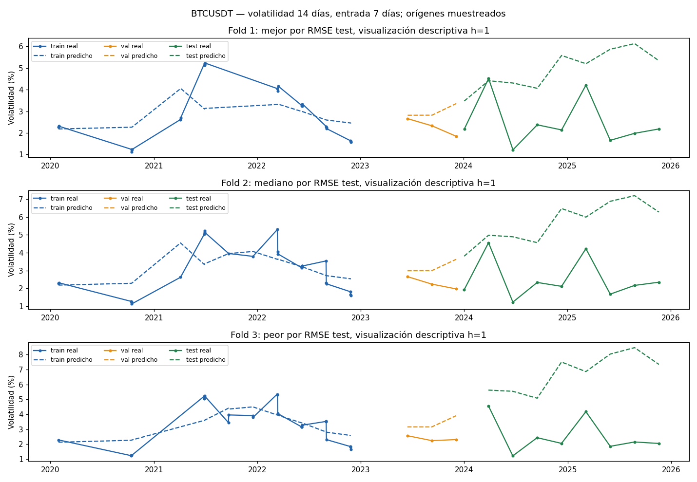

### Entrada de 14 días

| fold | n | mape | mae | rmse | mse | bds_pvalue |
| --- | --- | --- | --- | --- | --- | --- |
| 1 | 9 | 212.01672 | 4.37817 | 4.94129 | 24.49567 | 0.00000 |
| 2 | 9 | 218.29468 | 4.46698 | 5.10867 | 26.13226 | 0.00000 |
| 3 | 8 | 261.39771 | 5.31070 | 5.84587 | 34.28628 | 0.00000 |
| 4 | 8 | 252.44038 | 5.08501 | 5.71629 | 32.72736 | 0.00000 |
| 5 | 8 | 182.56384 | 2.89117 | 4.11004 | 16.96250 | 0.00000 |
| Mean ± Std | 8.40000 ± 0.54772 | 225.34267 ± 31.98255 | 4.42641 ± 0.94561 | 5.14443 ± 0.69490 | 26.92081 ± 6.95768 | 0.00000 ± 0.00000 |

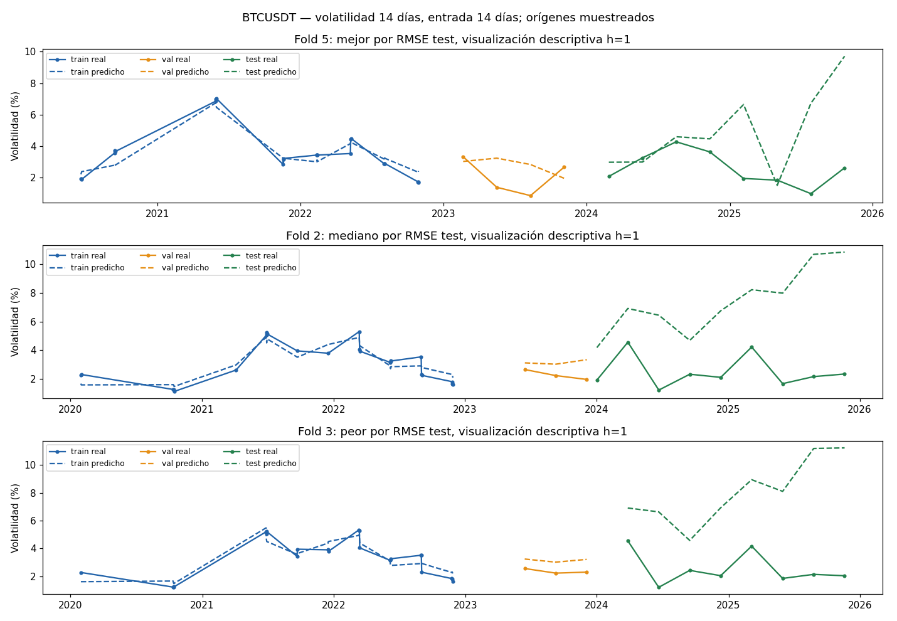

### Entrada de 21 días

| fold | n | mape | mae | rmse | mse | bds_pvalue |
| --- | --- | --- | --- | --- | --- | --- |
| 1 | 9 | 202.46027 | 4.04298 | 4.71771 | 22.38422 | 0.00000 |
| 2 | 9 | 205.92399 | 4.04976 | 4.92881 | 24.40382 | 0.00000 |
| 3 | 8 | 258.81420 | 5.12141 | 5.90161 | 34.98924 | 0.00000 |
| 4 | 8 | 265.18029 | 5.25066 | 6.06513 | 36.83325 | 0.00000 |
| 5 | 8 | 150.51324 | 2.44184 | 3.44411 | 11.93596 | 0.00000 |
| Mean ± Std | 8.40000 ± 0.54772 | 216.57840 ± 46.96661 | 4.18133 ± 1.12800 | 5.01147 ± 1.05502 | 26.10930 ± 10.14304 | 0.00000 ± 0.00000 |

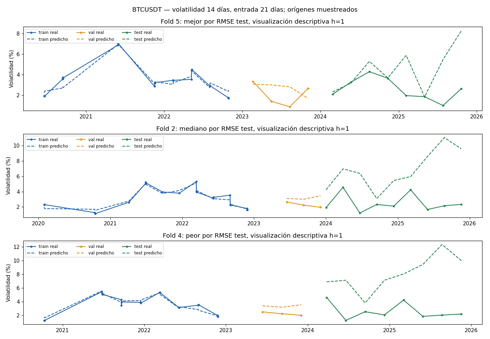

### Entrada de 28 días

| fold | n | mape | mae | rmse | mse | bds_pvalue |
| --- | --- | --- | --- | --- | --- | --- |
| 1 | 9 | 145.17576 | 2.83625 | 3.18774 | 10.33212 | No estimable |
| 2 | 9 | 175.68768 | 3.47642 | 3.85675 | 14.97092 | 0.00000 |
| 3 | 8 | 223.06794 | 4.43659 | 4.80454 | 23.14185 | 0.00000 |
| 4 | 8 | 213.25769 | 4.24498 | 4.62726 | 21.46281 | 0.00000 |
| 5 | 8 | 162.82931 | 2.61681 | 3.11609 | 9.73228 | 0.00000 |
| Mean ± Std | 8.40000 ± 0.54772 | 184.00368 ± 33.19236 | 3.52221 ± 0.81408 | 3.91848 ± 0.78567 | 15.92800 ± 6.19053 | 0.00000 ± 0.00000 |

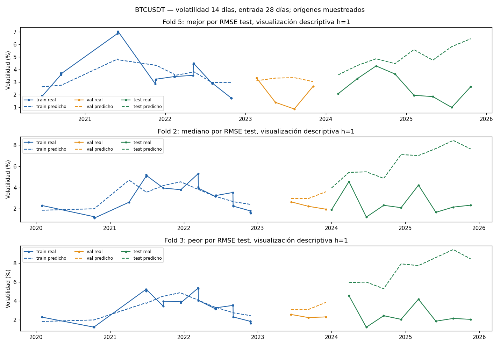

Con la entrada seleccionada, RMSE SVR=5.14443 frente a Persistence=0.37277. SVR no mejora la referencia en este resumen de test. No se extrapola esta diferencia a significancia estadística ni a objetivos de otra ventana.

## BTCUSDT: volatilidad de 21 días

Entrada elegida con validación: **21 días**, C=10, epsilon=0.01.

| input_window | model | mape | mae | rmse | mse |
| --- | --- | --- | --- | --- | --- |
| 7 | Persistence | 7.57608 | 0.18101 | 0.22854 | 0.06524 |
| 7 | SVR | 167.08613 | 3.49369 | 3.78444 | 16.15451 |
| 14 | Persistence | 7.57608 | 0.18101 | 0.22854 | 0.06524 |
| 14 | SVR | 197.16041 | 4.04759 | 4.69091 | 23.42941 |
| 21 | Persistence | 7.57608 | 0.18101 | 0.22854 | 0.06524 |
| 21 | SVR | 218.35762 | 4.52453 | 5.21366 | 29.20168 |
| 28 | Persistence | 7.57608 | 0.18101 | 0.22854 | 0.06524 |
| 28 | SVR | 242.27497 | 5.14630 | 5.66725 | 36.76975 |

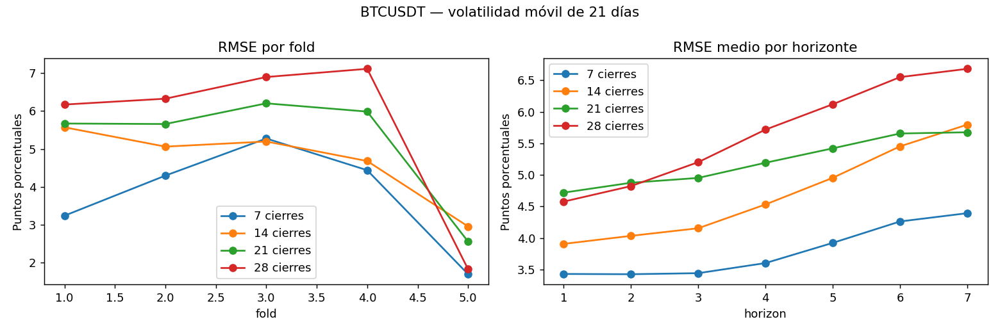

### Entrada de 7 días

| fold | n | mape | mae | rmse | mse | bds_pvalue |
| --- | --- | --- | --- | --- | --- | --- |
| 1 | 9 | 143.52537 | 3.03433 | 3.23287 | 10.61980 | 0.03032 |
| 2 | 9 | 190.20078 | 3.95170 | 4.29329 | 18.85468 | 0.00000 |
| 3 | 8 | 237.92430 | 5.00676 | 5.27496 | 28.40030 | 0.00000 |
| 4 | 8 | 200.87581 | 4.05768 | 4.43639 | 19.98142 | 0.00000 |
| 5 | 8 | 62.90438 | 1.41795 | 1.68469 | 2.91633 | 0.00000 |
| Mean ± Std | 8.40000 ± 0.54772 | 167.08613 ± 67.27374 | 3.49369 ± 1.35434 | 3.78444 ± 1.38011 | 16.15451 ± 9.71826 | 0.00606 ± 0.01356 |

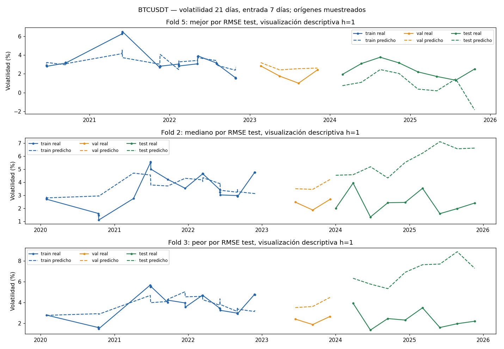

### Entrada de 14 días

| fold | n | mape | mae | rmse | mse | bds_pvalue |
| --- | --- | --- | --- | --- | --- | --- |
| 1 | 9 | 231.76875 | 4.92590 | 5.57156 | 31.67062 | 0.00000 |
| 2 | 9 | 212.04663 | 4.46825 | 5.06004 | 26.09546 | 0.00000 |
| 3 | 8 | 224.09032 | 4.63475 | 5.19527 | 27.99830 | 0.00000 |
| 4 | 8 | 205.23076 | 4.19030 | 4.67934 | 22.50789 | 0.00000 |
| 5 | 8 | 112.66558 | 2.01878 | 2.94834 | 8.87481 | 0.00000 |
| Mean ± Std | 8.40000 ± 0.54772 | 197.16041 ± 48.34528 | 4.04759 ± 1.16507 | 4.69091 ± 1.02505 | 23.42941 ± 8.78331 | 0.00000 ± 0.00000 |

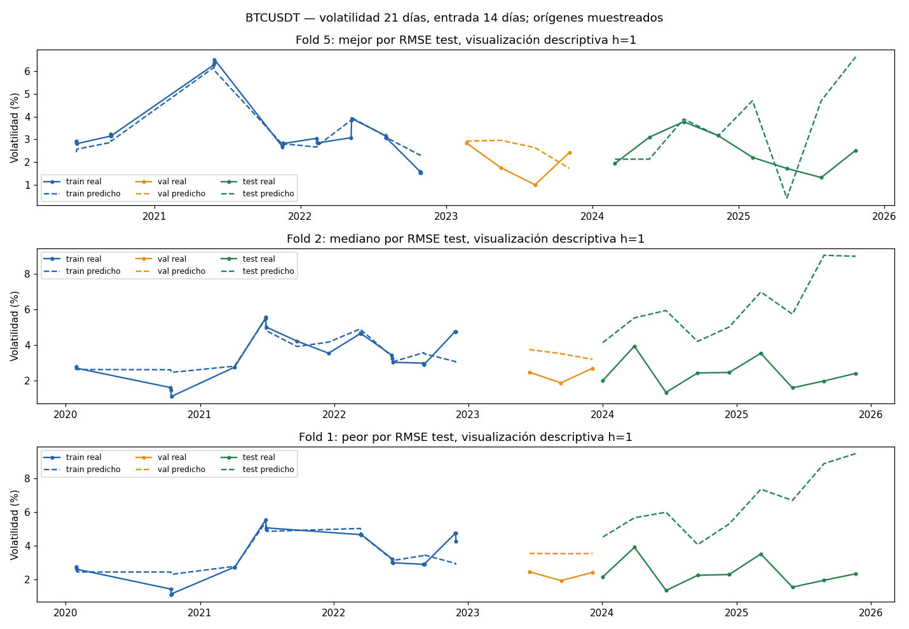

### Entrada de 21 días

| fold | n | mape | mae | rmse | mse | bds_pvalue |
| --- | --- | --- | --- | --- | --- | --- |
| 1 | 9 | 235.45820 | 4.98044 | 5.67103 | 32.38204 | 0.00000 |
| 2 | 9 | 234.10769 | 4.90037 | 5.65799 | 32.16782 | 0.00000 |
| 3 | 8 | 264.71422 | 5.54609 | 6.20496 | 38.73226 | 0.03429 |
| 4 | 8 | 260.27821 | 5.39199 | 5.98666 | 35.96256 | 0.00025 |
| 5 | 8 | 97.22977 | 1.80375 | 2.54764 | 6.76371 | 0.00000 |
| Mean ± Std | 8.40000 ± 0.54772 | 218.35762 ± 69.13523 | 4.52453 ± 1.54498 | 5.21366 ± 1.50786 | 29.20168 ± 12.83469 | 0.00691 ± 0.01531 |

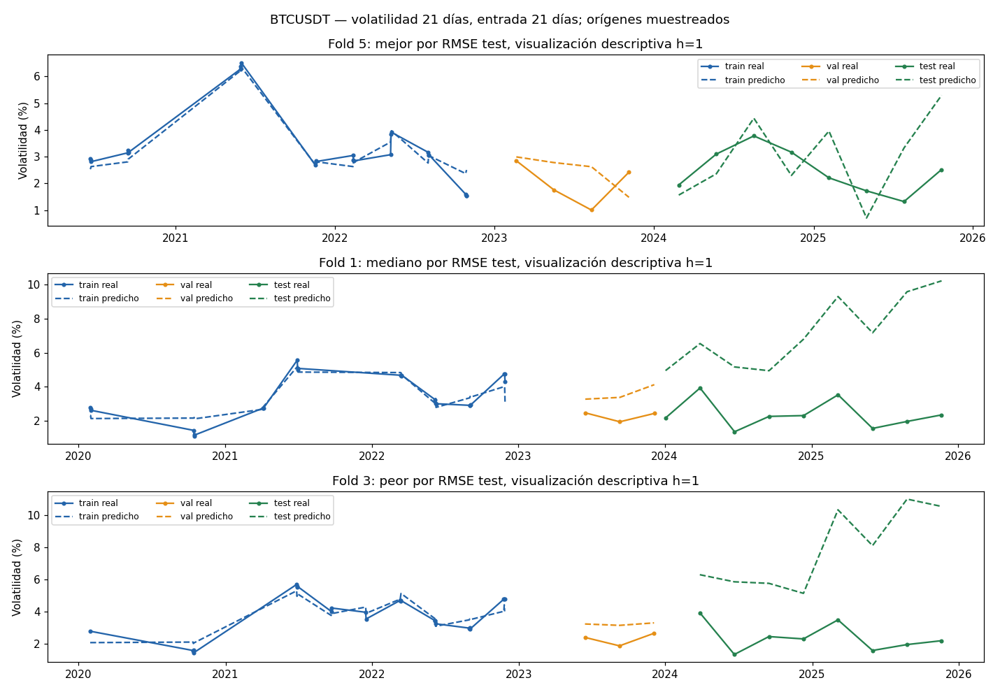

### Entrada de 28 días

| fold | n | mape | mae | rmse | mse | bds_pvalue |
| --- | --- | --- | --- | --- | --- | --- |
| 1 | 9 | 254.04555 | 5.37255 | 6.17318 | 39.26963 | 0.00000 |
| 2 | 9 | 265.87079 | 5.66153 | 6.32784 | 41.01130 | 0.00000 |
| 3 | 8 | 300.17307 | 6.41692 | 6.90123 | 49.17021 | 0.03429 |
| 4 | 8 | 317.16821 | 6.74678 | 7.11812 | 51.05794 | 0.06738 |
| 5 | 8 | 74.11723 | 1.53373 | 1.81587 | 3.33969 | 0.00000 |
| Mean ± Std | 8.40000 ± 0.54772 | 242.27497 ± 97.38265 | 5.14630 ± 2.09424 | 5.66725 ± 2.18822 | 36.76975 ± 19.36319 | 0.02033 ± 0.03020 |

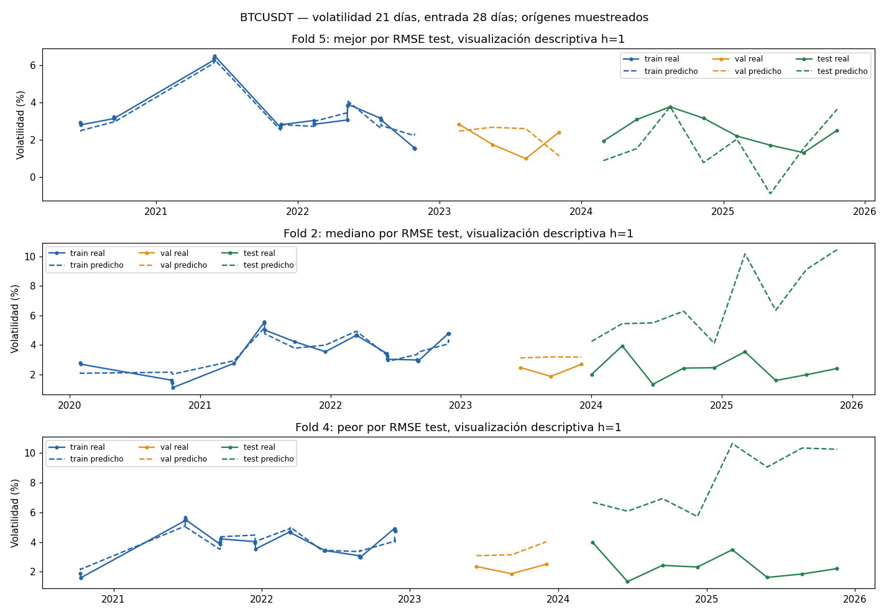

Con la entrada seleccionada, RMSE SVR=5.21366 frente a Persistence=0.22854. SVR no mejora la referencia en este resumen de test. No se extrapola esta diferencia a significancia estadística ni a objetivos de otra ventana.

## BTCUSDT: volatilidad de 28 días

Entrada elegida con validación: **28 días**, C=10, epsilon=0.1.

| input_window | model | mape | mae | rmse | mse |
| --- | --- | --- | --- | --- | --- |
| 7 | Persistence | 7.33647 | 0.17495 | 0.22821 | 0.06238 |
| 7 | SVR | 130.19137 | 2.62850 | 2.84626 | 8.39641 |
| 14 | Persistence | 7.33647 | 0.17495 | 0.22821 | 0.06238 |
| 14 | SVR | 172.11533 | 3.53388 | 3.96419 | 16.46876 |
| 21 | Persistence | 7.33647 | 0.17495 | 0.22821 | 0.06238 |
| 21 | SVR | 198.05043 | 4.15794 | 4.58536 | 23.26438 |
| 28 | Persistence | 7.33647 | 0.17495 | 0.22821 | 0.06238 |
| 28 | SVR | 189.89271 | 4.06359 | 4.40628 | 22.34966 |

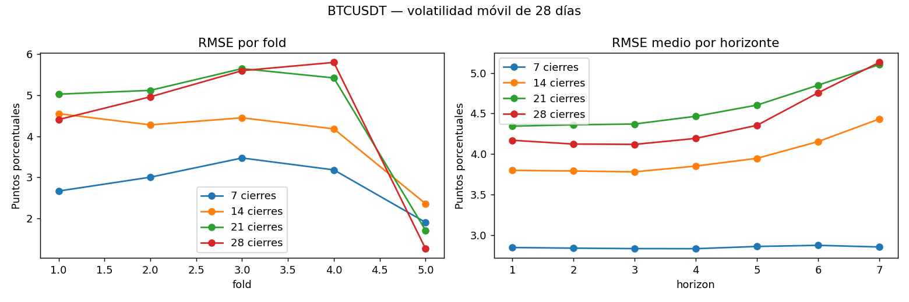

### Entrada de 7 días

| fold | n | mape | mae | rmse | mse | bds_pvalue |
| --- | --- | --- | --- | --- | --- | --- |
| 1 | 9 | 120.91184 | 2.46578 | 2.66725 | 7.12345 | 0.00000 |
| 2 | 9 | 136.84882 | 2.79154 | 3.00473 | 9.03253 | 0.00000 |
| 3 | 8 | 160.95155 | 3.25650 | 3.47209 | 12.06141 | 0.00000 |
| 4 | 8 | 148.13608 | 2.95806 | 3.18275 | 10.13269 | 0.00000 |
| 5 | 8 | 84.10857 | 1.67062 | 1.90447 | 3.63197 | 0.00000 |
| Mean ± Std | 8.40000 ± 0.54772 | 130.19137 ± 29.67430 | 2.62850 ± 0.60696 | 2.84626 ± 0.60188 | 8.39641 ± 3.20827 | 0.00000 ± 0.00000 |

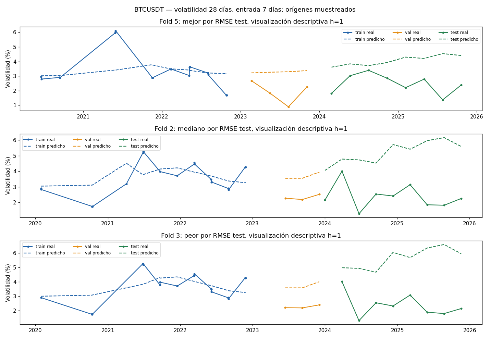

### Entrada de 14 días

| fold | n | mape | mae | rmse | mse | bds_pvalue |
| --- | --- | --- | --- | --- | --- | --- |
| 1 | 9 | 196.51118 | 4.13887 | 4.55063 | 20.89237 | 0.00000 |
| 2 | 9 | 186.30819 | 3.89881 | 4.27904 | 18.38992 | 0.00009 |
| 3 | 8 | 199.15332 | 4.07223 | 4.45029 | 19.95166 | 0.18588 |
| 4 | 8 | 188.09535 | 3.79741 | 4.18149 | 17.53666 | 0.00000 |
| 5 | 8 | 90.50861 | 1.76206 | 2.35950 | 5.57318 | 0.00000 |
| Mean ± Std | 8.40000 ± 0.54772 | 172.11533 ± 45.94199 | 3.53388 ± 0.99973 | 3.96419 ± 0.90851 | 16.46876 ± 6.22985 | 0.03719 ± 0.08312 |

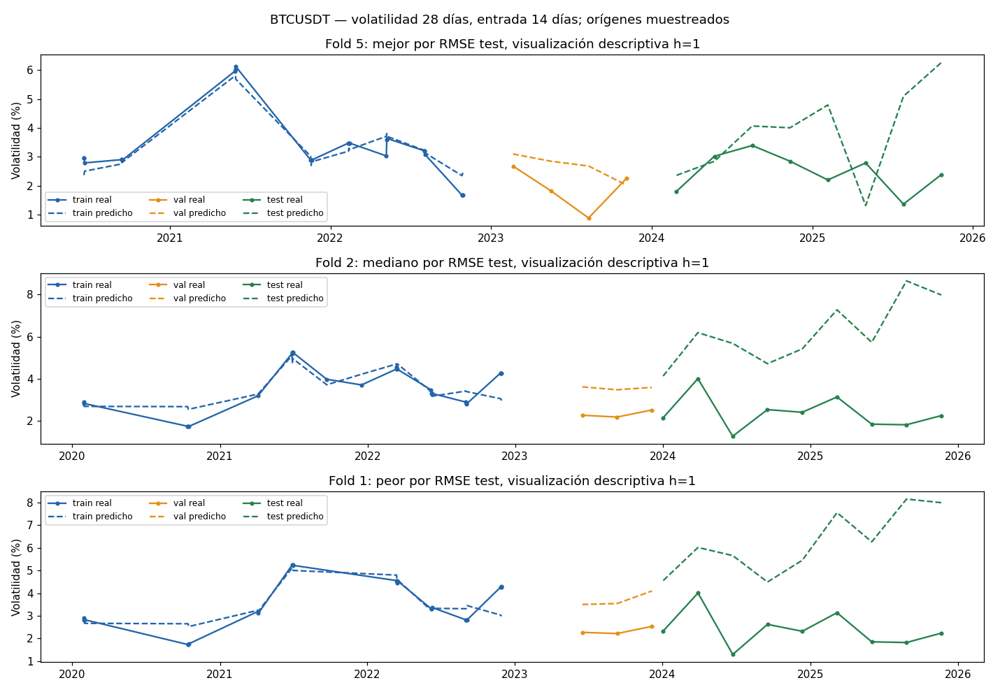

### Entrada de 21 días

| fold | n | mape | mae | rmse | mse | bds_pvalue |
| --- | --- | --- | --- | --- | --- | --- |
| 1 | 9 | 216.95718 | 4.66294 | 5.02617 | 25.45204 | No estimable |
| 2 | 9 | 219.15130 | 4.63066 | 5.11880 | 26.35394 | 0.00000 |
| 3 | 8 | 248.90413 | 5.21926 | 5.64830 | 32.12181 | 0.00000 |
| 4 | 8 | 239.33772 | 4.94588 | 5.42178 | 29.44925 | 0.03429 |
| 5 | 8 | 65.90183 | 1.33097 | 1.71177 | 2.94486 | 0.00000 |
| Mean ± Std | 8.40000 ± 0.54772 | 198.05043 ± 75.09445 | 4.15794 ± 1.59824 | 4.58536 ± 1.62525 | 23.26438 ± 11.66106 | 0.00857 ± 0.01715 |

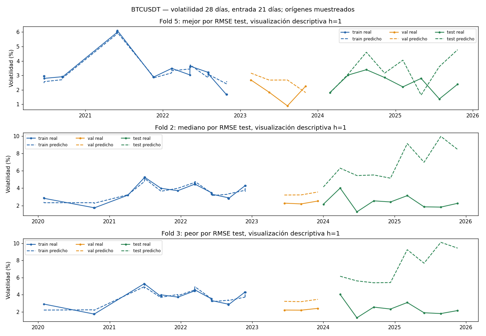

### Entrada de 28 días

| fold | n | mape | mae | rmse | mse | bds_pvalue |
| --- | --- | --- | --- | --- | --- | --- |
| 1 | 9 | 183.08576 | 3.94708 | 4.40792 | 19.73775 | 0.04080 |
| 2 | 9 | 212.79337 | 4.55845 | 4.96219 | 24.88886 | 0.00000 |
| 3 | 8 | 247.79257 | 5.26409 | 5.59828 | 31.80569 | 0.06738 |
| 4 | 8 | 259.69248 | 5.46754 | 5.79917 | 33.71652 | 0.06738 |
| 5 | 8 | 46.09939 | 1.08081 | 1.26388 | 1.59947 | 0.09971 |
| Mean ± Std | 8.40000 ± 0.54772 | 189.89271 ± 85.83661 | 4.06359 ± 1.77255 | 4.40628 ± 1.84016 | 22.34966 ± 12.86917 | 0.05505 ± 0.03719 |

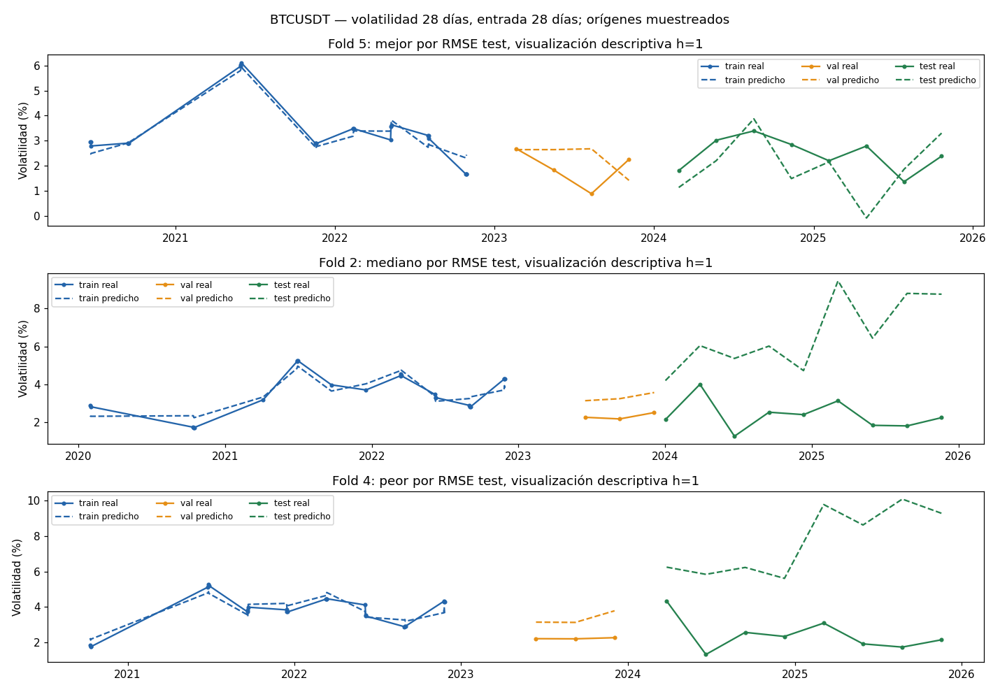

Con la entrada seleccionada, RMSE SVR=4.40628 frente a Persistence=0.22821. SVR no mejora la referencia en este resumen de test. No se extrapola esta diferencia a significancia estadística ni a objetivos de otra ventana.

## ETHUSDT: volatilidad de 7 días

Entrada elegida con validación: **21 días**, C=10, epsilon=0.1.

| input_window | model | mape | mae | rmse | mse |
| --- | --- | --- | --- | --- | --- |
| 7 | Persistence | 33.93501 | 0.92693 | 1.30690 | 2.17128 |
| 7 | SVR | 60.58939 | 1.62929 | 1.99976 | 4.26385 |
| 14 | Persistence | 33.93501 | 0.92693 | 1.30690 | 2.17128 |
| 14 | SVR | 69.83677 | 1.87352 | 2.33649 | 6.01657 |
| 21 | Persistence | 33.93501 | 0.92693 | 1.30690 | 2.17128 |
| 21 | SVR | 71.57922 | 1.92545 | 2.41621 | 6.53015 |
| 28 | Persistence | 33.93501 | 0.92693 | 1.30690 | 2.17128 |
| 28 | SVR | 88.95142 | 2.32010 | 2.81808 | 8.23301 |

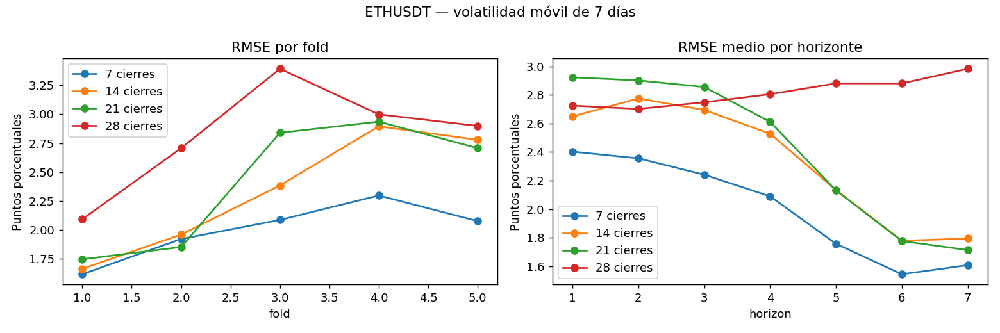

### Entrada de 7 días

| fold | n | mape | mae | rmse | mse | bds_pvalue |
| --- | --- | --- | --- | --- | --- | --- |
| 1 | 9 | 51.67281 | 1.29038 | 1.61689 | 2.76390 | 0.04730 |
| 2 | 9 | 63.01418 | 1.62392 | 1.92149 | 3.95261 | 0.18159 |
| 3 | 8 | 52.40984 | 1.65922 | 2.08631 | 4.76171 | 0.00329 |
| 4 | 8 | 54.17154 | 1.83173 | 2.29747 | 5.49157 | 0.00000 |
| 5 | 8 | 81.67857 | 1.74119 | 2.07665 | 4.34946 | 0.09971 |
| Mean ± Std | 8.40000 ± 0.54772 | 60.58939 ± 12.63163 | 1.62929 ± 0.20572 | 1.99976 ± 0.25237 | 4.26385 ± 1.01356 | 0.06638 ± 0.07605 |

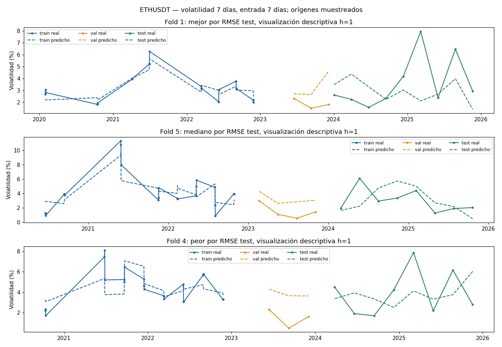

### Entrada de 14 días

| fold | n | mape | mae | rmse | mse | bds_pvalue |
| --- | --- | --- | --- | --- | --- | --- |
| 1 | 9 | 54.26436 | 1.40439 | 1.66354 | 2.85092 | 0.13256 |
| 2 | 9 | 62.22324 | 1.63465 | 1.96001 | 3.94640 | 0.60908 |
| 3 | 8 | 53.78397 | 1.84109 | 2.38401 | 6.46530 | 0.00000 |
| 4 | 8 | 61.51236 | 2.17659 | 2.89614 | 8.98762 | 0.00191 |
| 5 | 8 | 117.39992 | 2.31089 | 2.77876 | 7.83259 | 0.00000 |
| Mean ± Std | 8.40000 ± 0.54772 | 69.83677 ± 26.87800 | 1.87352 ± 0.37461 | 2.33649 ± 0.52575 | 6.01657 ± 2.58038 | 0.14871 ± 0.26362 |

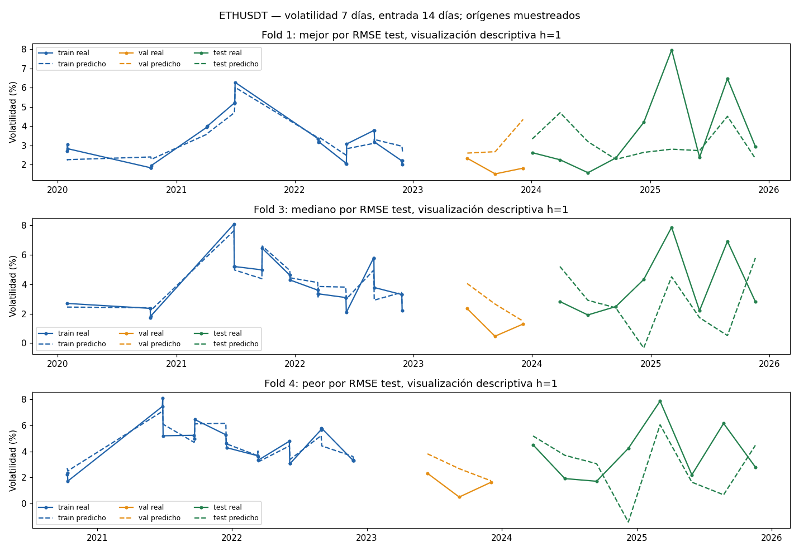

### Entrada de 21 días

| fold | n | mape | mae | rmse | mse | bds_pvalue |
| --- | --- | --- | --- | --- | --- | --- |
| 1 | 9 | 52.78175 | 1.44242 | 1.74600 | 3.13254 | 0.00000 |
| 2 | 9 | 57.35691 | 1.51470 | 1.85180 | 3.82789 | 0.00326 |
| 3 | 8 | 60.94993 | 2.10225 | 2.83987 | 9.10705 | 0.37782 |
| 4 | 8 | 68.49744 | 2.28093 | 2.93610 | 9.13190 | 0.00191 |
| 5 | 8 | 118.31005 | 2.28697 | 2.70727 | 7.45136 | 0.00000 |
| Mean ± Std | 8.40000 ± 0.54772 | 71.57922 ± 26.74822 | 1.92545 ± 0.41544 | 2.41621 ± 0.57057 | 6.53015 ± 2.87681 | 0.07660 ± 0.16839 |

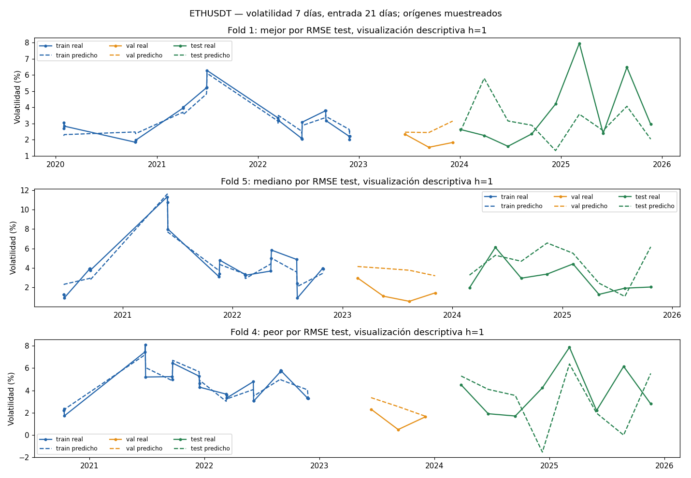

### Entrada de 28 días

| fold | n | mape | mae | rmse | mse | bds_pvalue |
| --- | --- | --- | --- | --- | --- | --- |
| 1 | 9 | 67.87902 | 1.81199 | 2.09243 | 4.61809 | 0.03783 |
| 2 | 9 | 82.61176 | 2.14035 | 2.70640 | 7.40153 | 0.00000 |
| 3 | 8 | 85.16763 | 2.68938 | 3.39290 | 11.56449 | 0.00000 |
| 4 | 8 | 86.71655 | 2.58594 | 2.99942 | 9.06208 | 0.00191 |
| 5 | 8 | 122.38214 | 2.37286 | 2.89927 | 8.51886 | 0.00000 |
| Mean ± Std | 8.40000 ± 0.54772 | 88.95142 ± 20.13183 | 2.32010 ± 0.35366 | 2.81808 ± 0.47669 | 8.23301 ± 2.53115 | 0.00795 ± 0.01672 |

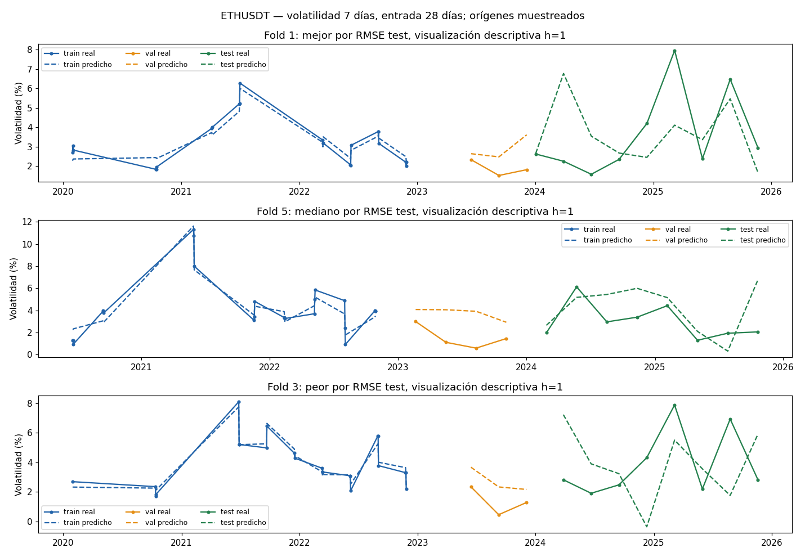

Con la entrada seleccionada, RMSE SVR=2.41621 frente a Persistence=1.30690. SVR no mejora la referencia en este resumen de test. No se extrapola esta diferencia a significancia estadística ni a objetivos de otra ventana.

## ETHUSDT: volatilidad de 14 días

Entrada elegida con validación: **21 días**, C=10, epsilon=0.01.

| input_window | model | mape | mae | rmse | mse |
| --- | --- | --- | --- | --- | --- |
| 7 | Persistence | 12.18171 | 0.35214 | 0.47784 | 0.34165 |
| 7 | SVR | 52.21956 | 1.62387 | 1.91880 | 3.84779 |
| 14 | Persistence | 12.18171 | 0.35214 | 0.47784 | 0.34165 |
| 14 | SVR | 47.59047 | 1.52293 | 1.80734 | 3.31387 |
| 21 | Persistence | 12.18171 | 0.35214 | 0.47784 | 0.34165 |
| 21 | SVR | 49.73188 | 1.58895 | 1.88671 | 3.65780 |
| 28 | Persistence | 12.18171 | 0.35214 | 0.47784 | 0.34165 |
| 28 | SVR | 63.17428 | 2.00022 | 2.41079 | 6.06637 |

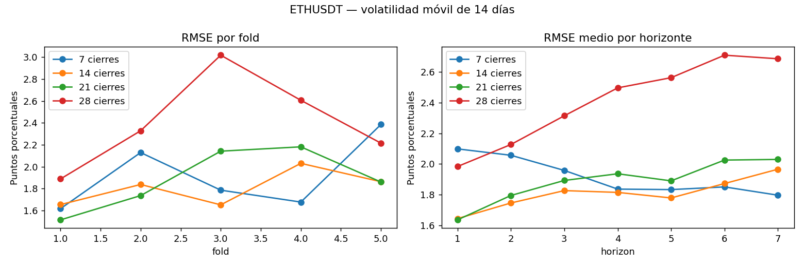

### Entrada de 7 días

| fold | n | mape | mae | rmse | mse | bds_pvalue |
| --- | --- | --- | --- | --- | --- | --- |
| 1 | 9 | 45.91364 | 1.33410 | 1.61708 | 2.62034 | 0.00615 |
| 2 | 9 | 65.52029 | 1.93708 | 2.12895 | 4.53610 | 0.36328 |
| 3 | 8 | 49.80944 | 1.49998 | 1.78576 | 3.19120 | 0.43308 |
| 4 | 8 | 44.74017 | 1.46332 | 1.67718 | 2.81405 | 0.33285 |
| 5 | 8 | 55.11423 | 1.88490 | 2.38505 | 6.07728 | 0.00071 |
| Mean ± Std | 8.40000 ± 0.54772 | 52.21956 ± 8.46763 | 1.62387 ± 0.26987 | 1.91880 ± 0.32736 | 3.84779 ± 1.45351 | 0.22721 ± 0.20750 |

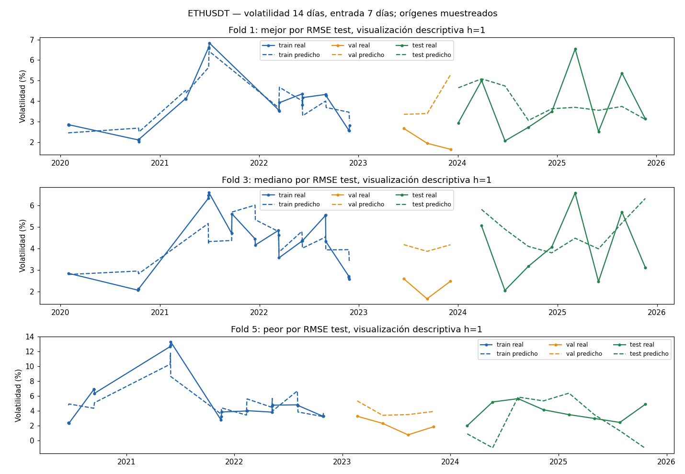

### Entrada de 14 días

| fold | n | mape | mae | rmse | mse | bds_pvalue |
| --- | --- | --- | --- | --- | --- | --- |
| 1 | 9 | 44.46869 | 1.34370 | 1.65413 | 2.77823 | 0.00884 |
| 2 | 9 | 50.09213 | 1.58517 | 1.83755 | 3.39413 | 0.25081 |
| 3 | 8 | 43.60446 | 1.49701 | 1.65176 | 2.73768 | 0.00000 |
| 4 | 8 | 45.86131 | 1.61277 | 2.03032 | 4.15476 | 0.00250 |
| 5 | 8 | 53.92577 | 1.57598 | 1.86293 | 3.50453 | 0.00000 |
| Mean ± Std | 8.40000 ± 0.54772 | 47.59047 ± 4.33065 | 1.52293 ± 0.10904 | 1.80734 ± 0.15922 | 3.31387 ± 0.58497 | 0.05243 ± 0.11096 |

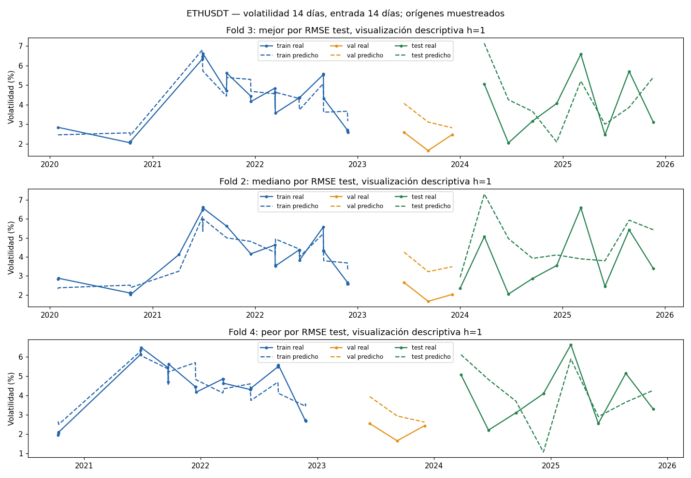

### Entrada de 21 días

| fold | n | mape | mae | rmse | mse | bds_pvalue |
| --- | --- | --- | --- | --- | --- | --- |
| 1 | 9 | 43.18108 | 1.30132 | 1.51471 | 2.32048 | 0.00545 |
| 2 | 9 | 49.07561 | 1.52378 | 1.73614 | 3.02035 | 0.00000 |
| 3 | 8 | 51.40886 | 1.77463 | 2.14150 | 4.61051 | 0.00000 |
| 4 | 8 | 51.16717 | 1.76775 | 2.18112 | 4.84130 | 0.00250 |
| 5 | 8 | 53.82670 | 1.57728 | 1.86006 | 3.49639 | 0.37782 |
| Mean ± Std | 8.40000 ± 0.54772 | 49.73188 ± 4.03062 | 1.58895 ± 0.19593 | 1.88671 ± 0.27989 | 3.65780 ± 1.06409 | 0.07715 ± 0.16809 |

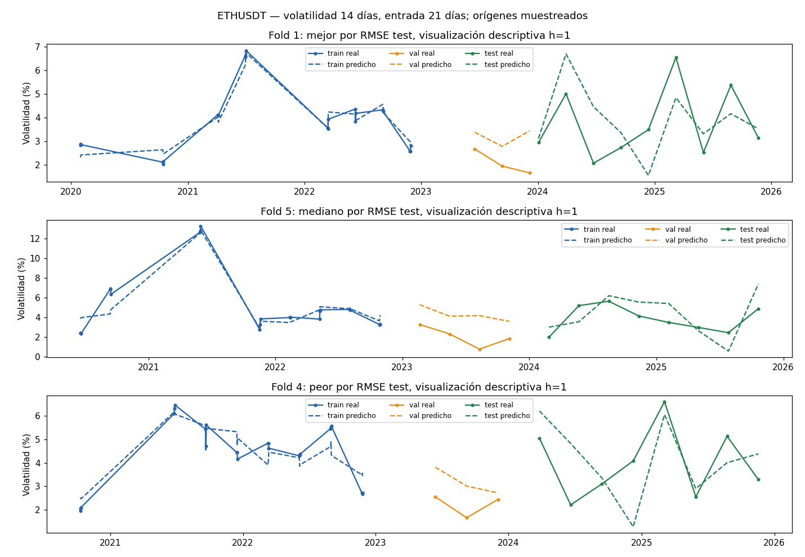

### Entrada de 28 días

| fold | n | mape | mae | rmse | mse | bds_pvalue |
| --- | --- | --- | --- | --- | --- | --- |
| 1 | 9 | 56.17580 | 1.68841 | 1.88821 | 3.63804 | No estimable |
| 2 | 9 | 64.54566 | 2.00388 | 2.32769 | 5.46304 | 0.00000 |
| 3 | 8 | 72.47318 | 2.45982 | 3.01736 | 9.27073 | 0.00000 |
| 4 | 8 | 63.80596 | 2.10307 | 2.60598 | 7.03643 | 0.16747 |
| 5 | 8 | 58.87082 | 1.74591 | 2.21472 | 4.92360 | 0.00000 |
| Mean ± Std | 8.40000 ± 0.54772 | 63.17428 ± 6.24995 | 2.00022 ± 0.30973 | 2.41079 ± 0.42558 | 6.06637 ± 2.16655 | 0.04187 ± 0.08373 |

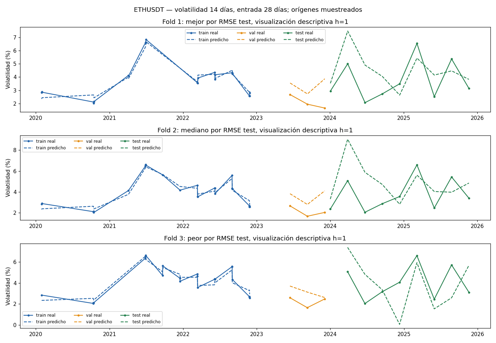

Con la entrada seleccionada, RMSE SVR=1.88671 frente a Persistence=0.47784. SVR no mejora la referencia en este resumen de test. No se extrapola esta diferencia a significancia estadística ni a objetivos de otra ventana.

## ETHUSDT: volatilidad de 21 días

Entrada elegida con validación: **28 días**, C=1, epsilon=0.01.

| input_window | model | mape | mae | rmse | mse |
| --- | --- | --- | --- | --- | --- |
| 7 | Persistence | 7.23167 | 0.23839 | 0.32266 | 0.11986 |
| 7 | SVR | 53.47029 | 1.63149 | 1.91500 | 3.85293 |
| 14 | Persistence | 7.23167 | 0.23839 | 0.32266 | 0.11986 |
| 14 | SVR | 47.11846 | 1.45271 | 1.66816 | 2.84842 |
| 21 | Persistence | 7.23167 | 0.23839 | 0.32266 | 0.11986 |
| 21 | SVR | 56.02962 | 1.69849 | 1.96787 | 4.00844 |
| 28 | Persistence | 7.23167 | 0.23839 | 0.32266 | 0.11986 |
| 28 | SVR | 56.78153 | 1.80431 | 2.14370 | 4.71907 |

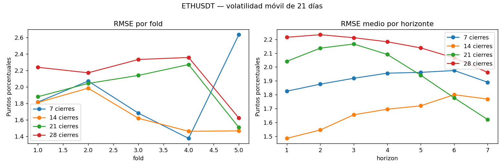

### Entrada de 7 días

| fold | n | mape | mae | rmse | mse | bds_pvalue |
| --- | --- | --- | --- | --- | --- | --- |
| 1 | 9 | 56.28410 | 1.58638 | 1.81556 | 3.31220 | 0.00001 |
| 2 | 9 | 64.55480 | 1.87425 | 2.07013 | 4.29559 | 0.23433 |
| 3 | 8 | 51.17176 | 1.50860 | 1.68156 | 2.83041 | 0.00000 |
| 4 | 8 | 39.06407 | 1.11963 | 1.37560 | 1.89344 | 0.00000 |
| 5 | 8 | 56.27675 | 2.06858 | 2.63215 | 6.93298 | 0.00014 |
| Mean ± Std | 8.40000 ± 0.54772 | 53.47029 ± 9.37393 | 1.63149 ± 0.36370 | 1.91500 ± 0.47268 | 3.85293 ± 1.92745 | 0.04690 ± 0.10478 |

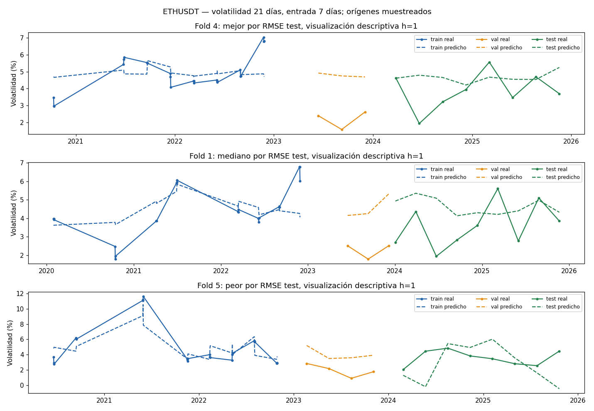

### Entrada de 14 días

| fold | n | mape | mae | rmse | mse | bds_pvalue |
| --- | --- | --- | --- | --- | --- | --- |
| 1 | 9 | 54.54415 | 1.61152 | 1.81044 | 3.34989 | 0.00593 |
| 2 | 9 | 56.86267 | 1.79509 | 1.98407 | 3.95111 | 0.22544 |
| 3 | 8 | 45.02060 | 1.34934 | 1.61874 | 2.62360 | 0.00000 |
| 4 | 8 | 40.90230 | 1.21827 | 1.46146 | 2.14328 | 0.00099 |
| 5 | 8 | 38.26257 | 1.28932 | 1.46608 | 2.17423 | 0.00000 |
| Mean ± Std | 8.40000 ± 0.54772 | 47.11846 ± 8.23952 | 1.45271 ± 0.24227 | 1.66816 ± 0.22697 | 2.84842 ± 0.78576 | 0.04647 ± 0.10008 |

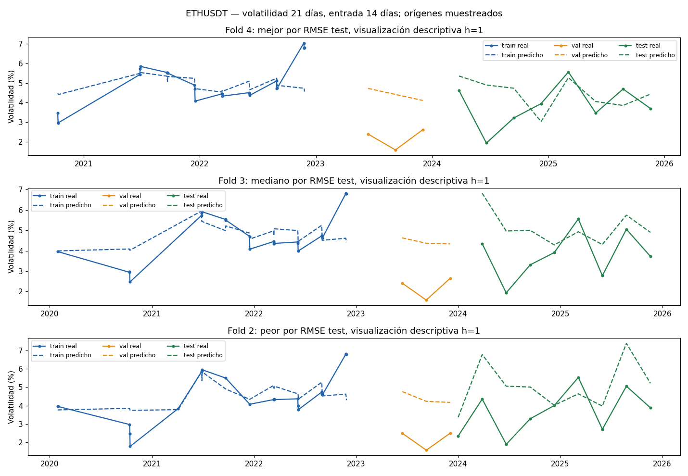

### Entrada de 21 días

| fold | n | mape | mae | rmse | mse | bds_pvalue |
| --- | --- | --- | --- | --- | --- | --- |
| 1 | 9 | 56.85127 | 1.66662 | 1.88068 | 3.56531 | 0.85677 |
| 2 | 9 | 58.25116 | 1.72677 | 2.04144 | 4.21418 | 0.03242 |
| 3 | 8 | 61.32357 | 1.85201 | 2.13852 | 4.68921 | 0.00000 |
| 4 | 8 | 66.15464 | 1.96883 | 2.27029 | 5.27128 | 0.07776 |
| 5 | 8 | 37.56748 | 1.27822 | 1.50841 | 2.30222 | 0.00000 |
| Mean ± Std | 8.40000 ± 0.54772 | 56.02962 ± 10.92020 | 1.69849 ± 0.26225 | 1.96787 ± 0.29355 | 4.00844 ± 1.14106 | 0.19339 ± 0.37221 |

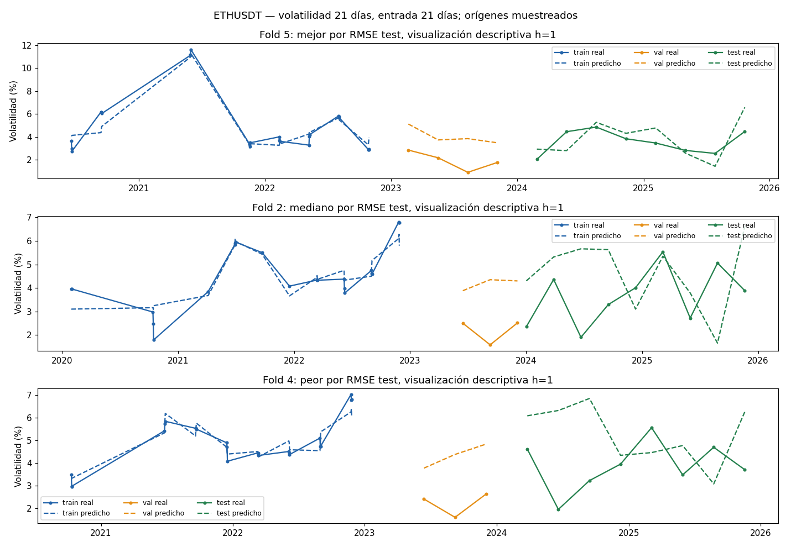

### Entrada de 28 días

| fold | n | mape | mae | rmse | mse | bds_pvalue |
| --- | --- | --- | --- | --- | --- | --- |
| 1 | 9 | 64.67835 | 1.90451 | 2.23722 | 5.04232 | 0.85677 |
| 2 | 9 | 58.86548 | 1.81787 | 2.17047 | 4.77700 | 0.85677 |
| 3 | 8 | 59.77730 | 1.95075 | 2.33163 | 5.50418 | 0.00000 |
| 4 | 8 | 60.78429 | 1.97679 | 2.35643 | 5.60223 | 0.00000 |
| 5 | 8 | 39.80223 | 1.37161 | 1.62278 | 2.66963 | 0.09971 |
| Mean ± Std | 8.40000 ± 0.54772 | 56.78153 ± 9.74674 | 1.80431 ± 0.24932 | 2.14370 ± 0.30058 | 4.71907 ± 1.19419 | 0.36265 ± 0.45290 |

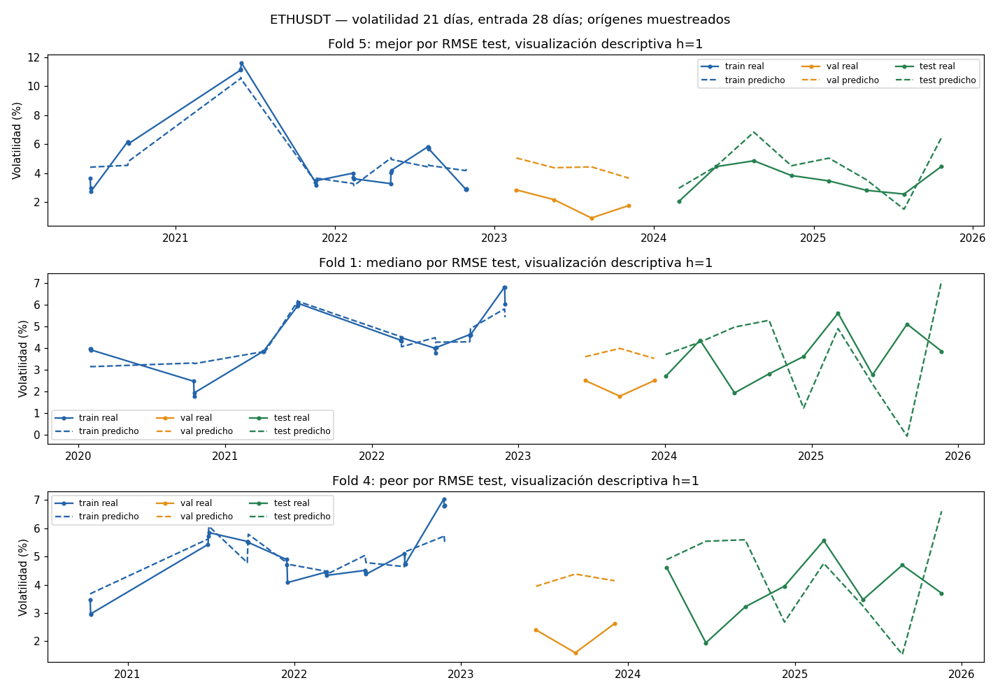

Con la entrada seleccionada, RMSE SVR=2.14370 frente a Persistence=0.32266. SVR no mejora la referencia en este resumen de test. No se extrapola esta diferencia a significancia estadística ni a objetivos de otra ventana.

## ETHUSDT: volatilidad de 28 días

Entrada elegida con validación: **28 días**, C=10, epsilon=0.1.

| input_window | model | mape | mae | rmse | mse |
| --- | --- | --- | --- | --- | --- |
| 7 | Persistence | 4.30524 | 0.15781 | 0.26969 | 0.11033 |
| 7 | SVR | 46.10983 | 1.37268 | 1.67743 | 2.88919 |
| 14 | Persistence | 4.30524 | 0.15781 | 0.26969 | 0.11033 |
| 14 | SVR | 43.40444 | 1.30553 | 1.49796 | 2.28832 |
| 21 | Persistence | 4.30524 | 0.15781 | 0.26969 | 0.11033 |
| 21 | SVR | 53.10359 | 1.56713 | 1.87025 | 3.61116 |
| 28 | Persistence | 4.30524 | 0.15781 | 0.26969 | 0.11033 |
| 28 | SVR | 62.61532 | 2.00677 | 2.39408 | 5.94880 |

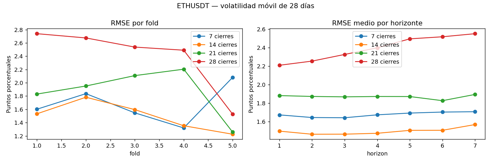

### Entrada de 7 días

| fold | n | mape | mae | rmse | mse | bds_pvalue |
| --- | --- | --- | --- | --- | --- | --- |
| 1 | 9 | 48.74935 | 1.33131 | 1.60211 | 2.58570 | 0.00001 |
| 2 | 9 | 56.50590 | 1.61009 | 1.83631 | 3.37926 | 0.03783 |
| 3 | 8 | 45.01537 | 1.26303 | 1.54724 | 2.39463 | 0.00607 |
| 4 | 8 | 37.13599 | 1.00502 | 1.31980 | 1.74285 | 0.43308 |
| 5 | 8 | 43.14251 | 1.65394 | 2.08169 | 4.34351 | 0.00000 |
| Mean ± Std | 8.40000 ± 0.54772 | 46.10983 ± 7.16899 | 1.37268 ± 0.26664 | 1.67743 ± 0.29120 | 2.88919 ± 1.00075 | 0.09540 ± 0.18942 |

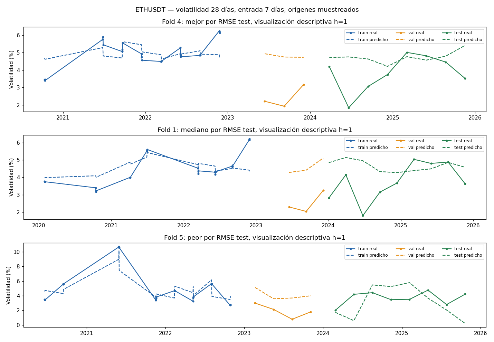

### Entrada de 14 días

| fold | n | mape | mae | rmse | mse | bds_pvalue |
| --- | --- | --- | --- | --- | --- | --- |
| 1 | 9 | 45.87658 | 1.34916 | 1.53303 | 2.36381 | 0.00000 |
| 2 | 9 | 52.27684 | 1.59008 | 1.78222 | 3.18348 | 0.19245 |
| 3 | 8 | 46.13267 | 1.34140 | 1.59615 | 2.55539 | 0.00000 |
| 4 | 8 | 39.37254 | 1.10180 | 1.35309 | 1.83218 | 0.00000 |
| 5 | 8 | 33.36357 | 1.14521 | 1.22532 | 1.50672 | 0.00000 |
| Mean ± Std | 8.40000 ± 0.54772 | 43.40444 ± 7.23446 | 1.30553 ± 0.19453 | 1.49796 ± 0.21621 | 2.28832 ± 0.65140 | 0.03849 ± 0.08607 |

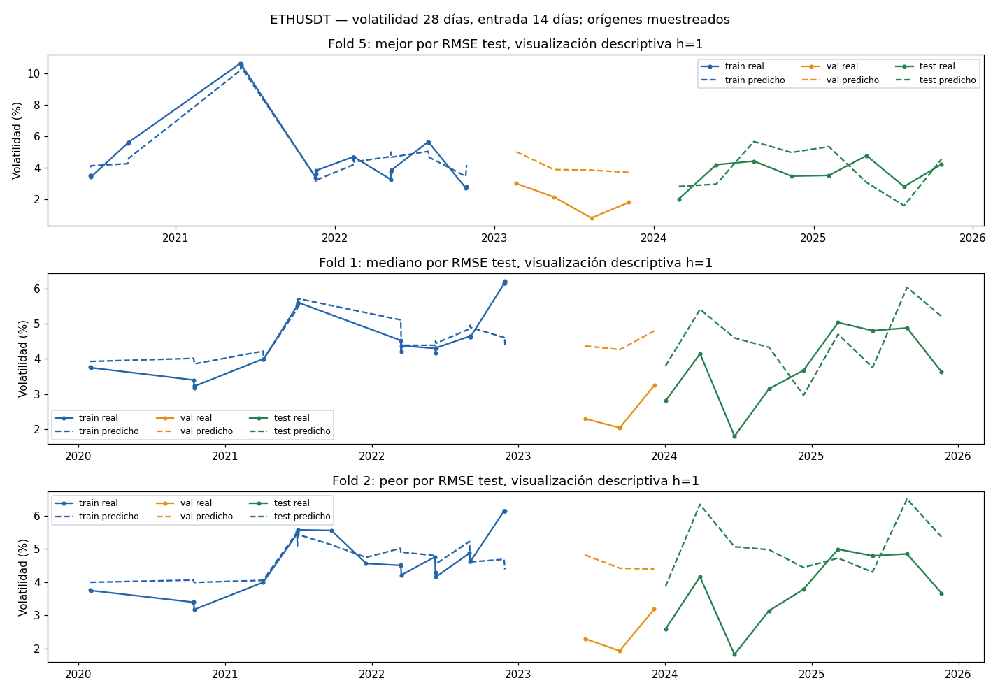

### Entrada de 21 días

| fold | n | mape | mae | rmse | mse | bds_pvalue |
| --- | --- | --- | --- | --- | --- | --- |
| 1 | 9 | 53.88975 | 1.55735 | 1.83023 | 3.35097 | 0.11619 |
| 2 | 9 | 56.30799 | 1.62292 | 1.95130 | 3.80964 | 0.38067 |
| 3 | 8 | 59.01555 | 1.69115 | 2.10797 | 4.44394 | 0.00000 |
| 4 | 8 | 62.27472 | 1.78529 | 2.20463 | 4.86279 | 0.00000 |
| 5 | 8 | 34.02993 | 1.17893 | 1.25710 | 1.58846 | 0.00000 |
| Mean ± Std | 8.40000 ± 0.54772 | 53.10359 ± 11.11026 | 1.56713 ± 0.23285 | 1.87025 ± 0.37163 | 3.61116 ± 1.27068 | 0.09937 ± 0.16510 |

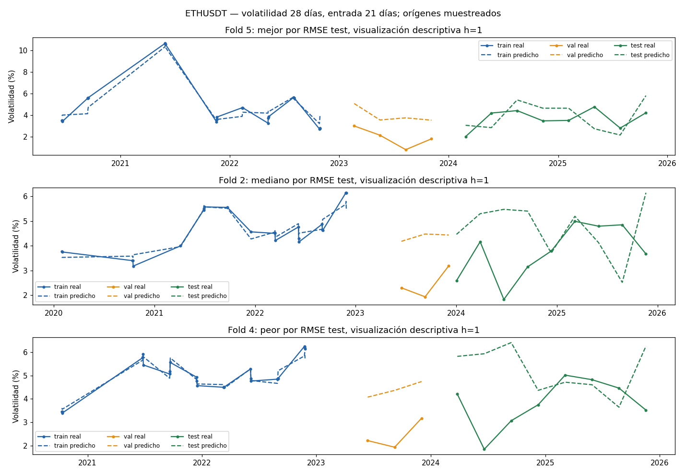

### Entrada de 28 días

| fold | n | mape | mae | rmse | mse | bds_pvalue |
| --- | --- | --- | --- | --- | --- | --- |
| 1 | 9 | 70.48376 | 2.32298 | 2.73936 | 7.51660 | 0.00002 |
| 2 | 9 | 69.15849 | 2.20712 | 2.67544 | 7.19795 | 0.00002 |
| 3 | 8 | 67.77340 | 2.09390 | 2.53762 | 6.47044 | 0.00000 |
| 4 | 8 | 69.37473 | 2.10110 | 2.49070 | 6.22439 | 0.00000 |
| 5 | 8 | 36.28622 | 1.30877 | 1.52729 | 2.33461 | 0.15822 |
| Mean ± Std | 8.40000 ± 0.54772 | 62.61532 ± 14.74994 | 2.00677 ± 0.40119 | 2.39408 ± 0.49488 | 5.94880 ± 2.08739 | 0.03165 ± 0.07076 |

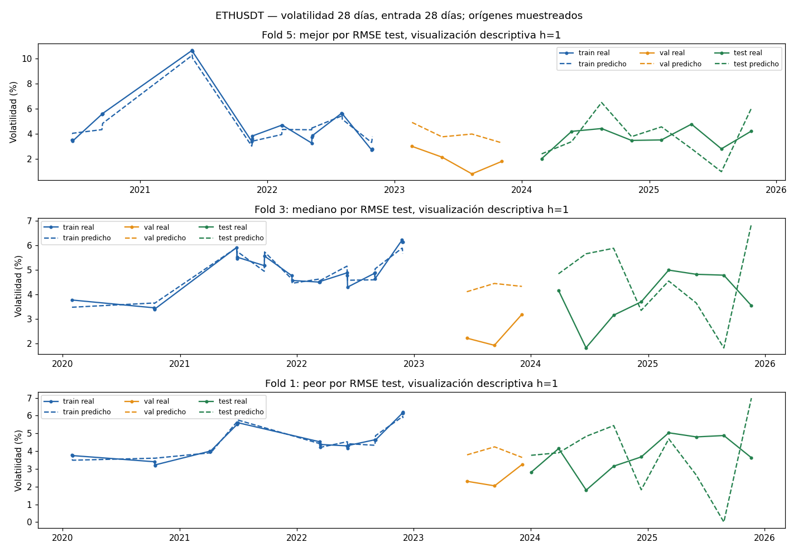

Con la entrada seleccionada, RMSE SVR=2.39408 frente a Persistence=0.26969. SVR no mejora la referencia en este resumen de test. No se extrapola esta diferencia a significancia estadística ni a objetivos de otra ventana.

## BNBUSDT: volatilidad de 7 días

Entrada elegida con validación: **21 días**, C=10, epsilon=0.01.

| input_window | model | mape | mae | rmse | mse |
| --- | --- | --- | --- | --- | --- |
| 7 | Persistence | 34.76378 | 0.75265 | 1.04053 | 1.16688 |
| 7 | SVR | 89.43550 | 1.84658 | 2.10487 | 5.00416 |
| 14 | Persistence | 34.76378 | 0.75265 | 1.04053 | 1.16688 |
| 14 | SVR | 120.15138 | 2.44308 | 2.99470 | 10.39476 |
| 21 | Persistence | 34.76378 | 0.75265 | 1.04053 | 1.16688 |
| 21 | SVR | 114.72857 | 2.43159 | 2.87727 | 9.09469 |
| 28 | Persistence | 34.76378 | 0.75265 | 1.04053 | 1.16688 |
| 28 | SVR | 121.42284 | 2.63952 | 3.07523 | 10.69212 |

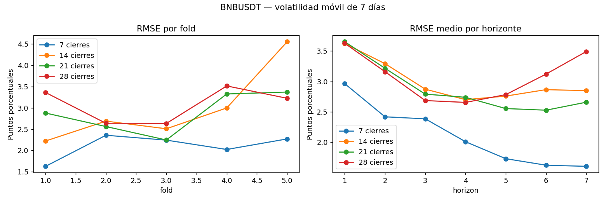

### Entrada de 7 días

| fold | n | mape | mae | rmse | mse | bds_pvalue |
| --- | --- | --- | --- | --- | --- | --- |
| 1 | 9 | 70.50096 | 1.38147 | 1.62793 | 2.86182 | 0.00000 |
| 2 | 9 | 102.70786 | 2.11124 | 2.35765 | 5.77441 | 0.00000 |
| 3 | 8 | 99.76344 | 2.07911 | 2.24321 | 5.93396 | 0.47157 |
| 4 | 8 | 89.99249 | 1.83266 | 2.02393 | 5.07765 | 0.07776 |
| 5 | 8 | 84.21272 | 1.82843 | 2.27163 | 5.37295 | 0.00002 |
| Mean ± Std | 8.40000 ± 0.54772 | 89.43550 ± 12.93180 | 1.84658 ± 0.29196 | 2.10487 ± 0.29363 | 5.00416 ± 1.24387 | 0.10987 ± 0.20498 |

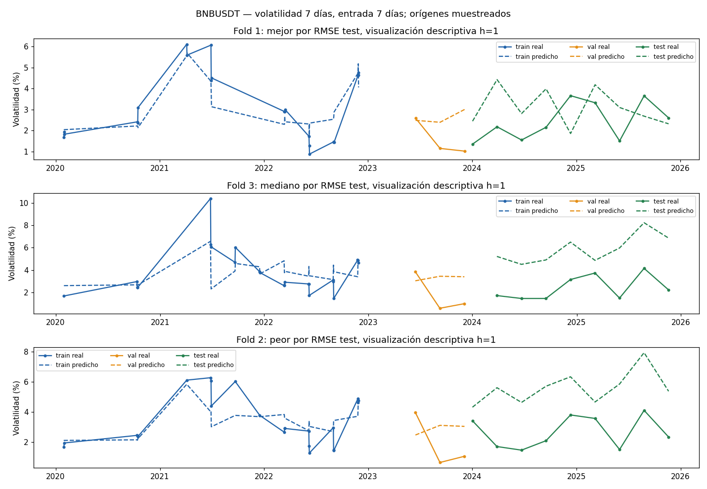

### Entrada de 14 días

| fold | n | mape | mae | rmse | mse | bds_pvalue |
| --- | --- | --- | --- | --- | --- | --- |
| 1 | 9 | 92.42804 | 1.80352 | 2.22281 | 5.25829 | 0.03032 |
| 2 | 9 | 117.61911 | 2.37470 | 2.68924 | 7.63537 | No estimable |
| 3 | 8 | 110.07062 | 2.13203 | 2.50993 | 7.32154 | 0.00000 |
| 4 | 8 | 113.65338 | 2.43355 | 2.99899 | 9.97565 | 0.00000 |
| 5 | 8 | 166.98576 | 3.47158 | 4.55256 | 21.78295 | 0.00000 |
| Mean ± Std | 8.40000 ± 0.54772 | 120.15138 ± 27.89400 | 2.44308 ± 0.62617 | 2.99470 ± 0.91530 | 10.39476 ± 6.58234 | 0.00758 ± 0.01516 |

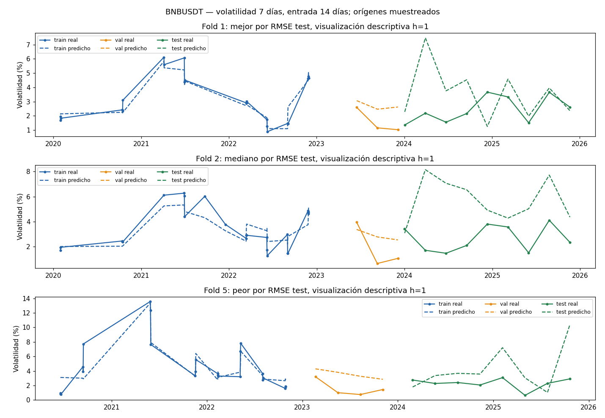

### Entrada de 21 días

| fold | n | mape | mae | rmse | mse | bds_pvalue |
| --- | --- | --- | --- | --- | --- | --- |
| 1 | 9 | 116.70046 | 2.29168 | 2.87898 | 8.50685 | 0.39893 |
| 2 | 9 | 111.93600 | 2.17615 | 2.56226 | 6.68743 | 0.00000 |
| 3 | 8 | 85.59510 | 1.93255 | 2.24652 | 5.79347 | 0.15822 |
| 4 | 8 | 120.19106 | 2.96056 | 3.32707 | 12.99222 | 0.00000 |
| 5 | 8 | 139.22024 | 2.79698 | 3.37154 | 11.49349 | 0.00000 |
| Mean ± Std | 8.40000 ± 0.54772 | 114.72857 ± 19.30108 | 2.43159 ± 0.43220 | 2.87727 ± 0.48572 | 9.09469 ± 3.08154 | 0.11143 ± 0.17471 |

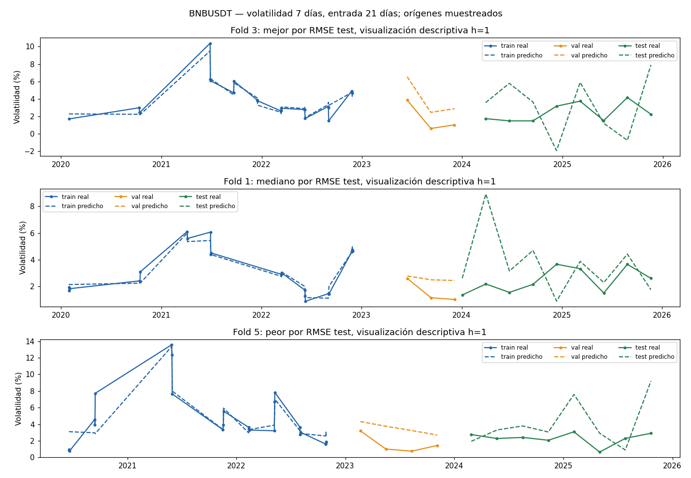

### Entrada de 28 días

| fold | n | mape | mae | rmse | mse | bds_pvalue |
| --- | --- | --- | --- | --- | --- | --- |
| 1 | 9 | 139.83090 | 2.86224 | 3.36137 | 13.31756 | 0.17843 |
| 2 | 9 | 110.24733 | 2.28645 | 2.63841 | 7.45160 | 0.00000 |
| 3 | 8 | 101.92613 | 2.25164 | 2.63600 | 7.83518 | 0.00000 |
| 4 | 8 | 129.47600 | 3.09584 | 3.51530 | 14.35303 | 0.00000 |
| 5 | 8 | 125.63386 | 2.70144 | 3.22506 | 10.50320 | 0.00000 |
| Mean ± Std | 8.40000 ± 0.54772 | 121.42284 ± 15.21887 | 2.63952 ± 0.36632 | 3.07523 ± 0.41283 | 10.69212 ± 3.12226 | 0.03569 ± 0.07979 |

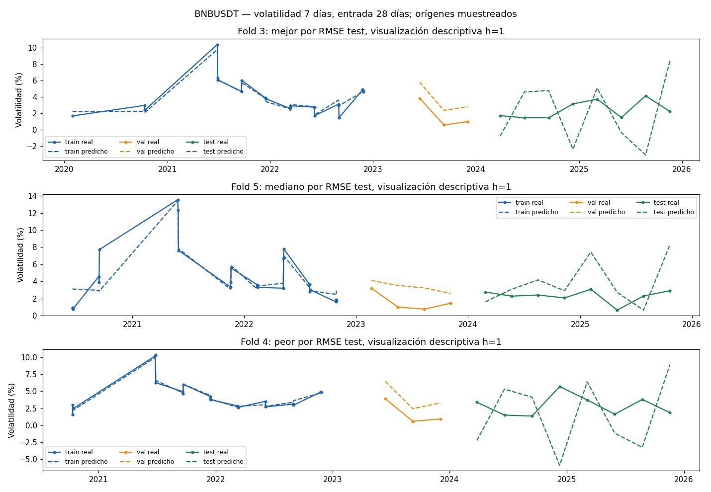

Con la entrada seleccionada, RMSE SVR=2.87727 frente a Persistence=1.04053. SVR no mejora la referencia en este resumen de test. No se extrapola esta diferencia a significancia estadística ni a objetivos de otra ventana.

## BNBUSDT: volatilidad de 14 días

Entrada elegida con validación: **28 días**, C=10, epsilon=0.01.

| input_window | model | mape | mae | rmse | mse |
| --- | --- | --- | --- | --- | --- |
| 7 | Persistence | 14.90669 | 0.40355 | 0.62201 | 0.48706 |
| 7 | SVR | 90.33463 | 2.31853 | 3.06903 | 11.58523 |
| 14 | Persistence | 14.90669 | 0.40355 | 0.62201 | 0.48706 |
| 14 | SVR | 97.72028 | 2.52248 | 2.91231 | 8.69473 |
| 21 | Persistence | 14.90669 | 0.40355 | 0.62201 | 0.48706 |
| 21 | SVR | 107.02910 | 2.81988 | 3.34543 | 11.50443 |
| 28 | Persistence | 14.90669 | 0.40355 | 0.62201 | 0.48706 |
| 28 | SVR | 111.28081 | 2.90672 | 3.42416 | 12.22810 |

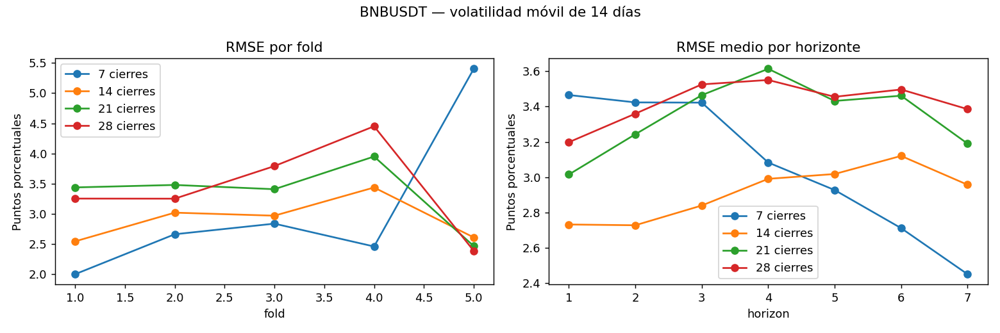

### Entrada de 7 días

| fold | n | mape | mae | rmse | mse | bds_pvalue |
| --- | --- | --- | --- | --- | --- | --- |
| 1 | 9 | 74.73285 | 1.69636 | 1.99445 | 3.99069 | 0.00000 |
| 2 | 9 | 101.20245 | 2.36263 | 2.65780 | 7.07230 | 0.00000 |
| 3 | 8 | 107.65506 | 2.54272 | 2.83391 | 8.06083 | 0.00000 |
| 4 | 8 | 90.13545 | 2.23186 | 2.45476 | 6.04220 | 0.00000 |
| 5 | 8 | 77.94733 | 2.75907 | 5.40423 | 32.76013 | 0.00002 |
| Mean ± Std | 8.40000 ± 0.54772 | 90.33463 ± 14.27417 | 2.31853 ± 0.40028 | 3.06903 ± 1.34253 | 11.58523 ± 11.93280 | 0.00000 ± 0.00001 |

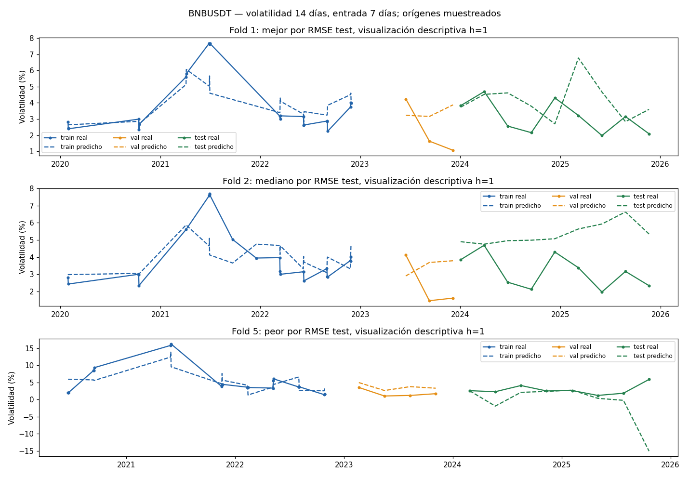

### Entrada de 14 días

| fold | n | mape | mae | rmse | mse | bds_pvalue |
| --- | --- | --- | --- | --- | --- | --- |
| 1 | 9 | 93.39164 | 2.37185 | 2.53993 | 6.49240 | 0.00000 |
| 2 | 9 | 113.65369 | 2.78939 | 3.01641 | 9.13621 | 0.00000 |
| 3 | 8 | 98.49960 | 2.59807 | 2.96606 | 8.85754 | 0.41044 |
| 4 | 8 | 99.60312 | 2.78002 | 3.43399 | 11.84401 | 0.00000 |
| 5 | 8 | 83.45336 | 2.07305 | 2.60517 | 7.14348 | 0.00000 |
| Mean ± Std | 8.40000 ± 0.54772 | 97.72028 ± 10.95797 | 2.52248 ± 0.30330 | 2.91231 ± 0.36017 | 8.69473 ± 2.08542 | 0.08209 ± 0.18355 |

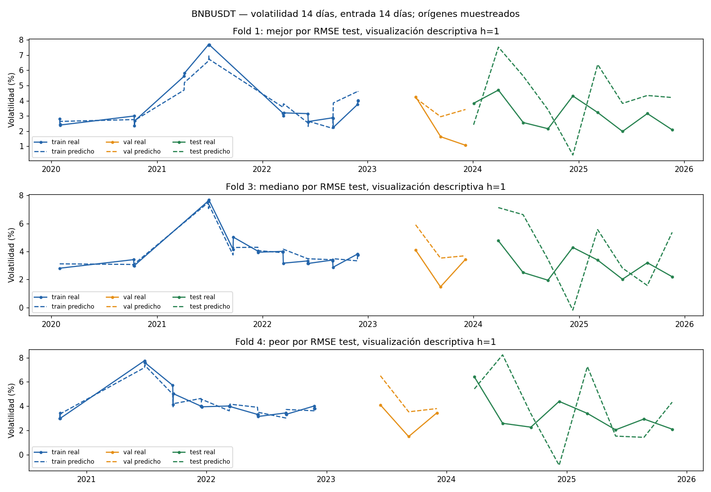

### Entrada de 21 días

| fold | n | mape | mae | rmse | mse | bds_pvalue |
| --- | --- | --- | --- | --- | --- | --- |
| 1 | 9 | 114.51347 | 2.84341 | 3.43534 | 11.90930 | 0.00000 |
| 2 | 9 | 119.79210 | 2.99264 | 3.47642 | 12.15057 | 0.00000 |
| 3 | 8 | 100.73127 | 2.77923 | 3.40565 | 11.65922 | 0.88997 |
| 4 | 8 | 119.27748 | 3.48519 | 3.94835 | 15.62729 | 0.00000 |
| 5 | 8 | 80.83115 | 1.99894 | 2.46138 | 6.17577 | 0.37408 |
| Mean ± Std | 8.40000 ± 0.54772 | 107.02910 ± 16.54485 | 2.81988 ± 0.53587 | 3.34543 ± 0.54174 | 11.50443 ± 3.39109 | 0.25281 ± 0.39129 |

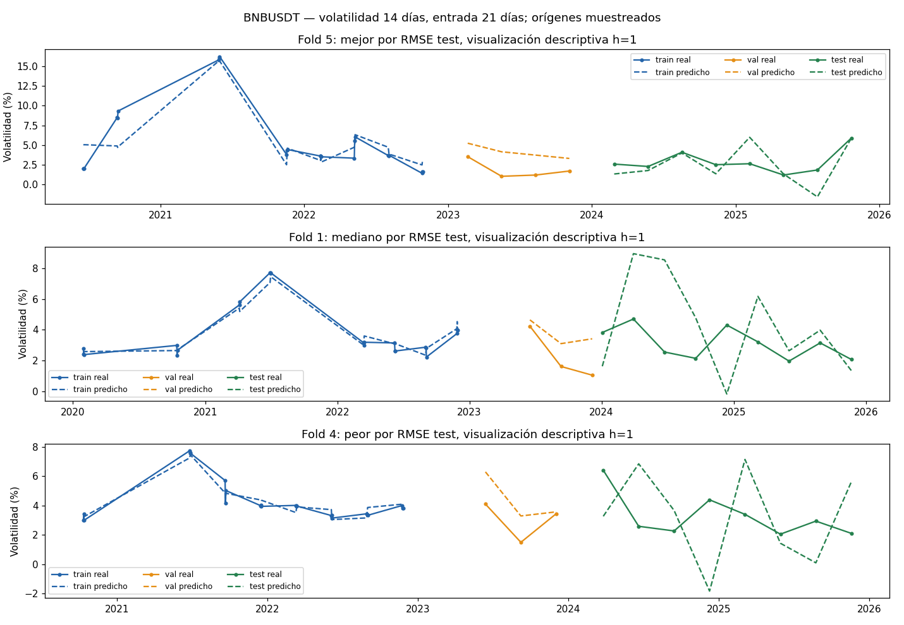

### Entrada de 28 días

| fold | n | mape | mae | rmse | mse | bds_pvalue |
| --- | --- | --- | --- | --- | --- | --- |
| 1 | 9 | 109.26121 | 2.58209 | 3.25019 | 10.59495 | 0.00000 |
| 2 | 9 | 110.28867 | 2.71780 | 3.24864 | 10.58170 | 0.00000 |
| 3 | 8 | 121.52934 | 3.36114 | 3.78939 | 14.41603 | 0.23964 |
| 4 | 8 | 134.94814 | 3.94187 | 4.45023 | 19.84035 | 0.00000 |
| 5 | 8 | 80.37670 | 1.93068 | 2.38237 | 5.70744 | 0.00000 |
| Mean ± Std | 8.40000 ± 0.54772 | 111.28081 ± 20.15752 | 2.90672 ± 0.77003 | 3.42416 ± 0.76364 | 12.22810 ± 5.25905 | 0.04793 ± 0.10717 |

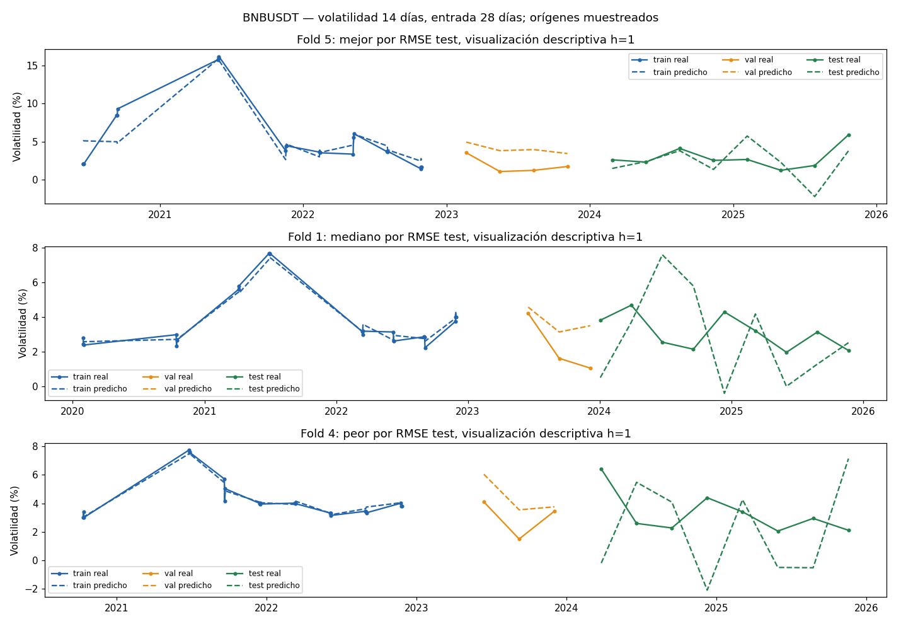

Con la entrada seleccionada, RMSE SVR=3.42416 frente a Persistence=0.62201. SVR no mejora la referencia en este resumen de test. No se extrapola esta diferencia a significancia estadística ni a objetivos de otra ventana.

## BNBUSDT: volatilidad de 21 días

Entrada elegida con validación: **7 días**, C=10, epsilon=0.01.

| input_window | model | mape | mae | rmse | mse |
| --- | --- | --- | --- | --- | --- |
| 7 | Persistence | 8.95085 | 0.25124 | 0.33270 | 0.13306 |
| 7 | SVR | 87.61212 | 2.41534 | 3.27438 | 12.97998 |
| 14 | Persistence | 8.95085 | 0.25124 | 0.33270 | 0.13306 |
| 14 | SVR | 78.22256 | 2.08945 | 2.49199 | 6.45823 |
| 21 | Persistence | 8.95085 | 0.25124 | 0.33270 | 0.13306 |
| 21 | SVR | 81.67875 | 2.25106 | 2.60300 | 6.97770 |
| 28 | Persistence | 8.95085 | 0.25124 | 0.33270 | 0.13306 |
| 28 | SVR | 76.16172 | 2.13328 | 2.53000 | 6.66724 |

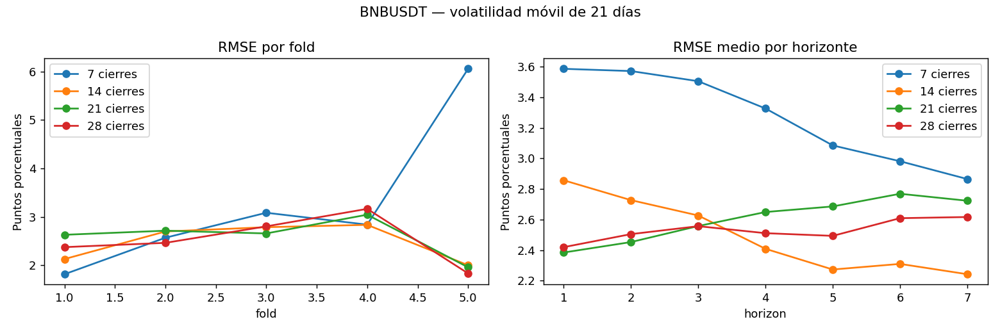

### Entrada de 7 días

| fold | n | mape | mae | rmse | mse | bds_pvalue |
| --- | --- | --- | --- | --- | --- | --- |
| 1 | 9 | 61.18204 | 1.55641 | 1.81832 | 3.33451 | 0.02852 |
| 2 | 9 | 90.25639 | 2.28048 | 2.57087 | 6.68729 | 0.00000 |
| 3 | 8 | 109.22605 | 2.74895 | 3.08620 | 9.86180 | 0.00000 |
| 4 | 8 | 101.20943 | 2.54189 | 2.84105 | 8.29111 | 0.00000 |
| 5 | 8 | 76.18671 | 2.94896 | 6.05547 | 36.72519 | 0.00002 |
| Mean ± Std | 8.40000 ± 0.54772 | 87.61212 ± 19.28814 | 2.41534 ± 0.54037 | 3.27438 ± 1.62578 | 12.97998 ± 13.49237 | 0.00571 ± 0.01275 |

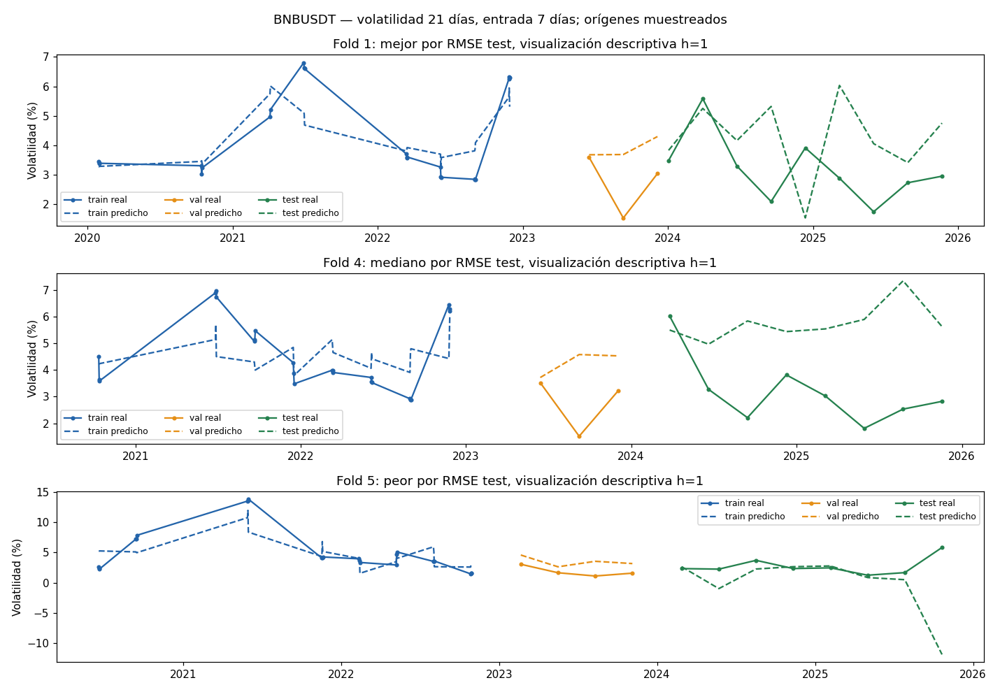

### Entrada de 14 días

| fold | n | mape | mae | rmse | mse | bds_pvalue |
| --- | --- | --- | --- | --- | --- | --- |
| 1 | 9 | 68.63984 | 1.87609 | 2.13109 | 4.59476 | 0.10035 |
| 2 | 9 | 89.80395 | 2.35331 | 2.69959 | 7.42270 | 0.00000 |
| 3 | 8 | 90.44928 | 2.48810 | 2.78841 | 8.14188 | 0.00071 |
| 4 | 8 | 78.96290 | 2.21781 | 2.83678 | 8.07841 | 0.43308 |
| 5 | 8 | 63.25682 | 1.51195 | 2.00411 | 4.05341 | 0.00000 |
| Mean ± Std | 8.40000 ± 0.54772 | 78.22256 ± 12.24716 | 2.08945 ± 0.39498 | 2.49199 ± 0.39310 | 6.45823 ± 1.97772 | 0.10683 ± 0.18746 |

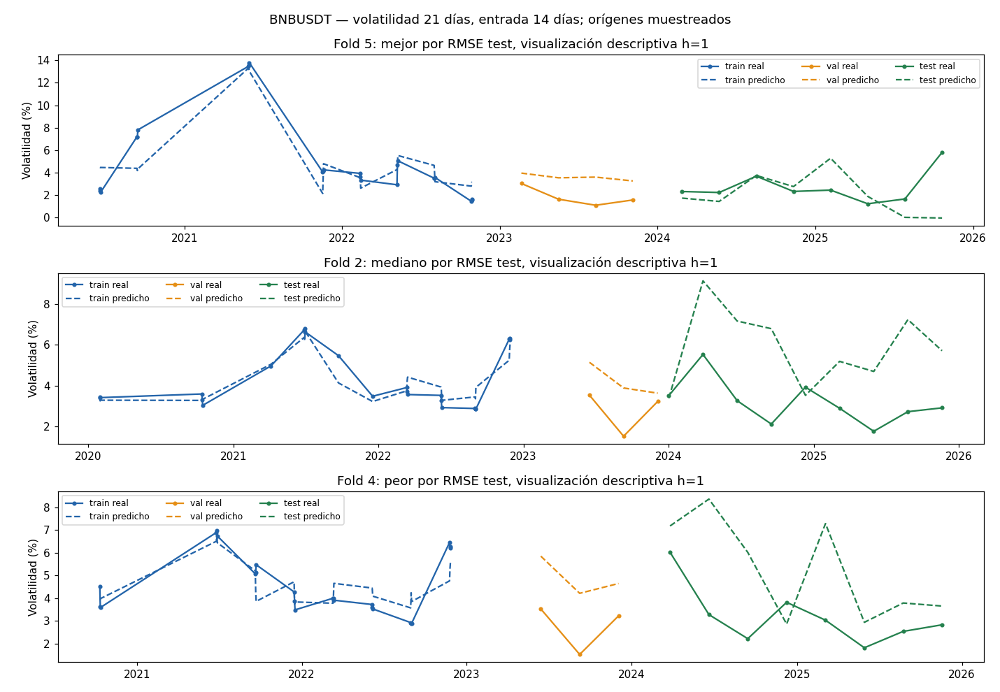

### Entrada de 21 días

| fold | n | mape | mae | rmse | mse | bds_pvalue |
| --- | --- | --- | --- | --- | --- | --- |
| 1 | 9 | 80.62563 | 2.24888 | 2.63186 | 7.11427 | 0.24724 |
| 2 | 9 | 86.66795 | 2.32513 | 2.71594 | 7.41133 | 0.79072 |
| 3 | 8 | 82.03617 | 2.33426 | 2.65960 | 7.10968 | 0.00000 |
| 4 | 8 | 94.18296 | 2.78350 | 3.04633 | 9.31081 | 0.00015 |
| 5 | 8 | 64.88104 | 1.56355 | 1.96126 | 3.94240 | 0.19957 |
| Mean ± Std | 8.40000 ± 0.54772 | 81.67875 ± 10.77784 | 2.25106 ± 0.43834 | 2.60300 ± 0.39534 | 6.97770 ± 1.92876 | 0.24753 ± 0.32397 |

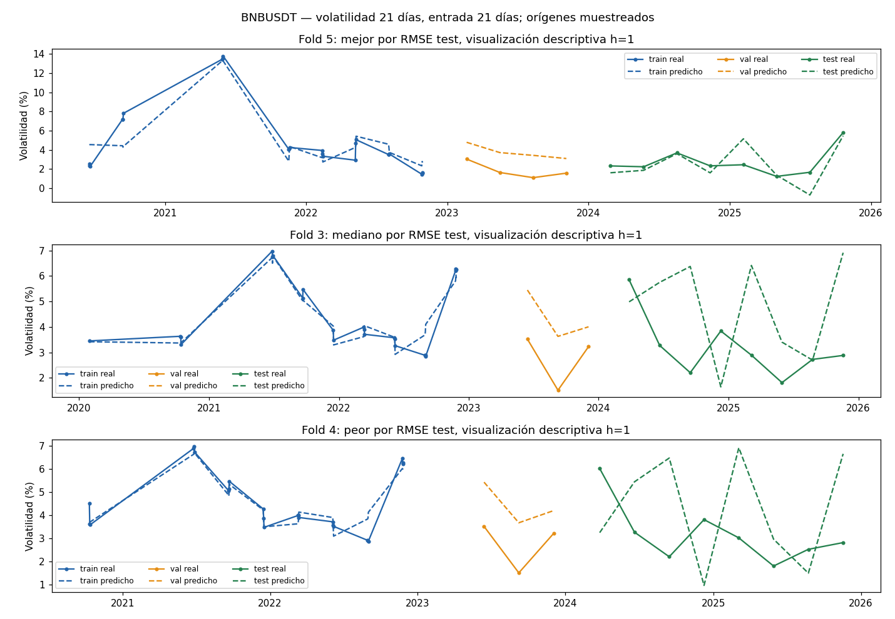

### Entrada de 28 días

| fold | n | mape | mae | rmse | mse | bds_pvalue |
| --- | --- | --- | --- | --- | --- | --- |
| 1 | 9 | 67.23493 | 1.83425 | 2.37694 | 5.80494 | 0.02735 |
| 2 | 9 | 72.46056 | 2.05153 | 2.46530 | 6.10537 | No estimable |
| 3 | 8 | 83.73474 | 2.51344 | 2.80547 | 7.92406 | 0.00000 |
| 4 | 8 | 90.35352 | 2.78933 | 3.16671 | 10.07823 | 0.00000 |
| 5 | 8 | 67.02485 | 1.47786 | 1.83556 | 3.42362 | 0.00000 |
| Mean ± Std | 8.40000 ± 0.54772 | 76.16172 ± 10.43583 | 2.13328 ± 0.52455 | 2.53000 ± 0.49778 | 6.66724 ± 2.48972 | 0.00684 ± 0.01368 |

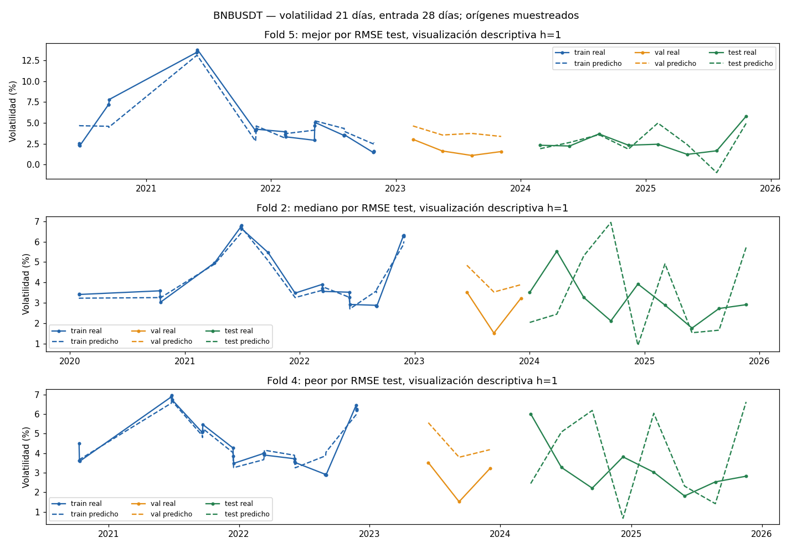

Con la entrada seleccionada, RMSE SVR=3.27438 frente a Persistence=0.33270. SVR no mejora la referencia en este resumen de test. No se extrapola esta diferencia a significancia estadística ni a objetivos de otra ventana.

## BNBUSDT: volatilidad de 28 días

Entrada elegida con validación: **7 días**, C=10, epsilon=0.01.

| input_window | model | mape | mae | rmse | mse |
| --- | --- | --- | --- | --- | --- |
| 7 | Persistence | 4.88373 | 0.11939 | 0.14609 | 0.02981 |
| 7 | SVR | 77.54248 | 2.13908 | 2.83684 | 9.16358 |
| 14 | Persistence | 4.88373 | 0.11939 | 0.14609 | 0.02981 |
| 14 | SVR | 70.73539 | 1.92234 | 2.30211 | 5.47777 |
| 21 | Persistence | 4.88373 | 0.11939 | 0.14609 | 0.02981 |
| 21 | SVR | 69.01080 | 1.91551 | 2.27599 | 5.26938 |
| 28 | Persistence | 4.88373 | 0.11939 | 0.14609 | 0.02981 |
| 28 | SVR | 66.13559 | 1.77850 | 2.18513 | 4.88774 |

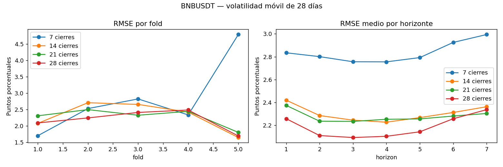

### Entrada de 7 días

| fold | n | mape | mae | rmse | mse | bds_pvalue |
| --- | --- | --- | --- | --- | --- | --- |
| 1 | 9 | 57.23922 | 1.48723 | 1.70002 | 2.93944 | 0.00000 |
| 2 | 9 | 87.23947 | 2.23714 | 2.52955 | 6.42283 | 0.00000 |
| 3 | 8 | 97.52376 | 2.47981 | 2.82449 | 7.98814 | 0.00000 |
| 4 | 8 | 81.96490 | 2.13216 | 2.33637 | 5.46807 | 0.00000 |
| 5 | 8 | 63.74504 | 2.35904 | 4.79376 | 22.99944 | 0.00002 |
| Mean ± Std | 8.40000 ± 0.54772 | 77.54248 ± 16.69904 | 2.13908 ± 0.38699 | 2.83684 ± 1.16907 | 9.16358 ± 7.94860 | 0.00000 ± 0.00001 |

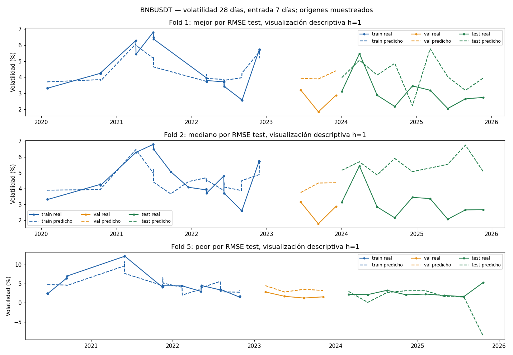

### Entrada de 14 días

| fold | n | mape | mae | rmse | mse | bds_pvalue |
| --- | --- | --- | --- | --- | --- | --- |
| 1 | 9 | 67.82290 | 1.89730 | 2.07731 | 4.34825 | 0.10035 |
| 2 | 9 | 87.14617 | 2.34153 | 2.70918 | 7.36209 | No estimable |
| 3 | 8 | 83.92636 | 2.32831 | 2.65730 | 7.07722 | 0.00000 |
| 4 | 8 | 63.77087 | 1.82981 | 2.42196 | 5.88913 | 0.00250 |
| 5 | 8 | 51.01064 | 1.21477 | 1.64481 | 2.71216 | 0.01242 |
| Mean ± Std | 8.40000 ± 0.54772 | 70.73539 ± 14.91114 | 1.92234 ± 0.46108 | 2.30211 ± 0.44407 | 5.47777 ± 1.94952 | 0.02882 ± 0.04799 |

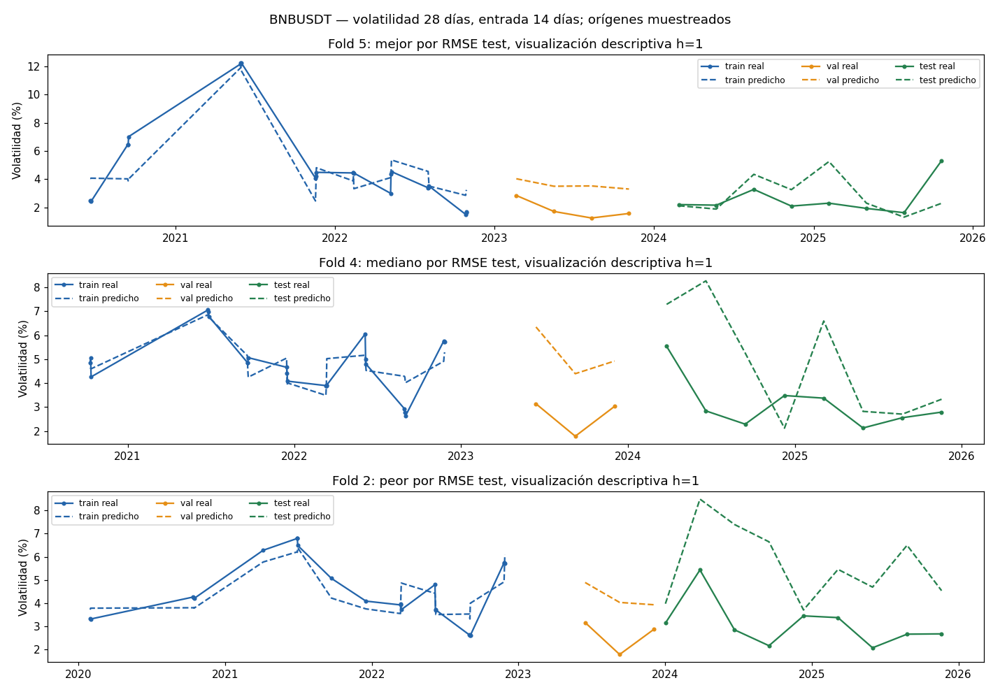

### Entrada de 21 días

| fold | n | mape | mae | rmse | mse | bds_pvalue |
| --- | --- | --- | --- | --- | --- | --- |
| 1 | 9 | 69.12527 | 2.00976 | 2.30901 | 5.35814 | 0.03620 |
| 2 | 9 | 74.82384 | 2.06821 | 2.49792 | 6.28553 | 0.01940 |
| 3 | 8 | 73.26194 | 1.99049 | 2.32629 | 5.42972 | 0.00607 |
| 4 | 8 | 76.58131 | 2.18246 | 2.44495 | 5.98430 | 0.00000 |
| 5 | 8 | 51.26164 | 1.32665 | 1.80176 | 3.28922 | 0.00000 |
| Mean ± Std | 8.40000 ± 0.54772 | 69.01080 ± 10.29832 | 1.91551 ± 0.33758 | 2.27599 ± 0.27673 | 5.26938 ± 1.17242 | 0.01233 ± 0.01552 |

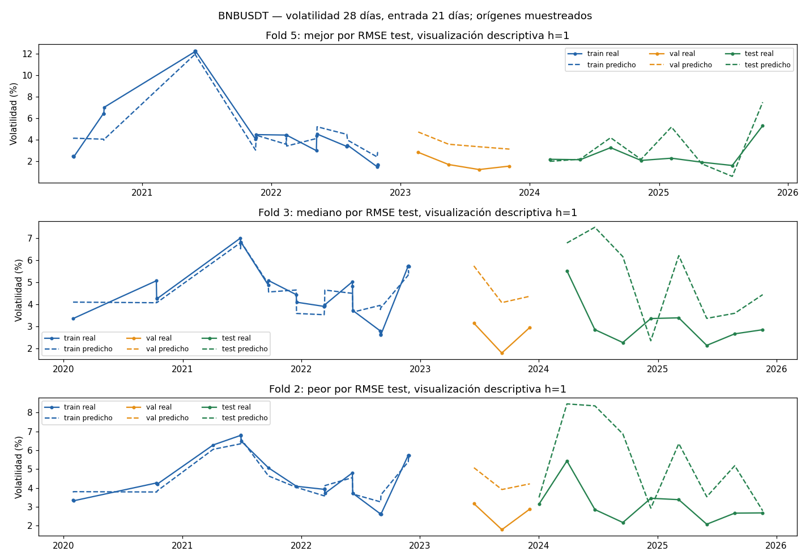

### Entrada de 28 días

| fold | n | mape | mae | rmse | mse | bds_pvalue |
| --- | --- | --- | --- | --- | --- | --- |
| 1 | 9 | 61.09047 | 1.72455 | 2.09069 | 4.43913 | 0.31885 |
| 2 | 9 | 60.66245 | 1.64494 | 2.24441 | 5.08314 | 0.09283 |
| 3 | 8 | 72.70853 | 2.02768 | 2.41146 | 5.83288 | 0.00000 |
| 4 | 8 | 76.50461 | 2.22524 | 2.48626 | 6.19235 | 0.00000 |
| 5 | 8 | 59.71189 | 1.27012 | 1.69282 | 2.89117 | 0.00000 |
| Mean ± Std | 8.40000 ± 0.54772 | 66.13559 ± 7.86436 | 1.77850 ± 0.36772 | 2.18513 ± 0.31492 | 4.88774 ± 1.30585 | 0.08234 ± 0.13819 |

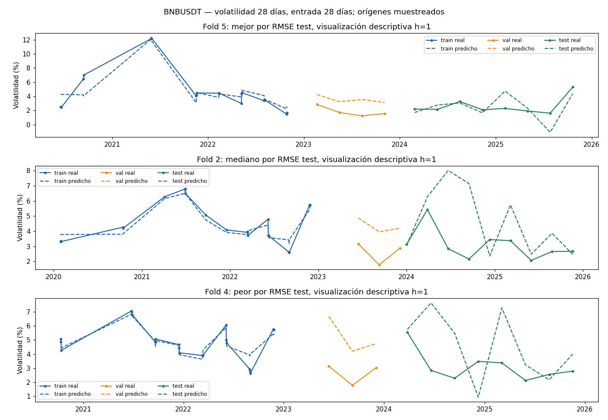

Con la entrada seleccionada, RMSE SVR=2.83684 frente a Persistence=0.14609. SVR no mejora la referencia en este resumen de test. No se extrapola esta diferencia a significancia estadística ni a objetivos de otra ventana.

## XRPUSDT: volatilidad de 7 días

Entrada elegida con validación: **14 días**, C=10, epsilon=0.01.

| input_window | model | mape | mae | rmse | mse |
| --- | --- | --- | --- | --- | --- |
| 7 | Persistence | 47.45315 | 1.38815 | 2.06372 | 5.65154 |
| 7 | SVR | 204.54172 | 6.46676 | 8.77347 | 89.05386 |
| 14 | Persistence | 47.45315 | 1.38815 | 2.06372 | 5.65154 |
| 14 | SVR | 219.72257 | 6.94450 | 9.78647 | 139.36790 |
| 21 | Persistence | 47.45315 | 1.38815 | 2.06372 | 5.65154 |
| 21 | SVR | 239.60014 | 7.00603 | 9.86598 | 123.38735 |
| 28 | Persistence | 47.45315 | 1.38815 | 2.06372 | 5.65154 |
| 28 | SVR | 295.00933 | 9.06360 | 12.44374 | 193.22224 |

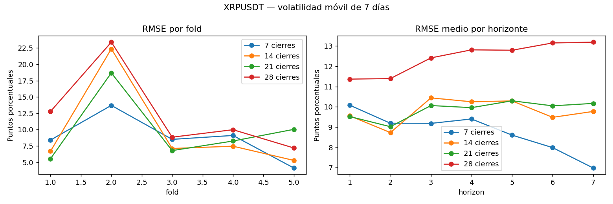

### Entrada de 7 días

| fold | n | mape | mae | rmse | mse | bds_pvalue |
| --- | --- | --- | --- | --- | --- | --- |
| 1 | 9 | 177.61034 | 5.61112 | 8.40265 | 71.43457 | 0.29855 |
| 2 | 9 | 281.40831 | 9.65969 | 13.71703 | 189.53782 | 0.00000 |
| 3 | 8 | 211.75524 | 7.05433 | 8.51258 | 79.27585 | 0.00000 |
| 4 | 8 | 216.18521 | 6.94740 | 9.10905 | 87.70862 | 0.00000 |
| 5 | 8 | 135.74953 | 3.06128 | 4.12605 | 17.31244 | 0.47157 |
| Mean ± Std | 8.40000 ± 0.54772 | 204.54172 ± 53.74417 | 6.46676 ± 2.40315 | 8.77347 ± 3.40424 | 89.05386 ± 62.55341 | 0.15402 ± 0.21960 |

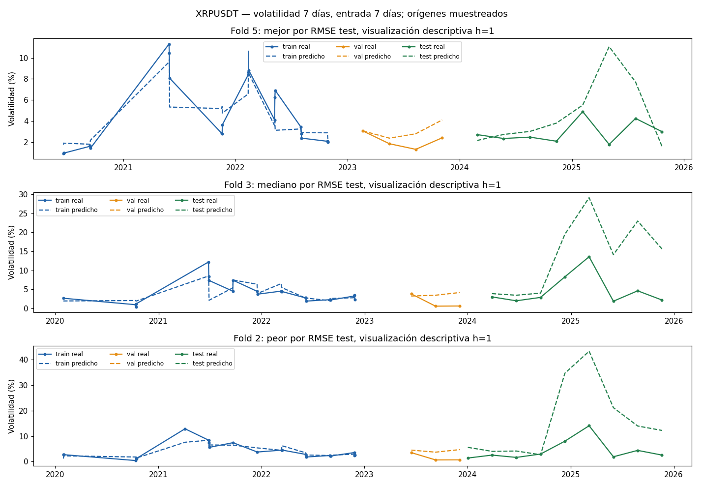

### Entrada de 14 días

| fold | n | mape | mae | rmse | mse | bds_pvalue |
| --- | --- | --- | --- | --- | --- | --- |
| 1 | 9 | 156.04202 | 4.92822 | 6.69630 | 45.47354 | 0.01513 |
| 2 | 9 | 439.64672 | 15.07273 | 22.37301 | 509.91577 | 0.91987 |
| 3 | 8 | 184.01744 | 5.31732 | 7.11108 | 53.42038 | 0.00098 |
| 4 | 8 | 183.38498 | 5.56892 | 7.46397 | 58.97754 | 0.03027 |
| 5 | 8 | 135.52167 | 3.83533 | 5.28797 | 29.05225 | 0.00000 |
| Mean ± Std | 8.40000 ± 0.54772 | 219.72257 ± 124.60629 | 6.94450 ± 4.59185 | 9.78647 ± 7.08446 | 139.36790 ± 207.44939 | 0.19325 ± 0.40638 |

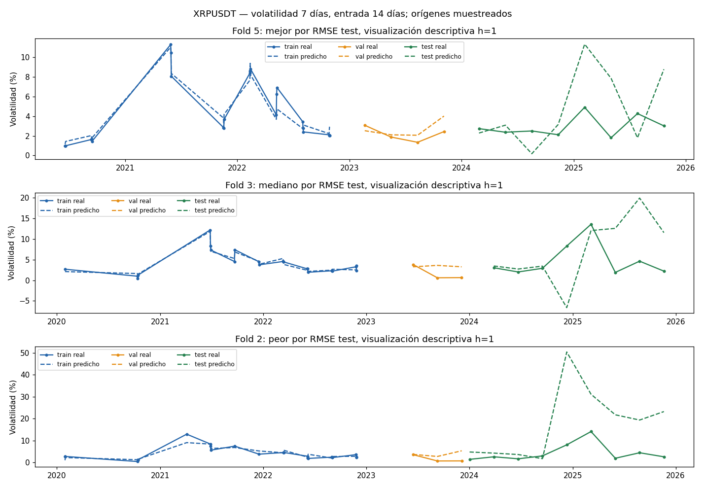

### Entrada de 21 días

| fold | n | mape | mae | rmse | mse | bds_pvalue |
| --- | --- | --- | --- | --- | --- | --- |
| 1 | 9 | 121.67394 | 3.84249 | 5.54049 | 33.25334 | 0.01786 |
| 2 | 9 | 374.00202 | 12.21080 | 18.69452 | 355.42929 | 0.00000 |
| 3 | 8 | 180.60401 | 5.08794 | 6.79369 | 50.36805 | 0.22648 |
| 4 | 8 | 203.35637 | 6.11159 | 8.25779 | 71.43020 | 0.47157 |
| 5 | 8 | 318.36435 | 7.77735 | 10.04341 | 106.45586 | 0.00000 |
| Mean ± Std | 8.40000 ± 0.54772 | 239.60014 ± 103.64411 | 7.00603 ± 3.24699 | 9.86598 ± 5.21320 | 123.38735 ± 132.55720 | 0.14318 ± 0.20705 |

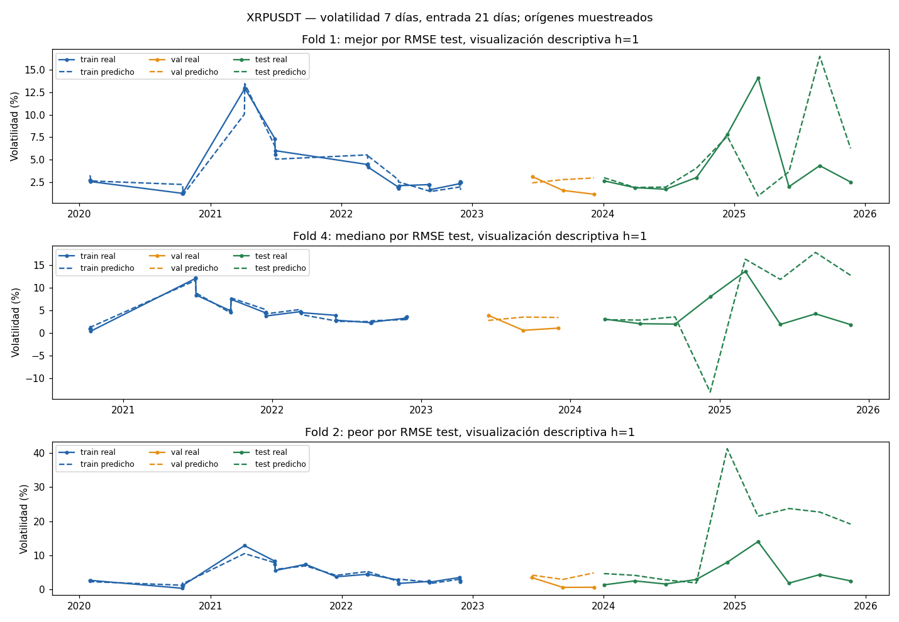

### Entrada de 28 días

| fold | n | mape | mae | rmse | mse | bds_pvalue |
| --- | --- | --- | --- | --- | --- | --- |
| 1 | 9 | 276.65744 | 8.48694 | 12.78662 | 172.94082 | 0.00000 |
| 2 | 9 | 486.94115 | 16.75633 | 23.40325 | 554.21259 | 0.00000 |
| 3 | 8 | 228.32280 | 6.83158 | 8.84480 | 82.98508 | 0.22648 |
| 4 | 8 | 246.71679 | 7.58088 | 9.99011 | 102.04409 | 0.00428 |
| 5 | 8 | 236.40849 | 5.66228 | 7.19393 | 53.92863 | 0.00000 |
| Mean ± Std | 8.40000 ± 0.54772 | 295.00933 ± 108.84385 | 9.06360 ± 4.42323 | 12.44374 ± 6.45681 | 193.22224 ± 206.51499 | 0.04615 ± 0.10082 |

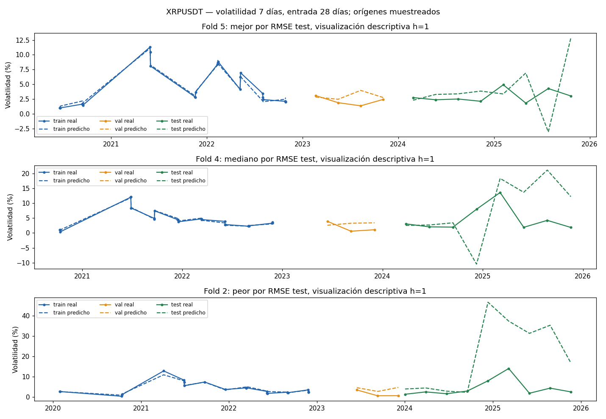

Con la entrada seleccionada, RMSE SVR=9.78647 frente a Persistence=2.06372. SVR no mejora la referencia en este resumen de test. No se extrapola esta diferencia a significancia estadística ni a objetivos de otra ventana.

## XRPUSDT: volatilidad de 14 días

Entrada elegida con validación: **14 días**, C=10, epsilon=0.01.

| input_window | model | mape | mae | rmse | mse |
| --- | --- | --- | --- | --- | --- |
| 7 | Persistence | 14.11664 | 0.50661 | 0.72504 | 0.84581 |
| 7 | SVR | 169.60233 | 6.74291 | 9.25179 | 100.23487 |
| 14 | Persistence | 14.11664 | 0.50661 | 0.72504 | 0.84581 |
| 14 | SVR | 147.90679 | 6.10930 | 8.62323 | 84.52802 |
| 21 | Persistence | 14.11664 | 0.50661 | 0.72504 | 0.84581 |
| 21 | SVR | 164.37490 | 6.47690 | 8.93133 | 84.09057 |
| 28 | Persistence | 14.11664 | 0.50661 | 0.72504 | 0.84581 |
| 28 | SVR | 179.62103 | 7.19018 | 9.98658 | 110.73390 |

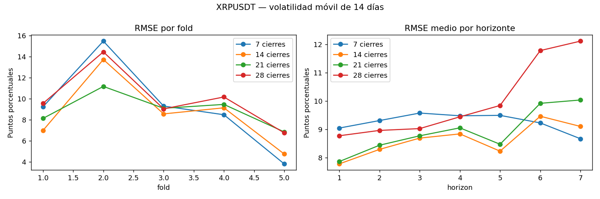

### Entrada de 7 días

| fold | n | mape | mae | rmse | mse | bds_pvalue |
| --- | --- | --- | --- | --- | --- | --- |
| 1 | 9 | 189.75818 | 6.91441 | 9.23169 | 87.77046 | 0.17266 |
| 2 | 9 | 224.24961 | 10.42944 | 15.47043 | 240.13539 | 0.70132 |
| 3 | 8 | 180.84883 | 7.37296 | 9.29226 | 86.56140 | 0.00000 |
| 4 | 8 | 161.72799 | 6.29950 | 8.46952 | 72.09999 | 0.00000 |
| 5 | 8 | 91.42704 | 2.69823 | 3.79503 | 14.60712 | 0.01242 |
| Mean ± Std | 8.40000 ± 0.54772 | 169.60233 ± 49.22511 | 6.74291 ± 2.76464 | 9.25179 ± 4.15517 | 100.23487 ± 83.72300 | 0.17728 ± 0.30194 |

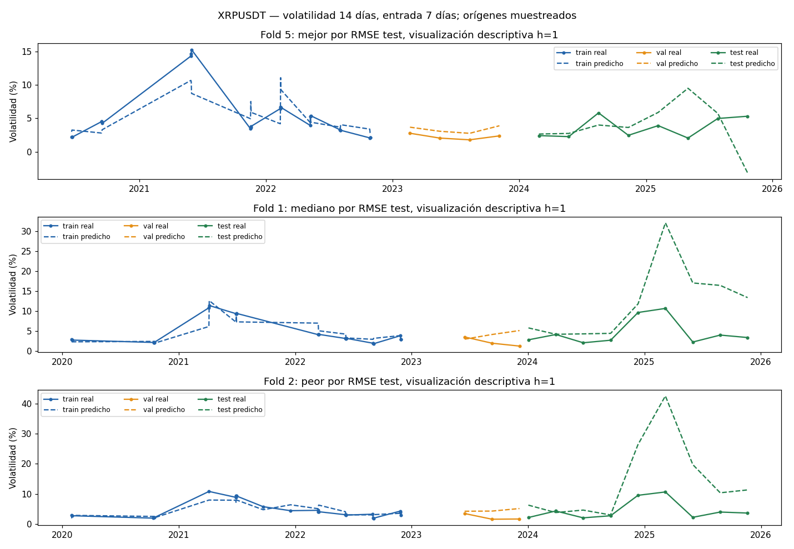

### Entrada de 14 días

| fold | n | mape | mae | rmse | mse | bds_pvalue |
| --- | --- | --- | --- | --- | --- | --- |
| 1 | 9 | 95.42687 | 4.26546 | 6.98253 | 49.09777 | 0.10633 |
| 2 | 9 | 247.23676 | 10.26948 | 13.72033 | 193.49812 | 0.00000 |
| 3 | 8 | 149.43305 | 6.07630 | 8.54943 | 73.77502 | 0.47157 |
| 4 | 8 | 141.90418 | 6.15134 | 9.12756 | 83.75063 | 0.47157 |
| 5 | 8 | 105.53308 | 3.78394 | 4.73632 | 22.51857 | 0.00566 |
| Mean ± Std | 8.40000 ± 0.54772 | 147.90679 ± 60.11339 | 6.10930 ± 2.55524 | 8.62323 ± 3.31814 | 84.52802 ± 65.36664 | 0.21102 ± 0.24157 |

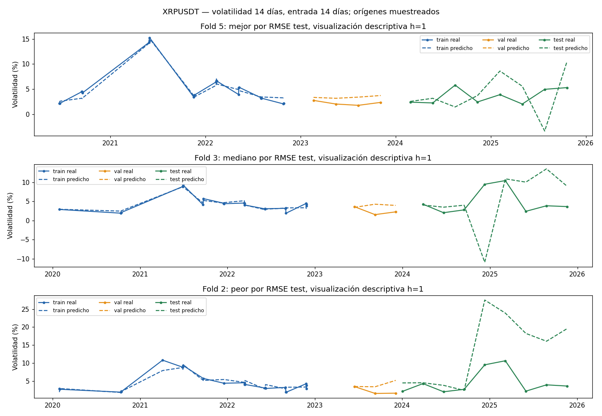

### Entrada de 21 días

| fold | n | mape | mae | rmse | mse | bds_pvalue |
| --- | --- | --- | --- | --- | --- | --- |
| 1 | 9 | 130.38758 | 5.59458 | 8.12358 | 66.62892 | 0.25081 |
| 2 | 9 | 215.94709 | 8.19117 | 11.16181 | 130.21977 | 0.00000 |
| 3 | 8 | 160.71922 | 6.62742 | 9.08445 | 83.54081 | 0.47157 |
| 4 | 8 | 151.02751 | 6.62506 | 9.45108 | 89.48425 | 0.47157 |
| 5 | 8 | 163.79310 | 5.34629 | 6.83570 | 50.57908 | 0.00566 |
| Mean ± Std | 8.40000 ± 0.54772 | 164.37490 ± 31.64919 | 6.47690 ± 1.12251 | 8.93133 ± 1.60567 | 84.09057 ± 29.93838 | 0.23992 ± 0.23446 |

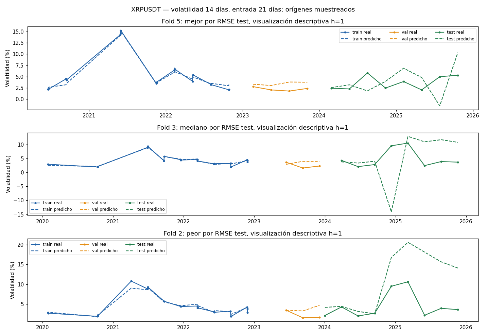

### Entrada de 28 días

| fold | n | mape | mae | rmse | mse | bds_pvalue |
| --- | --- | --- | --- | --- | --- | --- |
| 1 | 9 | 175.89363 | 6.64115 | 9.55408 | 104.16026 | 0.10633 |
| 2 | 9 | 266.91214 | 10.80503 | 14.44876 | 218.33354 | 0.49533 |
| 3 | 8 | 155.73063 | 6.58397 | 9.02530 | 82.01608 | 0.47157 |
| 4 | 8 | 163.47103 | 7.17384 | 10.15775 | 103.43231 | 0.47157 |
| 5 | 8 | 136.09771 | 4.74693 | 6.74701 | 45.72731 | 0.71039 |
| Mean ± Std | 8.40000 ± 0.54772 | 179.62103 ± 50.89078 | 7.19018 ± 2.21956 | 9.98658 ± 2.80830 | 110.73390 ± 64.66216 | 0.45104 ± 0.21731 |

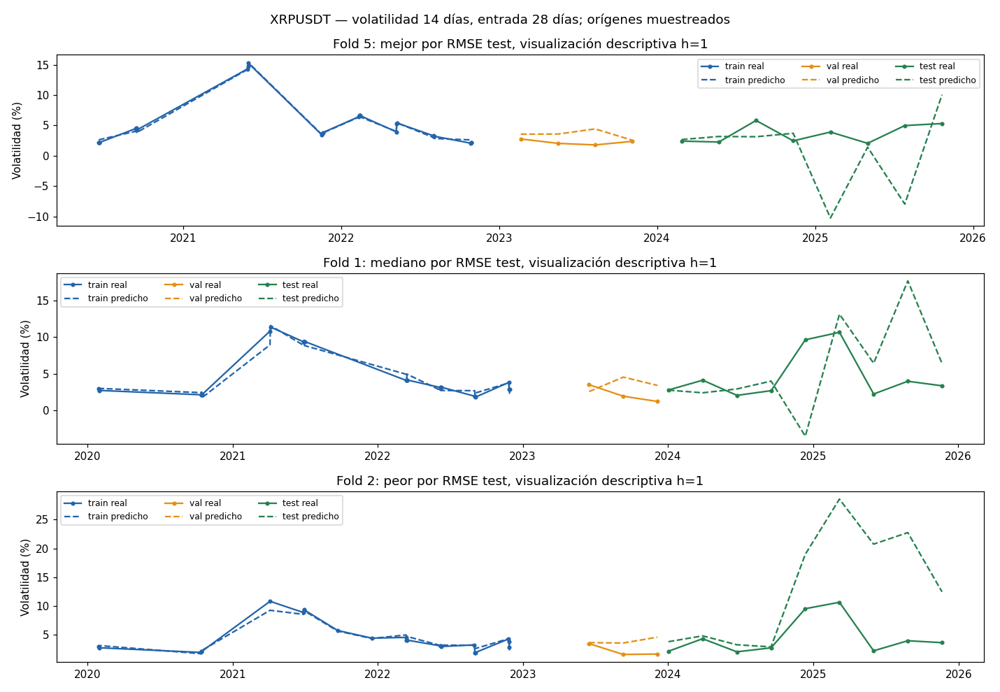

Con la entrada seleccionada, RMSE SVR=8.62323 frente a Persistence=0.72504. SVR no mejora la referencia en este resumen de test. No se extrapola esta diferencia a significancia estadística ni a objetivos de otra ventana.

## XRPUSDT: volatilidad de 21 días

Entrada elegida con validación: **28 días**, C=10, epsilon=0.01.

| input_window | model | mape | mae | rmse | mse |
| --- | --- | --- | --- | --- | --- |
| 7 | Persistence | 11.07630 | 0.40661 | 0.58286 | 0.45676 |
| 7 | SVR | 145.67417 | 5.82608 | 7.50914 | 63.93622 |
| 14 | Persistence | 11.07630 | 0.40661 | 0.58286 | 0.45676 |
| 14 | SVR | 137.83783 | 5.41329 | 7.19524 | 66.50573 |
| 21 | Persistence | 11.07630 | 0.40661 | 0.58286 | 0.45676 |
| 21 | SVR | 141.69352 | 5.88858 | 7.39025 | 58.09794 |
| 28 | Persistence | 11.07630 | 0.40661 | 0.58286 | 0.45676 |
| 28 | SVR | 170.19938 | 7.01566 | 9.06631 | 90.99894 |

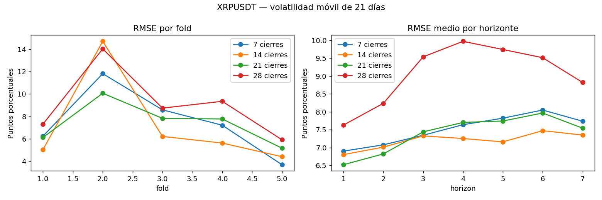

### Entrada de 7 días

| fold | n | mape | mae | rmse | mse | bds_pvalue |
| --- | --- | --- | --- | --- | --- | --- |
| 1 | 9 | 131.80421 | 4.79571 | 6.24309 | 39.43023 | 0.65936 |
| 2 | 9 | 195.14435 | 8.68768 | 11.80939 | 140.25600 | 0.00638 |
| 3 | 8 | 167.86795 | 7.04987 | 8.58224 | 73.93797 | 0.00000 |
| 4 | 8 | 146.20279 | 5.85522 | 7.21449 | 52.33746 | 0.00000 |
| 5 | 8 | 87.35153 | 2.74194 | 3.69647 | 13.71941 | 0.12509 |
| Mean ± Std | 8.40000 ± 0.54772 | 145.67417 ± 40.41673 | 5.82608 ± 2.25060 | 7.50914 ± 2.99457 | 63.93622 ± 47.91019 | 0.15817 ± 0.28520 |

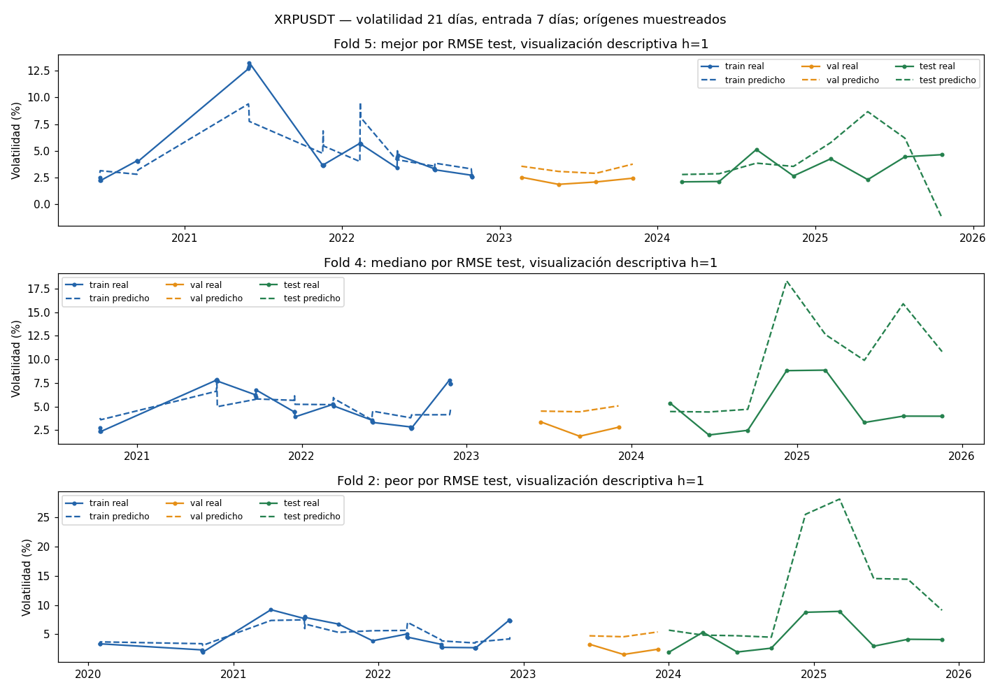

### Entrada de 14 días

| fold | n | mape | mae | rmse | mse | bds_pvalue |
| --- | --- | --- | --- | --- | --- | --- |
| 1 | 9 | 94.46696 | 3.69412 | 5.04211 | 25.71795 | 0.00000 |
| 2 | 9 | 237.57151 | 10.47133 | 14.68717 | 216.76342 | 0.79857 |
| 3 | 8 | 138.85617 | 4.91224 | 6.21424 | 38.62873 | 0.00000 |
| 4 | 8 | 121.85886 | 4.37873 | 5.62462 | 31.75937 | 0.00000 |
| 5 | 8 | 96.43563 | 3.61005 | 4.40805 | 19.65919 | 0.00566 |
| Mean ± Std | 8.40000 ± 0.54772 | 137.83783 ± 58.73318 | 5.41329 ± 2.87717 | 7.19524 ± 4.24154 | 66.50573 ± 84.29124 | 0.16085 ± 0.35651 |

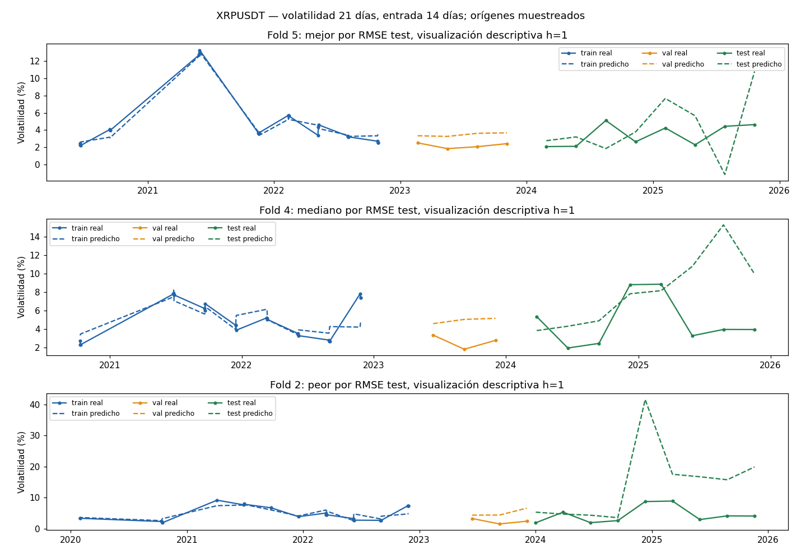

### Entrada de 21 días

| fold | n | mape | mae | rmse | mse | bds_pvalue |
| --- | --- | --- | --- | --- | --- | --- |
| 1 | 9 | 119.77567 | 4.87519 | 6.12379 | 37.89864 | 0.79857 |
| 2 | 9 | 188.91118 | 7.80776 | 10.06132 | 102.21544 | 0.35429 |
| 3 | 8 | 147.87871 | 6.43248 | 7.82861 | 61.49067 | 0.05073 |
| 4 | 8 | 139.06618 | 6.25420 | 7.76992 | 60.54875 | 0.47157 |
| 5 | 8 | 112.83589 | 4.07325 | 5.16762 | 28.33621 | 0.46547 |
| Mean ± Std | 8.40000 ± 0.54772 | 141.69352 ± 29.94921 | 5.88858 ± 1.45216 | 7.39025 ± 1.87182 | 58.09794 ± 28.53789 | 0.42813 ± 0.26851 |

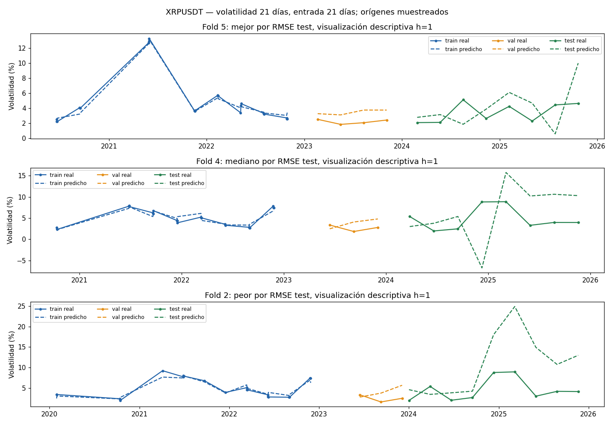

### Entrada de 28 días

| fold | n | mape | mae | rmse | mse | bds_pvalue |
| --- | --- | --- | --- | --- | --- | --- |
| 1 | 9 | 144.19857 | 5.21663 | 7.31650 | 55.81333 | 0.85677 |
| 2 | 9 | 255.85862 | 10.76778 | 14.01540 | 199.49126 | 0.00000 |
| 3 | 8 | 172.66443 | 7.26210 | 8.73807 | 76.89045 | 0.00002 |
| 4 | 8 | 175.23476 | 7.72639 | 9.34437 | 87.58645 | 0.16931 |
| 5 | 8 | 103.04051 | 4.10539 | 5.91720 | 35.21319 | 0.00477 |
| Mean ± Std | 8.40000 ± 0.54772 | 170.19938 ± 56.02520 | 7.01566 ± 2.56664 | 9.06631 ± 3.06827 | 90.99894 ± 63.89709 | 0.20617 ± 0.37088 |

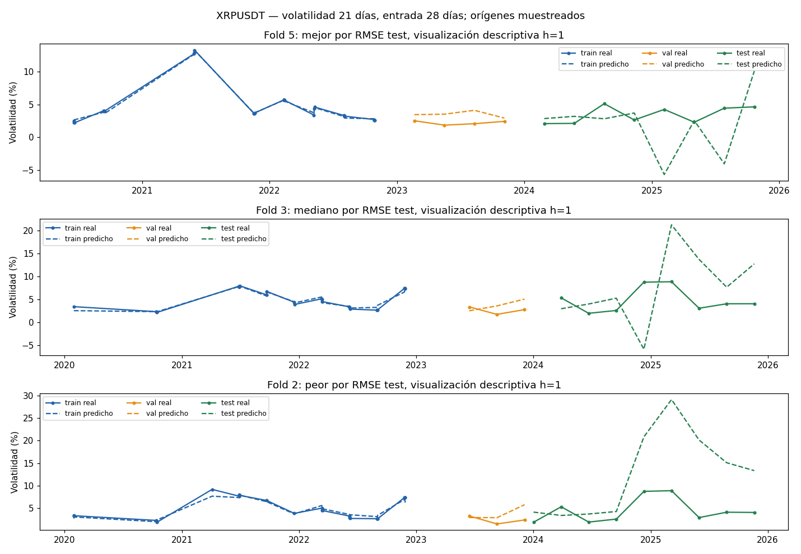

Con la entrada seleccionada, RMSE SVR=9.06631 frente a Persistence=0.58286. SVR no mejora la referencia en este resumen de test. No se extrapola esta diferencia a significancia estadística ni a objetivos de otra ventana.

## XRPUSDT: volatilidad de 28 días

Entrada elegida con validación: **28 días**, C=10, epsilon=0.01.

| input_window | model | mape | mae | rmse | mse |
| --- | --- | --- | --- | --- | --- |
| 7 | Persistence | 5.98176 | 0.26558 | 0.40955 | 0.27276 |
| 7 | SVR | 118.79423 | 4.93330 | 6.14802 | 43.53793 |
| 14 | Persistence | 5.98176 | 0.26558 | 0.40955 | 0.27276 |
| 14 | SVR | 125.23483 | 5.01775 | 6.52765 | 56.14481 |
| 21 | Persistence | 5.98176 | 0.26558 | 0.40955 | 0.27276 |
| 21 | SVR | 120.49104 | 5.16028 | 6.22852 | 41.90998 |
| 28 | Persistence | 5.98176 | 0.26558 | 0.40955 | 0.27276 |
| 28 | SVR | 132.62896 | 5.77367 | 7.13051 | 58.81983 |

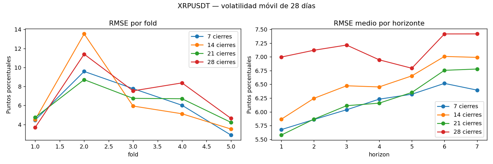

### Entrada de 7 días

| fold | n | mape | mae | rmse | mse | bds_pvalue |
| --- | --- | --- | --- | --- | --- | --- |
| 1 | 9 | 91.50663 | 3.35439 | 4.47140 | 20.02895 | 0.03032 |
| 2 | 9 | 163.42908 | 7.41265 | 9.58196 | 92.30266 | 0.35429 |
| 3 | 8 | 148.16755 | 6.42689 | 7.77417 | 60.52314 | 0.00000 |
| 4 | 8 | 126.95942 | 5.16768 | 6.02207 | 36.44216 | 0.00000 |
| 5 | 8 | 63.90847 | 2.30489 | 2.89049 | 8.39276 | 0.00000 |
| Mean ± Std | 8.40000 ± 0.54772 | 118.79423 ± 40.86194 | 4.93330 ± 2.11154 | 6.14802 ± 2.63982 | 43.53793 ± 33.55854 | 0.07692 ± 0.15561 |

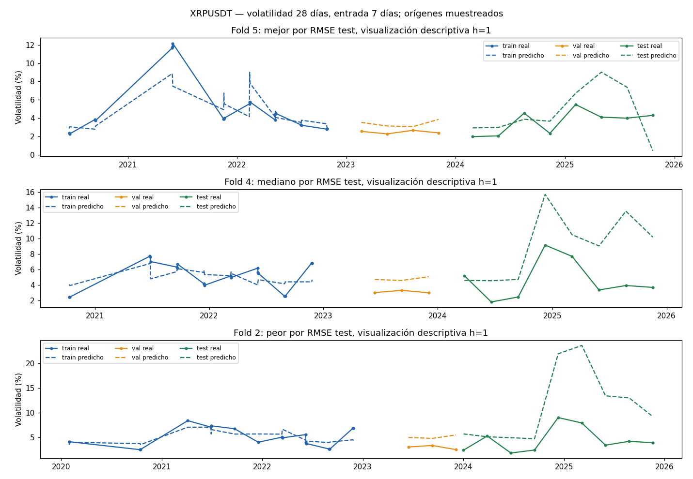

### Entrada de 14 días

| fold | n | mape | mae | rmse | mse | bds_pvalue |
| --- | --- | --- | --- | --- | --- | --- |
| 1 | 9 | 98.77975 | 3.55403 | 4.51706 | 20.56944 | 0.00000 |
| 2 | 9 | 206.68107 | 9.65700 | 13.52853 | 185.95502 | 0.07687 |
| 3 | 8 | 131.23119 | 4.87094 | 5.94051 | 35.31467 | 0.00000 |
| 4 | 8 | 113.57621 | 4.04022 | 5.12863 | 26.31823 | 0.00000 |
| 5 | 8 | 75.90591 | 2.96656 | 3.52353 | 12.56667 | 0.00000 |
| Mean ± Std | 8.40000 ± 0.54772 | 125.23483 ± 49.84622 | 5.01775 ± 2.68559 | 6.52765 ± 4.01190 | 56.14481 ± 73.03915 | 0.01537 ± 0.03438 |

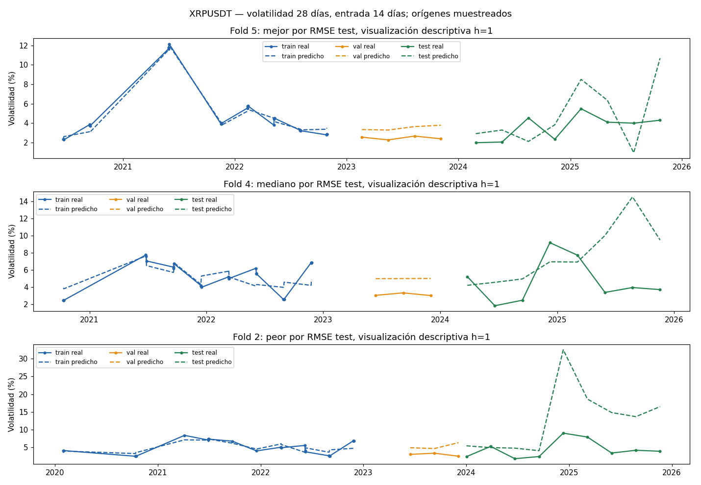

### Entrada de 21 días

| fold | n | mape | mae | rmse | mse | bds_pvalue |
| --- | --- | --- | --- | --- | --- | --- |
| 1 | 9 | 95.69073 | 3.85451 | 4.74031 | 22.54395 | 0.53943 |
| 2 | 9 | 159.23473 | 7.03774 | 8.71683 | 77.45429 | 0.19245 |
| 3 | 8 | 135.53499 | 5.93670 | 6.74959 | 45.62551 | 0.07776 |
| 4 | 8 | 125.34069 | 5.64658 | 6.71008 | 45.18599 | 0.41560 |
| 5 | 8 | 86.65406 | 3.32589 | 4.22580 | 18.74016 | 0.00081 |
| Mean ± Std | 8.40000 ± 0.54772 | 120.49104 ± 29.62646 | 5.16028 ± 1.53575 | 6.22852 ± 1.79727 | 41.90998 ± 23.45111 | 0.24521 ± 0.22702 |

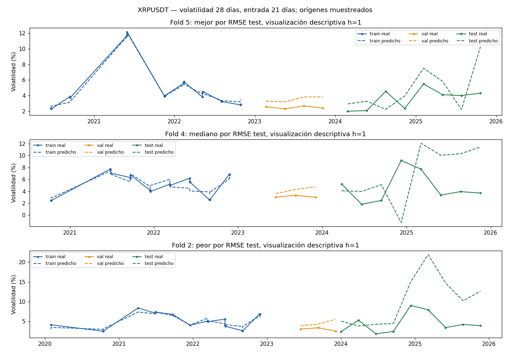

### Entrada de 28 días

| fold | n | mape | mae | rmse | mse | bds_pvalue |
| --- | --- | --- | --- | --- | --- | --- |
| 1 | 9 | 67.72603 | 2.82775 | 3.69690 | 13.82287 | 0.79857 |
| 2 | 9 | 199.72146 | 8.99064 | 11.39656 | 131.21707 | 0.00000 |
| 3 | 8 | 149.57650 | 6.49338 | 7.53790 | 56.98830 | 0.00002 |
| 4 | 8 | 160.19990 | 7.16442 | 8.37482 | 70.32406 | 0.03177 |
| 5 | 8 | 85.92088 | 3.39214 | 4.64637 | 21.74686 | 0.00000 |
| Mean ± Std | 8.40000 ± 0.54772 | 132.62896 ± 54.64159 | 5.77367 ± 2.60534 | 7.13051 ± 3.07710 | 58.81983 ± 46.84067 | 0.16607 ± 0.35384 |

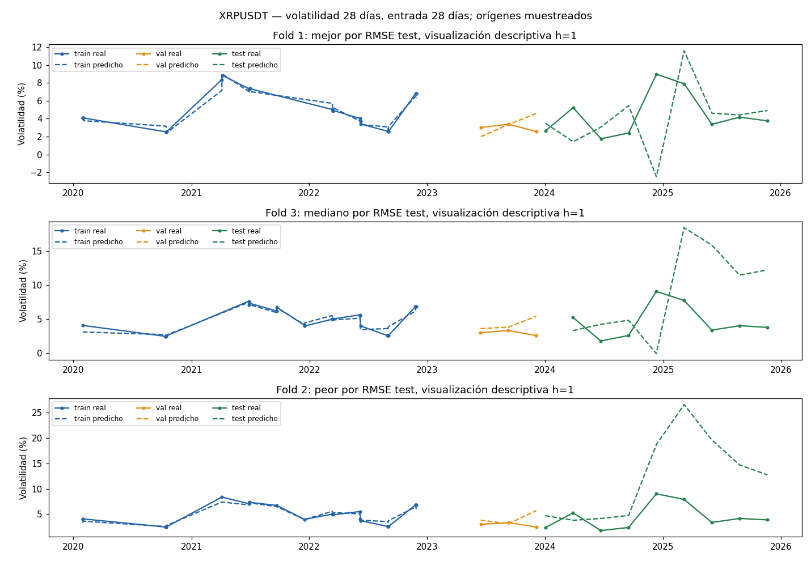

Con la entrada seleccionada, RMSE SVR=7.13051 frente a Persistence=0.40955. SVR no mejora la referencia en este resumen de test. No se extrapola esta diferencia a significancia estadística ni a objetivos de otra ventana.
