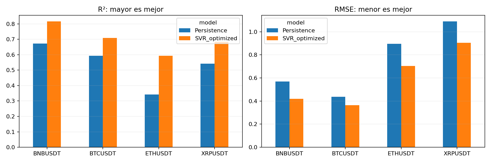

# Entregable 1: predicción de volatilidad con SVR lineal

**Jassan Arteta y Mateo Bernal**  
Universidad del Norte · Maestría en Matemáticas · Machine Learning · Profesor Lihki Rubio · 2026-30

## Objetivo y datos

Se predice la volatilidad de BTCUSDT, ETHUSDT, BNBUSDT y XRPUSDT para los siguientes siete días. El periodo es **1 de enero de 2023 a 31 de diciembre de 2025, UTC**. La fuente es Binance, con cierres de **un minuto**. Se conservan 1.578.159 observaciones válidas por activo y 81 minutos faltantes; el día incompleto es el 24 de marzo de 2023. Se excluyen las ventanas afectadas, sin interpolación.

La frecuencia de adquisición es un minuto, la construcción de características resume información intradía y cada muestra supervisada se origina al cierre de un día UTC. Por tanto, millones de observaciones de minuto no equivalen a millones de ejemplos de entrenamiento. Las fechas se etiquetan por el día cuyo cierre ya se conoce.

(seleccion-dataset)=
## Pregunta de investigación y selección del dataset

¿Puede un modelo clásico que utiliza información histórica diaria e intradía reducir el error de pronóstico de volatilidad a uno–siete días frente a repetir la volatilidad actual? La comparación se realiza por activo, ventana objetivo y horizonte, con selección temporal en 2024 y evaluación retrospectiva en 2025.

Binance Vision permite reconstruir cierres y retornos con una fuente homogénea y archivos verificables mediante SHA-256. La frecuencia de minuto aporta medidas de variación intradía que los cierres diarios por sí solos no contienen. Se utiliza el mismo mercado spot y denominador USDT para mantener consistente la interpretación de precios. BTC, ETH, BNB y XRP constituyen la muestra disponible y comparable del proyecto; no se afirma que representen todo el mercado ni que su selección resulte de un ranking de liquidez. SOL queda fuera del comparativo porque no tiene datos y resultados equivalentes en los artefactos vigentes.

El periodo 2023–2025 permite separar un primer año de historia, un año de selección y un año de evaluación. Es una decisión de diseño del estudio y no demuestra estabilidad entre regímenes. Las ventanas de 7, 14, 21 y 28 días comparan definiciones semanales de volatilidad. Los resultados se limitan a estos activos, esta fuente y este periodo; la cotización USDT tampoco equivale automáticamente a dólares estadounidenses.

(fuente-licencia)=
## Fuente, condiciones de uso y atribución

Fuente: [Binance Vision](https://data.binance.vision/), archivos spot mensuales de klines de un minuto. La [documentación oficial](https://github.com/binance/binance-public-data) describe campos, intervalos, checksums y el cambio a timestamps en microsegundos desde enero de 2025. Los scripts convierten las fechas a UTC y conservan hashes para identificar la versión descargada.

Consulta documental: **3 de octubre de 2026**. Los [Binance Vision Dataset Terms](https://github.com/binance/binance-public-data/blob/master/TERMS_AND_CONDITIONS.md), versión 1.0, actualizados el 26 de agosto de 2026, establecen CC BY-NC-SA 4.0 salvo designación distinta. Incluyen investigación académica no comercial y requieren atribución y compartir bajo la misma licencia las obras derivadas redistribuidas. La mención MIT del repositorio no se utiliza como licencia del dataset.

Atribución para esta entrega: **Datos de mercado: Binance Vision; procesamiento y análisis: Jassan Arteta y Mateo Bernal.** Las transformaciones incluyen selección de cierres, agregación diaria, cálculo de retornos y construcción de características y objetivos. No se atribuye patrocinio de Binance. Queda pendiente conservar evidencia de los términos aplicables en la fecha de descarga: los términos actuales indican que sus cambios no alteran los derechos de descargas anteriores. Esta consulta documenta las condiciones publicadas actualmente y no certifica la licencia histórica de cada archivo.

(diccionario-variables)=
## Estructura y diccionario de variables

La estructura es un panel temporal multiactivo: la observación original es un activo–minuto UTC y la muestra supervisada es un activo–día de origen. La clave conceptual es `(symbol, timestamp)` en minuto y `(symbol, origin)` en el modelo. El archivo diario usa formato ancho: una fila por fecha y una columna de cierre por activo. Los modelos se ajustan por activo y configuración; no se presume independencia entre activos, días u objetivos superpuestos. No hay coordenadas ni componente espacial geográfico.

En las siguientes definiciones, los retornos diarios y de minuto se expresan como `100 × log(P_actual/P_anterior)`, y `b_t = max(volatilidad_actual, 1e-8)`. Las seis características se repiten con rezagos `k = 0,…,L−1`; todos se normalizan con la base del origen actual `b_t`.

| Variable | Tipo | Unidad | Significado y disponibilidad |
| --- | --- | --- | --- |
| `symbol` | Categórica | Identificador | BTCUSDT, ETHUSDT, BNBUSDT o XRPUSDT; identifica el par spot. |
| Timestamp de minuto | Fecha y hora | UTC | Inicio del intervalo de adquisición; el cierre se conoce al terminar ese minuto. |
| `date` / `origin` | Fecha | Día UTC | Día cuyo cierre ya está disponible; origen del pronóstico. |
| Cierre de minuto | Numérica continua | USDT por unidad del activo | Último precio del intervalo; arrays `.npy` por activo. |
| Cierre diario `P_t` | Numérica continua | USDT por unidad del activo | Último cierre del día completo; un día incompleto permanece faltante. |
| Retorno diario `r_t` | Numérica continua | Porcentaje logarítmico | Cambio entre cierres diarios consecutivos. |
| Volatilidad histórica `sigma_t` | Numérica continua | Puntos porcentuales | Desviación poblacional de los últimos `w` retornos diarios, sin anualizar. |
| `retorno_diario_relativo` | Numérica continua | Adimensional | Retorno del día rezagado dividido por `b_t`. |
| `retorno_cuadrado_relativo` | Numérica continua | Adimensional | Retorno diario al cuadrado dividido por `b_t²`. |
| `volatilidad_minuto_relativa` | Numérica continua | Adimensional | Raíz de la suma de cuadrados de retornos de minuto del día, dividida por `b_t`. |
| `retorno_absoluto_minuto_relativo` | Numérica continua | Adimensional | Suma de retornos de minuto absolutos dividida por `sqrt(1440)` y por `b_t`. |
| `volatilidad_negativa_relativa` | Numérica continua | Adimensional | Raíz de la suma de cuadrados de la parte negativa de retornos de minuto, dividida por `b_t`. |
| `max_retorno_minuto_relativo` | Numérica continua | Adimensional | Máximo retorno de minuto absoluto del día, dividido por `b_t`. |
| `decaimiento_conocido_h1` … `h7` | Numérica continua | Adimensional | Referencia de cambio relativo por salida de retornos antiguos; fórmula descrita en preprocesamiento. Solo usa historia conocida. |
| Objetivo `y_t,h` | Numérica continua | Puntos porcentuales | Volatilidad diaria móvil en `t+h`; disponible posteriormente, no como predictor. |
| Objetivo transformado `z_t,h` | Numérica continua | Adimensional | `y_t,h / b_t − 1`; se utiliza para ajustar el regresor. |
| `volatility_window` / `input_window` | Entera | Días | Ventana del objetivo `w` y cantidad de días de entrada `L`. |
| `horizon` | Entera | Días | Distancia futura de la salida, de 1 a 7. |

El diccionario cubre las entradas del SVR lineal, con dimensión `6L+7`. Los archivos originales contienen otros campos OHLCV; volumen y rango OHLC no forman parte del dataset procesado compartido.

## Retornos, volatilidad y salidas

Sean $P_t$ el último cierre del día y $r_t=\ln(P_t/P_{t-1})$. El objetivo es

$$
\sigma_t^{(w)}=100\sqrt{\frac{1}{w}\sum_{j=0}^{w-1}(r_{t-j}-\bar r_t)^2},\qquad w\in\{7,14,21,28\}.
$$

Se usa `rolling(w).std(ddof=0)`, sin anualizar. Cada salida es $(\sigma_{t+1}^{(w)},\ldots,\sigma_{t+7}^{(w)})$. La volatilidad realizada de los retornos por minuto se emplea como característica; el objetivo sigue siendo la volatilidad de retornos diarios. Son definiciones diferentes.

## Exploración y calidad


descriptive_statistics.csv contiene estadísticas de cierres y retornos de un minuto y de retornos diarios.
Las figuras usan cierres diarios para legibilidad y la frecuencia diaria del objetivo para los diagnósticos.
Los huecos se mantienen; la ACF usa tratamiento conservador de faltantes. La ACF de cuadrados permite inspeccionar
dependencia en la magnitud de los retornos, sin demostrar por sí sola un modelo de heterocedasticidad.

- **BTCUSDT:** 1,578,159 cierres de minuto válidos y 81 faltantes. Los retornos logarítmicos diarios tienen desviación estándar de 2.42 %, mínimo -8.93 % y máximo 11.23 %. Los extremos justifican comparar errores cuadrados con MAE, menos sensible a valores extremos.
- **ETHUSDT:** 1,578,159 cierres de minuto válidos y 81 faltantes. Los retornos logarítmicos diarios tienen desviación estándar de 3.28 %, mínimo -15.85 % y máximo 19.79 %. Los extremos justifican comparar errores cuadrados con MAE, menos sensible a valores extremos.
- **BNBUSDT:** 1,578,159 cierres de minuto válidos y 81 faltantes. Los retornos logarítmicos diarios tienen desviación estándar de 2.71 %, mínimo -12.99 % y máximo 15.96 %. Los extremos justifican comparar errores cuadrados con MAE, menos sensible a valores extremos.
- **XRPUSDT:** 1,578,159 cierres de minuto válidos y 81 faltantes. Los retornos logarítmicos diarios tienen desviación estándar de 4.25 %, mínimo -20.81 % y máximo 54.87 %. Los extremos justifican comparar errores cuadrados con MAE, menos sensible a valores extremos.


La exploración de 2023–2025 es descriptiva y retrospectiva. Los extremos y la dependencia en retornos al cuadrado motivan estudiar volatilidad y comparar contra persistencia, pero no garantizan capacidad predictiva. Los escaladores y la selección del modelo utilizan únicamente los periodos de desarrollo correspondientes a cada corte.

(hallazgos-decisiones)=
### Relación entre hallazgos y decisiones

Los huecos motivan mantener el calendario y excluir muestras afectadas, sin interpolar precios. Los extremos de retorno motivan informar MAE junto con errores cuadrados, sin eliminar automáticamente movimientos de mercado reales. La dependencia temporal motiva validación creciente y separación de etiquetas; las correlaciones son descriptivas y no justifican causalidad. La comparación con persistencia mide si las características aportan información frente a la continuidad del nivel actual.

La descarga implementa controles de orden, duplicados, precios finitos positivos, alineación de timestamps y días completos. Un control implementado no sustituye un informe de ejecución sobre todos los archivos vigentes. Para cerrar la auditoría de calidad falta consolidar esos resultados por activo y archivo, con conteos antes y después de cada exclusión y análisis de sensibilidad a extremos. No se atribuyen al dataset de minuto los diagnósticos de versiones históricas de otra frecuencia.

(reserva-test)=
## Reserva del test y alcance de la evaluación

2025 ya se exploró en experimentos anteriores y el EDA publicado incluye 2023–2025. Por ello, no se acredita una reserva inicial intacta del test. La selección programada utiliza 2024 y el escalado se ajusta dentro de cada entrenamiento, pero estos controles no revierten el conocimiento previo de 2025. Los resultados de ese año se presentan como retrospectivos.

Para cerrar este requisito se debe fijar previamente el procedimiento completo —activos, variables, ventanas, hiperparámetros, métricas y exclusiones— y evaluarlo una sola vez en un periodo con objetivos completos que nunca haya intervenido en exploración o decisiones. No se declara aquí un periodo nuevo como independiente ni una evaluación realizada. El estudio compara el modelo base de persistencia con el SVR lineal.

## Preprocesamiento y características

Se prueban ventanas de entrada de **7, 14, 21 y 28 días**. Para cada día de la ventana se incluyen seis características: retorno diario, su cuadrado, raíz de la suma de cuadrados de todos los retornos por minuto, suma absoluta de retornos por minuto dividida por la raíz de 1.440, semivolatilidad negativa y máximo retorno absoluto por minuto. Se normalizan por la volatilidad actual conocida, o su cuadrado según la unidad.

Se añaden siete características que describen el efecto de la salida de retornos antiguos de la ventana objetivo. Para horizonte $h$, se conservan los $w-h$ retornos diarios más recientes y se supone varianza futura igual a la actual para construir una referencia. Esta operación usa únicamente retornos ya observados; no utiliza el valor futuro del objetivo.

En unidades porcentuales, con $b_t=\max(\sigma_t^{(w)},10^{-8})$, suma $S$ y suma de cuadrados $Q$ de esos retornos retenidos, la característica es

$$
\frac{\sqrt{\max((Q+h b_t^2)/w-(S/w)^2,0)}}{b_t}-1.
$$

La dimensión es **6L+7**: 49, 91, 133 o 175 características según la ventana. Este cambio sustituye las 10.080–40.320 columnas de precios del experimento original por características derivadas de los datos de un minuto. La volatilidad actual y las características de salida de la ventana requieren además la historia de la definición objetivo, de hasta 28 retornos diarios. El calendario común exige suficiente historia para la ventana máxima y siete objetivos completos.

## Modelo y justificación

Se mantienen siete regresores **LinearSVR**, uno por horizonte, mediante `MultiOutputRegressor`. Cada uno aprende la corrección relativa $z_{t,h}=\sigma_{t+h}/b_t-1$; la predicción final es $\max(b_t(1+\hat z_{t,h}),0)$. El recorte a cero forma parte del procedimiento evaluado. La persistencia repite la volatilidad actual en las siete salidas.

Esta representación reduce la dependencia del nivel nominal del precio y permite al SVR aprender cuándo corregir persistencia. Se ajustan los escaladores de entradas y objetivos exclusivamente dentro de cada entrenamiento. El modelo es lineal respecto a las características transformadas; el procesamiento completo incorpora transformaciones no lineales.

Se usa pérdida `squared_epsilon_insensitive`, `dual=False`, tolerancia 1e-6, máximo 50.000 iteraciones y semilla 42. La búsqueda evalúa C en {0,0001; 0,001; 0,01; 0,1; 1} y epsilon en {0,01; 0,1}, además de las cuatro entradas: **640 candidatos**, cada uno evaluado en seis cortes. Las advertencias de falta de convergencia interrumpen el ajuste.

## Split temporal y validación con tsxv

Se usa `timeseries-cv==0.1.5`, desarrollado con la coautoría de Filipe Roberto Ramos. Se ejecutan las funciones nativas `split_train_val_forwardChaining`, `split_train_val_kFold` y `split_train_val_groupKFold` sobre índices diarios del calendario de 2023–2024. Los índices se vinculan a características de datos por minuto y objetivos diarios; no se interpretan siete minutos como siete días.

La auditoría conserva los cortes nativos:

| method | cortes | cortes_con_futuro |
| --- | --- | --- |
| forwardChaining | 668 | 0 |
| groupKFold | 5 | 5 |
| kFold | 668 | 640 |

K-Fold y Group K-Fold contienen entrenamiento posterior a algunas fechas de validación. Se documentan como diagnóstico y se excluyen de la selección del pronóstico. No se convierten mediante agrupación en una copia de Forward Chaining ni se presentan como tres evaluaciones temporales equivalentes.

El método principal conserva seis cortes de entrenamiento nativos de Forward Chaining, con inicio de validación en enero, marzo, mayo, julio, septiembre y noviembre de 2024. Cada validación se extiende a dos meses; este adaptador se declara explícitamente. El entrenamiento crece y sus etiquetas terminan antes del inicio de cada validación. Se mantienen las restricciones conservadoras de separación de la biblioteca. Los últimos siete días de 2024 no se usan como orígenes de validación porque sus objetivos entrarían en 2025.

| fold | split | n | first | last |
| --- | --- | --- | --- | --- |
| 1 | train | 274 | 2023-01-29 00:00:00+00:00 | 2023-12-04 00:00:00+00:00 |
| 1 | validation | 60 | 2024-01-01 00:00:00+00:00 | 2024-02-29 00:00:00+00:00 |
| 2 | train | 334 | 2023-01-29 00:00:00+00:00 | 2024-02-02 00:00:00+00:00 |
| 2 | validation | 61 | 2024-03-01 00:00:00+00:00 | 2024-04-30 00:00:00+00:00 |
| 3 | train | 395 | 2023-01-29 00:00:00+00:00 | 2024-04-03 00:00:00+00:00 |
| 3 | validation | 61 | 2024-05-01 00:00:00+00:00 | 2024-06-30 00:00:00+00:00 |
| 4 | train | 456 | 2023-01-29 00:00:00+00:00 | 2024-06-03 00:00:00+00:00 |
| 4 | validation | 62 | 2024-07-01 00:00:00+00:00 | 2024-08-31 00:00:00+00:00 |
| 5 | train | 518 | 2023-01-29 00:00:00+00:00 | 2024-08-04 00:00:00+00:00 |
| 5 | validation | 61 | 2024-09-01 00:00:00+00:00 | 2024-10-31 00:00:00+00:00 |
| 6 | train | 579 | 2023-01-29 00:00:00+00:00 | 2024-10-04 00:00:00+00:00 |
| 6 | validation | 54 | 2024-11-01 00:00:00+00:00 | 2024-12-24 00:00:00+00:00 |

Se seleccionan C, epsilon y entrada por el RMSE conjunto de las predicciones fuera de muestra de 2024, promediando los siete RMSE por horizonte. Se fijan las 16 configuraciones antes de evaluar 2025. El ajuste final usa todas las muestras elegibles cuyas etiquetas terminan antes de 2025 y permanece fijo durante la prueba. La prueba contiene **358 orígenes diarios** y **40.096 valores pronosticados**.

## Selección y contraste en validación

| symbol | volatility_window | input_window | C | epsilon | validation_rmse |
| --- | --- | --- | --- | --- | --- |
| BTCUSDT | 7 | 14 | 0.001 | 0.01 | 0.72018 |
| BTCUSDT | 14 | 14 | 0.001 | 0.01 | 0.38693 |
| BTCUSDT | 21 | 21 | 0.001 | 0.01 | 0.27354 |
| BTCUSDT | 28 | 7 | 0.1 | 0.01 | 0.20782 |
| ETHUSDT | 7 | 21 | 0.001 | 0.01 | 0.92546 |
| ETHUSDT | 14 | 28 | 0.001 | 0.01 | 0.57944 |
| ETHUSDT | 21 | 7 | 0.01 | 0.01 | 0.39737 |
| ETHUSDT | 28 | 7 | 0.01 | 0.01 | 0.31532 |
| BNBUSDT | 7 | 21 | 0.001 | 0.01 | 0.82457 |
| BNBUSDT | 14 | 7 | 0.01 | 0.01 | 0.48086 |
| BNBUSDT | 21 | 21 | 0.001 | 0.01 | 0.32762 |
| BNBUSDT | 28 | 7 | 0.001 | 0.01 | 0.24959 |
| XRPUSDT | 7 | 14 | 0.001 | 0.01 | 1.35439 |
| XRPUSDT | 14 | 7 | 0.001 | 0.01 | 0.84652 |
| XRPUSDT | 21 | 7 | 0.0001 | 0.01 | 0.63939 |
| XRPUSDT | 28 | 7 | 0.001 | 0.01 | 0.51241 |

| symbol | volatility_window | svr_rmse | persistence_rmse |
| --- | --- | --- | --- |
| BTCUSDT | 7 | 0.72018 | 0.92859 |
| BTCUSDT | 14 | 0.38693 | 0.47452 |
| BTCUSDT | 21 | 0.27354 | 0.35376 |
| BTCUSDT | 28 | 0.20782 | 0.28442 |
| ETHUSDT | 7 | 0.92546 | 1.2107 |
| ETHUSDT | 14 | 0.57944 | 0.74367 |
| ETHUSDT | 21 | 0.39737 | 0.50431 |
| ETHUSDT | 28 | 0.31532 | 0.41457 |
| BNBUSDT | 7 | 0.82457 | 1.00883 |
| BNBUSDT | 14 | 0.48086 | 0.64359 |
| BNBUSDT | 21 | 0.32762 | 0.44948 |
| BNBUSDT | 28 | 0.24959 | 0.32945 |
| XRPUSDT | 7 | 1.35439 | 1.5476 |
| XRPUSDT | 14 | 0.84652 | 0.98402 |
| XRPUSDT | 21 | 0.63939 | 0.7044 |
| XRPUSDT | 28 | 0.51241 | 0.56346 |

Las entradas elegidas cambian con el activo y la definición de volatilidad; una ventana más larga no mejora necesariamente el pronóstico. Los C seleccionados favorecen regularización fuerte, coherente con limitar el sobreajuste.

## Resultados de prueba de 2025

### Tabla comparativa global: persistencia y SVR lineal

| Métrica | Persistencia | SVR lineal | Mejora del SVR |
| --- | --- | --- | --- |
| R² ↑ | 0.53773 | 0.70073 | +0.1630 puntos de R² |
| RMSE ↓ | 0.7477 | 0.59808 | 20.01 % menos error |
| MAE ↓ | 0.49719 | 0.41403 | 16.73 % menos error |
| MSE ↓ | 0.8282 | 0.53717 | 35.14 % menos error |
| MAPE (%) ↓ | 18.80771 | 15.63947 | 16.85 % menos error |

### Comparación por criptomoneda

| Criptomoneda | Modelo | R² ↑ | RMSE ↓ | MAE ↓ | MSE ↓ | MAPE (%) ↓ |
| --- | --- | --- | --- | --- | --- | --- |
| BNBUSDT | Persistencia | 0.67199 | 0.56963 | 0.40284 | 0.43591 | 19.38251 |
| BNBUSDT | SVR lineal | 0.81556 | 0.41915 | 0.2983 | 0.24935 | 13.72312 |
| BTCUSDT | Persistencia | 0.59362 | 0.43642 | 0.3069 | 0.25727 | 16.96313 |
| BTCUSDT | SVR lineal | 0.70947 | 0.36444 | 0.27228 | 0.18567 | 15.69366 |
| ETHUSDT | Persistencia | 0.34257 | 0.89615 | 0.61315 | 1.0904 | 19.56662 |
| ETHUSDT | SVR lineal | 0.59317 | 0.70407 | 0.50192 | 0.66455 | 16.03942 |
| XRPUSDT | Persistencia | 0.54275 | 1.0886 | 0.66589 | 1.5292 | 19.31856 |
| XRPUSDT | SVR lineal | 0.68474 | 0.90466 | 0.58362 | 1.04911 | 17.10168 |

### Interpretación de las métricas

La comparación utiliza las mismas 358 fechas de prueba de 2025 y los mismos objetivos. Persistencia repite la última volatilidad observada durante los siete horizontes; el SVR lineal optimizado aprende una corrección relativa a esa referencia. ↑ indica que un valor mayor es mejor y ↓ que un valor menor es mejor.

El R² macro aumenta de 0,5377 a 0,7007: una diferencia de 0,1630 puntos. El SVR explica mejor la variación de los objetivos, en promedio entre horizontes, ventanas y activos. Este R² no representa un 70,07 % de pronósticos correctos ni es el R² calculado sobre todas las series concatenadas.

El RMSE disminuye aproximadamente un 20,01 %, el MAE un 16,73 % y el MSE un 35,14 %. La reducción conjunta indica menores errores absolutos y cuadrados en esta evaluación. El MSE penaliza más los errores grandes. El RMSE publicado promedia los RMSE de los horizontes y configuraciones, por lo que no coincide necesariamente con la raíz del MSE macro.

El MAPE baja de 18,81 % a 15,64 %, aproximadamente un 16,85 % de reducción relativa. Describe el error relativo a la volatilidad real y puede amplificar los errores cuando esta es pequeña. Debe interpretarse junto con MAE y RMSE, no como porcentaje de aciertos.

El SVR mejora las cinco métricas agregadas en las cuatro criptomonedas. BNB alcanza el mayor R² (0,8156); ETH conserva el menor (0,5932), aunque mejora frente a persistencia (0,3426). XRP mantiene el mayor RMSE absoluto (0,9047): las escalas de volatilidad difieren entre activos, por lo que este orden no equivale por sí solo a una comparación de dificultad.

El SVR supera a persistencia en RMSE en las 16 combinaciones seleccionadas de activo y ventana objetivo. Esto no implica ganar en todos los días ni en cada horizonte. La evaluación es retrospectiva y los objetivos móviles se superponen; estas tablas no demuestran significancia estadística ni garantizan resultados futuros.

RMSE y MAE están en puntos porcentuales de volatilidad no anualizada; MSE está en puntos porcentuales al cuadrado; MAPE está en porcentaje. Se seleccionó con validación de 2024 y se reajustó con etiquetas anteriores a 2025. Las mejoras aquí comparan el SVR optimizado con persistencia; la comparación con el SVR original combina cambios de características, validación y periodo de ajuste.



El SVR supera a persistencia en RMSE en **16 de 16 configuraciones seleccionadas**. El R² macro es **0,7007**, frente a **0,5377**; el RMSE macro baja de **0,7477 a 0,5981**, una reducción aproximada del **20 %**. BNB presenta el mayor R² y ETH el menor entre los cuatro activos. Una mejora media no implica ganar en todos los días ni en cada horizonte individual.

R² se promedia entre siete horizontes; por activo se promedian las cuatro definiciones de volatilidad y el global es la media de las 16 configuraciones. No es el R² de series concatenadas. RMSE es la media de los RMSE por horizonte, no la raíz de un MSE agrupado. RMSE y MAE se expresan en puntos porcentuales de volatilidad, MSE en su cuadrado y MAPE en porcentaje.

### Detalle por ventana objetivo

| symbol | volatility_window | input_window | model | r2 | rmse | mae |
| --- | --- | --- | --- | --- | --- | --- |
| BTCUSDT | 7 | 14 | SVR_optimized | 0.37268 | 0.66401 | 0.50199 |
| BTCUSDT | 7 | 14 | Persistence | 0.14987 | 0.78241 | 0.57793 |
| BTCUSDT | 14 | 14 | SVR_optimized | 0.73231 | 0.35873 | 0.27066 |
| BTCUSDT | 14 | 14 | Persistence | 0.63124 | 0.42637 | 0.28527 |
| BTCUSDT | 21 | 21 | SVR_optimized | 0.84566 | 0.24527 | 0.18027 |
| BTCUSDT | 21 | 21 | Persistence | 0.74221 | 0.31804 | 0.21627 |
| BTCUSDT | 28 | 7 | SVR_optimized | 0.88722 | 0.18974 | 0.13621 |
| BTCUSDT | 28 | 7 | Persistence | 0.85117 | 0.21887 | 0.14811 |
| ETHUSDT | 7 | 21 | SVR_optimized | 0.29526 | 1.25382 | 0.91216 |
| ETHUSDT | 7 | 21 | Persistence | -0.14698 | 1.59385 | 1.15404 |
| ETHUSDT | 14 | 28 | SVR_optimized | 0.63371 | 0.69118 | 0.47602 |
| ETHUSDT | 14 | 28 | Persistence | 0.35857 | 0.90986 | 0.60183 |
| ETHUSDT | 21 | 7 | SVR_optimized | 0.70169 | 0.49607 | 0.35853 |
| ETHUSDT | 21 | 7 | Persistence | 0.48374 | 0.65686 | 0.42966 |
| ETHUSDT | 28 | 7 | SVR_optimized | 0.74203 | 0.3752 | 0.26097 |
| ETHUSDT | 28 | 7 | Persistence | 0.67495 | 0.42405 | 0.26708 |
| BNBUSDT | 7 | 21 | SVR_optimized | 0.56385 | 0.77062 | 0.55515 |
| BNBUSDT | 7 | 21 | Persistence | 0.28788 | 0.9975 | 0.7428 |
| BNBUSDT | 14 | 7 | SVR_optimized | 0.84032 | 0.41339 | 0.29538 |
| BNBUSDT | 14 | 7 | Persistence | 0.695 | 0.5741 | 0.39619 |
| BNBUSDT | 21 | 21 | SVR_optimized | 0.91533 | 0.27915 | 0.19695 |
| BNBUSDT | 21 | 21 | Persistence | 0.81851 | 0.40809 | 0.28327 |
| BNBUSDT | 28 | 7 | SVR_optimized | 0.94272 | 0.21345 | 0.14574 |
| BNBUSDT | 28 | 7 | Persistence | 0.88655 | 0.29884 | 0.18908 |
| XRPUSDT | 7 | 14 | SVR_optimized | 0.39285 | 1.50685 | 0.98796 |
| XRPUSDT | 7 | 14 | Persistence | 0.10959 | 1.82771 | 1.20897 |
| XRPUSDT | 14 | 7 | SVR_optimized | 0.70761 | 0.90086 | 0.57768 |
| XRPUSDT | 14 | 7 | Persistence | 0.55976 | 1.10505 | 0.65579 |
| XRPUSDT | 21 | 7 | SVR_optimized | 0.78987 | 0.68381 | 0.43105 |
| XRPUSDT | 21 | 7 | Persistence | 0.70934 | 0.80157 | 0.44701 |
| XRPUSDT | 28 | 7 | SVR_optimized | 0.84863 | 0.52712 | 0.33779 |
| XRPUSDT | 28 | 7 | Persistence | 0.79232 | 0.62005 | 0.35179 |

## Conclusiones y límites

La ingeniería de características, la corrección de persistencia, la regularización y la validación creciente permiten una mejora observada frente al baseline. El modelo anterior obtuvo R² macro −16,0817 y RMSE 4,0266 en las mismas fechas y objetivos; se conserva como referencia histórica.

La comparación cambia varias decisiones simultáneamente, incluido el ajuste final con 2023–2024 frente al ajuste anterior solo con 2023. No permite atribuir toda la mejora a una decisión aislada. **2025 ya se había examinado**: es una evaluación retrospectiva, aunque la nueva selección no usa sus métricas. Los horizontes y objetivos móviles se superponen; no son observaciones estadísticamente independientes. No se aporta una prueba de significancia ni se garantiza rendimiento futuro.

Se verificaron hashes de los datos, elección de hiperparámetros, predicciones de modelos guardados, métricas recalculadas y coincidencia de fechas y objetivos con el experimento original. Pasaron 30 pruebas del proyecto. El informe anterior de BDS corresponde al modelo original; no se atribuye al modelo optimizado.

## Reproducción y archivos

Desde la raíz, con las dependencias de `requirements.txt` y `requirements-dashboard.txt` instaladas:

```bash
python src/optimize_minute_svr.py
python src/report_optimized_svr.py
python src/apply_optimized_delivery.py
```

La entrega incluye los datos procesados de minuto, los 16 modelos, las 640 búsquedas, calendarios, auditoría nativa, predicciones, métricas, figuras y notebook ejecutado. Para regenerar los datos desde Binance se incluyen los scripts de descarga y preparación y el registro SHA-256 de fuentes. El entrenamiento tarda varios minutos; no es necesario repetirlo para consultar los resultados.

Notebook vigente: [Entregable_1_Minuto.ipynb](../../notebooks/Entregable_1_Minuto.ipynb). Paquete: [Entregable1_optimizado_2023_2025.zip](../../delivery/Entregable1_optimizado_2023_2025.zip). Resultados: `results/optimized_minute_2023_2025`. El dashboard/API anteriores continúan asociados al modelo original y no sirven los modelos optimizados. El informe vigente se consulta en el HTML incluido o en localhost:8051.

## Referencias

- Binance. [Datos públicos de mercado](https://data.binance.vision/) y [API](https://www.binance.com/en/binance-api).
- [timeseries-cv](https://pypi.org/project/timeseries-cv/), versión 0.1.5.
- Ramos, F. (2021). *Data Science na Modelação e Previsão de Séries Económico-financeiras: das Metodologias Clássicas ao Deep Learning*. Tesis doctoral, Instituto Universitário de Lisboa, ISCTE Business School.
- Scikit-learn. [LinearSVR](https://scikit-learn.org/stable/modules/generated/sklearn.svm.LinearSVR.html).
