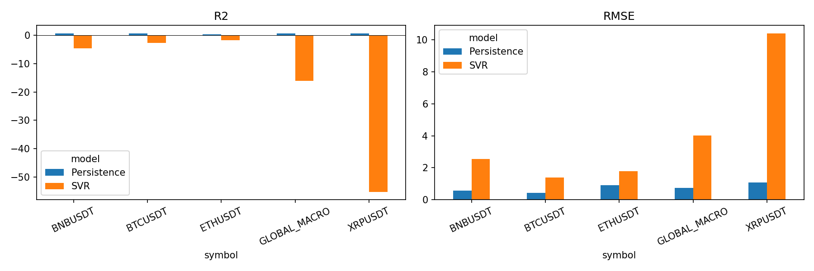

> **Referencia histórica:** modelo original con precios por minuto como columnas. El [entregable vigente](07_estudio_minuto.md) usa características derivadas y validación creciente.

# Estudio de tres años con entradas de un minuto

**Entregable 1 — Jassan Arteta y Mateo Bernal**  
Universidad del Norte · Maestría en Matemáticas · Machine Learning · Profesor Lihki Rubio · 2026-30

Periodo: **1 de enero de 2023 a 31 de diciembre de 2025 (UTC)**. BTCUSDT, ETHUSDT, BNBUSDT y XRPUSDT.
Entrenamiento 2023; validación 2024; evaluación retrospectiva 2025. Esta última ya se ha examinado en experimentos previos.

Las entradas conservan cada cierre de un minuto: 10.080, 20.160, 30.240 o 40.320 valores para ventanas de 7, 14, 21 o 28 días.
Se emite un pronóstico al cierre de cada día elegible. Las siete salidas son volatilidades diarias futuras:
100 veces la desviación estándar poblacional de retornos logarítmicos de cierres diarios, en ventanas de 7, 14, 21 o 28 días.
No se anualiza. Los días con minutos faltantes se excluyen cuando afectan una entrada o un objetivo; no se interpolan.
En este conjunto, el día incompleto es el 24 de marzo de 2023. Todas las ventanas comparten el calendario elegible
definido por la historia máxima, para que su comparación no cambie de fechas según el tamaño de entrada.

El escalado se ajusta exclusivamente en entrenamiento. LinearSVR se resuelve en una base ortonormal del espacio generado
por las filas de entrenamiento, conservando todas las direcciones numéricamente no nulas. Se verifica la reconstrucción
de la matriz de productos internos y se exportan coeficientes para todos los minutos originales.
No se sustituyen las entradas por cierres diarios. C, epsilon y ventana de entrada se eligen por RMSE de validación,
separadamente para cada cripto y definición de volatilidad.

La ejecución paralela reutilizó búsquedas ya terminadas, conservadas en selection_cache.csv, y volvió a verificar sus errores de validación. Para esas configuraciones, search.csv contiene la verificación del candidato seleccionado; para las nuevas, contiene la búsqueda completa. Una ejecución desde cero, sin caché, evalúa todos los candidatos.

## Validación

Se ejecutan GroupKFold, KFold y ForwardChaining de timeseries-cv con filtros cronológicos.
Los adaptadores de KFold y ForwardChaining agrupan cortes nativos y, tras filtrar, generan exactamente las mismas muestras.
Sus cinco particiones de evaluación comparten entrenamiento: no son cinco reentrenamientos independientes.
GroupKFold conserva pocas muestras. El archivo all_metrics.csv distingue fechas comunes de todas las fechas disponibles.
Las diferencias de rendimiento entre GroupKFold y los otros adaptadores combinan el método de partición
y la cantidad de entrenamiento retenida; GroupKFold conserva entre 9 y 12 muestras de entrenamiento por fold.
Comparar métodos exige usar common_test; los resultados siguientes usan todas las fechas de ForwardChaining.
KFold y ForwardChaining usan 294 orígenes únicos de entrenamiento, 359 de validación
y 358 de prueba. Hay 21 fechas de prueba comunes a los tres métodos.
Los millones de cierres de minuto constituyen las columnas de las ventanas; no equivalen a millones de muestras supervisadas.

## Exploración

descriptive_statistics.csv contiene estadísticas de cierres y retornos de un minuto y de retornos diarios.
Las figuras usan cierres diarios para legibilidad y la frecuencia diaria del objetivo para los diagnósticos.
Los huecos se mantienen; la ACF usa tratamiento conservador de faltantes. La ACF de cuadrados permite inspeccionar
dependencia en la magnitud de los retornos, sin demostrar por sí sola un modelo de heterocedasticidad.

- **BTCUSDT:** 1,578,159 cierres de minuto válidos y 81 faltantes. Los retornos logarítmicos diarios tienen desviación estándar de 2.42 %, mínimo -8.93 % y máximo 11.23 %. Los extremos justifican comparar errores cuadrados con MAE, menos sensible a valores extremos.
- **ETHUSDT:** 1,578,159 cierres de minuto válidos y 81 faltantes. Los retornos logarítmicos diarios tienen desviación estándar de 3.28 %, mínimo -15.85 % y máximo 19.79 %. Los extremos justifican comparar errores cuadrados con MAE, menos sensible a valores extremos.
- **BNBUSDT:** 1,578,159 cierres de minuto válidos y 81 faltantes. Los retornos logarítmicos diarios tienen desviación estándar de 2.71 %, mínimo -12.99 % y máximo 15.96 %. Los extremos justifican comparar errores cuadrados con MAE, menos sensible a valores extremos.
- **XRPUSDT:** 1,578,159 cierres de minuto válidos y 81 faltantes. Los retornos logarítmicos diarios tienen desviación estándar de 4.25 %, mínimo -20.81 % y máximo 54.87 %. Los extremos justifican comparar errores cuadrados con MAE, menos sensible a valores extremos.


## Resultados

Se evaluaron 192 combinaciones método–cripto–entrada–objetivo.
SVR supera a persistencia en RMSE en **0 de 16** selecciones del método principal.
Persistencia repite la última volatilidad conocida en los siete horizontes.
Se conservan 1900 predicciones negativas del SVR entre 40096 valores pronosticados seleccionados.
No se aplica recorte antes de evaluar; una predicción negativa no representa una volatilidad válida.
R² se promedia entre horizontes; por cripto se promedia entre cuatro objetivos, y GLOBAL_MACRO entre las 16 selecciones.
El global es un promedio macro, no un R² obtenido concatenando escalas distintas.
RMSE también promedia los siete RMSE por horizonte; no es la raíz de un único MSE global.
RMSE y MAE se expresan en puntos porcentuales de volatilidad, MSE en su cuadrado y MAPE en porcentaje.

| symbol | model | r2 | rmse | mae | mse | mape |
| --- | --- | --- | --- | --- | --- | --- |
| BNBUSDT | Persistence | 0.67199 | 0.56963 | 0.40284 | 0.43591 | 19.38251 |
| BNBUSDT | SVR | -4.72175 | 2.54052 | 2.248 | 6.59008 | 118.97934 |
| BTCUSDT | Persistence | 0.59362 | 0.43642 | 0.3069 | 0.25727 | 16.96313 |
| BTCUSDT | SVR | -2.76504 | 1.39495 | 1.05771 | 2.07383 | 51.82509 |
| ETHUSDT | Persistence | 0.34257 | 0.89615 | 0.61315 | 1.0904 | 19.56662 |
| ETHUSDT | SVR | -1.70908 | 1.77232 | 1.32482 | 3.20626 | 34.50461 |
| XRPUSDT | Persistence | 0.54275 | 1.0886 | 0.66589 | 1.5292 | 19.31856 |
| XRPUSDT | SVR | -55.13094 | 10.39844 | 9.24536 | 129.2181 | 268.33068 |
| GLOBAL_MACRO | Persistence | 0.53773 | 0.7477 | 0.49719 | 0.8282 | 18.80771 |
| GLOBAL_MACRO | SVR | -16.0817 | 4.02656 | 3.46897 | 35.27207 | 118.40993 |



Reducir años y cambiar de cierres diarios a entradas de un minuto modifica simultáneamente muestra y representación.
Por ello no se atribuye una diferencia de métricas exclusivamente a reducir el periodo. Más predictores que observaciones
de entrenamiento puede perjudicar la generalización. Los objetivos de volatilidad móvil comparten retornos conocidos,
lo que favorece un baseline persistente; superar ese baseline sigue siendo la referencia pertinente.

El archivo bds.csv conserva el diagnóstico BDS de residuos del primer horizonte por partición.
GroupKFold tiene menos de seis observaciones por partición y se registra como no estimable.
En los demás métodos, las particiones contienen fechas espaciadas: este diagnóstico es exploratorio
y no equivale a una prueba sobre todos los residuos diarios consecutivos.

Para revisar generalización, selected_split_metrics.csv evalúa los mismos 16 modelos seleccionados en cada periodo,
sin reentrenarlos. Su R² macro de entrenamiento es 0.3650,
frente a -1.4080 en validación y -16.0817 en prueba.
Una brecha grande señala que el ajuste dentro de 2023 no se traslada a años posteriores; acortar el periodo
no resuelve por sí solo la generalización.

## Reproducción

Configuración: experiment_minute.json. Ejecutar, desde la raíz y con dependencias instaladas:

```bash
python src/run_minute_experiment.py
python src/report_minute_experiment.py
python src/verify_minute_experiment.py
```

La entrega incluye los datos procesados de un minuto. Para reconstruirlos desde archivos mensuales de Binance
ya descargados en data/raw/minute_2020_2025, ejecutar python src/minute_experiment.py.
Si faltan los originales, python src/download_three_years.py descarga únicamente los 144 archivos necesarios.
Resultados, calendario, métricas por horizonte y modelos: results/minute_2023_2025.
El estudio anterior con entradas diarias permanece como referencia histórica.
