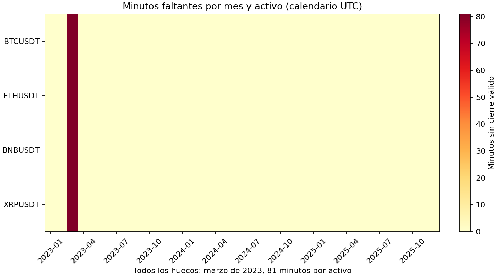
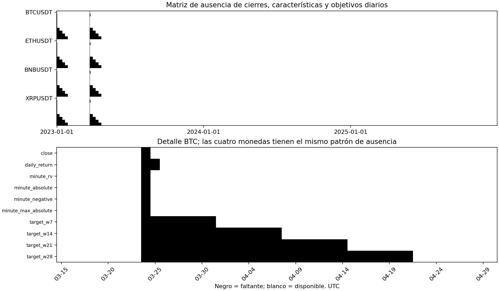
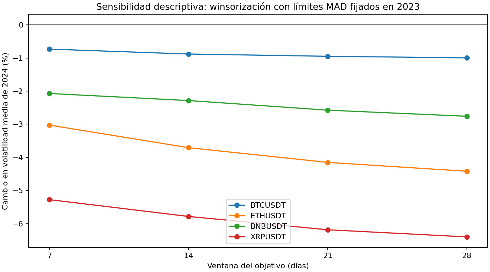

# 1. Base de datos

## Contexto del dataset

Se predice la volatilidad de BTCUSDT, ETHUSDT, BNBUSDT y XRPUSDT para los siguientes siete días. El periodo es **1 de enero de 2023 a 31 de diciembre de 2025, UTC**. La fuente es Binance, con cierres de **un minuto**. Se conservan 1.578.159 observaciones válidas por activo y 81 minutos sin cierre válido: 80 ausentes del RAW y uno excluido por cierre parcial; el día incompleto es el 24 de marzo de 2023. Se excluyen las ventanas afectadas, sin interpolación.

La frecuencia de adquisición es un minuto, la construcción de características resume información intradía y cada muestra supervisada se origina al cierre de un día UTC. Por tanto, millones de observaciones de minuto no equivalen a millones de ejemplos de entrenamiento. Las fechas se etiquetan por el día cuyo cierre ya se conoce.

(seleccion-dataset)=

## 1.1 Definición del problema de investigación

¿Puede un modelo clásico que utiliza información histórica diaria e intradía reducir el error de pronóstico de volatilidad a uno–siete días frente a repetir la volatilidad actual? La comparación se realiza por activo, ventana objetivo y horizonte, con selección temporal en 2024 y evaluación retrospectiva en 2025.

## 1.2 Justificación de la selección del dataset

Binance Vision permite reconstruir cierres y retornos con una fuente homogénea y archivos verificables mediante SHA-256. La frecuencia de minuto aporta medidas de variación intradía que los cierres diarios por sí solos no contienen. Se utiliza el mismo mercado spot y denominador USDT para mantener consistente la interpretación de precios. BTC, ETH, BNB y XRP constituyen la muestra disponible y comparable del proyecto; no se afirma que representen todo el mercado ni que su selección resulte de un ranking de liquidez. SOL queda fuera del comparativo porque no tiene datos y resultados equivalentes en los artefactos vigentes.

El periodo 2023–2025 permite separar un primer año de historia, un año de selección y un año de evaluación. Es una decisión de diseño del estudio y no demuestra estabilidad entre regímenes. Las ventanas de 7, 14, 21 y 28 días comparan definiciones semanales de volatilidad. Los resultados se limitan a estos activos, esta fuente y este periodo; la cotización USDT tampoco equivale automáticamente a dólares estadounidenses.

(fuente-licencia)=

## 1.3 Fuente de los datos y licencia de uso

Fuente: [Binance Vision](https://data.binance.vision/), archivos spot mensuales de klines de un minuto. La [documentación oficial](https://github.com/binance/binance-public-data) describe campos, intervalos, checksums y el cambio a timestamps en microsegundos desde enero de 2025. Los scripts convierten las fechas a UTC y conservan hashes para identificar la versión descargada.

Consulta documental: **3 de octubre de 2026**. Los [Binance Vision Dataset Terms](https://github.com/binance/binance-public-data/blob/master/TERMS_AND_CONDITIONS.md), versión 1.0, actualizados el 26 de agosto de 2026, establecen CC BY-NC-SA 4.0 salvo designación distinta. Incluyen investigación académica no comercial y requieren atribución y compartir bajo la misma licencia las obras derivadas redistribuidas. La mención MIT del repositorio no se utiliza como licencia del dataset.

Atribución para esta entrega: **Datos de mercado: Binance Vision; procesamiento y análisis: Jassan Arteta y Mateo Bernal.** Las transformaciones incluyen selección de cierres, agregación diaria, cálculo de retornos y construcción de características y objetivos. No se atribuye patrocinio de Binance.

El 4 de octubre de 2026 se archivó el texto de condiciones del
[commit inmutable `bd110bb`, publicado el 30 de septiembre de 2026](https://github.com/binance/binance-public-data/blob/bd110bb04caad6ad964a0098809f18343b1e104b/TERMS_AND_CONDITIONS.md).
Ese documento ya existía antes de las fechas locales de creación de los
144 archivos utilizados: **1 de octubre de 2026, 13:38–13:41 UTC**.
Se conservan la copia, su SHA-256, el identificador del commit y los
[metadatos por archivo](../../results/current_delivery_audit/licence/source_file_metadata.csv)
en el [registro documental](../../results/current_delivery_audit/licence/evidence.json).
Esto resuelve la conservación de evidencia histórica disponible. Las fechas
del sistema de archivos son evidencia local, no recibos de descarga firmados
ni una certificación jurídica de derechos anteriores. El
[aviso de atribución y licencia](../../results/current_delivery_audit/licence/DATA_LICENSE.txt)
identifica CC BY-NC-SA 4.0 para los datos y las obras derivadas redistribuidas.

(diccionario-variables)=

## 1.4 Diccionario de variables: tipo, unidad y significado

En las siguientes definiciones, los retornos diarios y de minuto se expresan como `100 × log(P_actual/P_anterior)`, y `b_t = max(volatilidad_actual, 1e-8)`. Las seis características se repiten con rezagos `k = 0,…,L−1`; todos se normalizan con la base del origen actual `b_t`.

| Variable | Tipo | Unidad | Significado y disponibilidad |
| --- | --- | --- | --- |
| `symbol` | Categórica | Identificador | BTCUSDT, ETHUSDT, BNBUSDT o XRPUSDT; identifica el par spot. |
| Timestamp de minuto | Fecha y hora | UTC | Inicio del intervalo de adquisición; el cierre se conoce al terminar ese minuto. |
| `date` / `origin` | Fecha | Día UTC | Día cuyo cierre ya está disponible; origen del pronóstico. |
| Cierre de minuto | Numérica continua | USDT por unidad del activo | Último precio del intervalo; arrays `.npy` por activo. |
| Cierre diario `P_t` | Numérica continua | USDT por unidad del activo | Último cierre del día completo; un día incompleto permanece faltante. |
| Retorno diario `r_t` | Numérica continua | Porcentaje logarítmico | Cambio entre cierres diarios consecutivos. |
| Volatilidad histórica `sigma_t` | Numérica continua | Puntos porcentuales | Desviación poblacional de los últimos `w` retornos diarios, sin anualizar. |
| `retorno_diario_relativo` | Numérica continua | Adimensional | Retorno del día rezagado dividido por `b_t`. |
| `retorno_cuadrado_relativo` | Numérica continua | Adimensional | Retorno diario al cuadrado dividido por `b_t²`. |
| `volatilidad_minuto_relativa` | Numérica continua | Adimensional | Raíz de la suma de cuadrados de retornos de minuto del día, dividida por `b_t`. |
| `retorno_absoluto_minuto_relativo` | Numérica continua | Adimensional | Suma de retornos de minuto absolutos dividida por `sqrt(1440)` y por `b_t`. |
| `volatilidad_negativa_relativa` | Numérica continua | Adimensional | Raíz de la suma de cuadrados de la parte negativa de retornos de minuto, dividida por `b_t`. |
| `max_retorno_minuto_relativo` | Numérica continua | Adimensional | Máximo retorno de minuto absoluto del día, dividido por `b_t`. |
| `decaimiento_conocido_h1` … `h7` | Numérica continua | Adimensional | Referencia de cambio relativo por salida de retornos antiguos; fórmula descrita en preprocesamiento. Solo usa historia conocida. |
| Objetivo `y_t,h` | Numérica continua | Puntos porcentuales | Volatilidad diaria móvil en `t+h`; disponible posteriormente, no como predictor. |
| Objetivo transformado `z_t,h` | Numérica continua | Adimensional | `y_t,h / b_t − 1`; se utiliza para ajustar el regresor. |
| `volatility_window` / `input_window` | Entera | Días | Ventana del objetivo `w` y cantidad de días de entrada `L`. |
| `horizon` | Entera | Días | Distancia futura de la salida, de 1 a 7. |

El diccionario cubre las entradas del SVR lineal, con dimensión `6L+7`. Los archivos originales contienen otros campos OHLCV; volumen y rango OHLC no forman parte del dataset procesado compartido.

## 1.5 Estructura de los datos

La estructura es un panel temporal multiactivo: la observación original es un activo-minuto UTC y la muestra supervisada es un activo-día de origen. La clave conceptual es `(symbol, timestamp)` en minuto y `(symbol, origin)` en el modelo. El archivo diario usa formato ancho: una fila por fecha y una columna de cierre por activo. Los modelos se ajustan por activo y configuración; no se presume independencia entre activos, días u objetivos superpuestos. No hay coordenadas ni componente espacial geográfico.

## 1.6 Tamaño de la muestra

Se dispone de cuatro activos y 1.096 fechas diarias por activo. La adquisición
supera 20.000 observaciones por activo, pero el tamaño efectivo del modelado
es diario: no se cuentan los minutos como muestras supervisadas independientes.
La dimensión del SVR es 49, 91, 133 o 175 características según la entrada.
Los tamaños de entrenamiento y validación se detallan en el capítulo del modelo.

### 1.6.1 Número de variables y relación n/p

El número de predictores es `p = 6L+7`: 49, 91, 133 o 175. Hay siete salidas,
una por horizonte, y se ajusta un regresor por salida. Para el primer corte
publicado, `n = 274` orígenes de entrenamiento por activo: `n/p` es 5,59;
3,01; 2,06 o 1,57, respectivamente. Estos cocientes describen filas disponibles,
no observaciones independientes; cambian en los cortes posteriores. El
[capítulo del modelo](13_modelo_base_svr.md) informa los tamaños de cada corte.

### 1.6.2 Rango de la variable objetivo

Es un problema de regresión; los casos por clase no aplican. El objetivo es
volatilidad no anualizada, en puntos porcentuales, con ventanas de 7, 14, 21
y 28 días y horizontes de 1 a 7 días. Se reconstruye desde los cierres del
dataset vigente, sin sustituir la volatilidad por extremos de retornos.
Los rangos siguientes corresponden a **todos los objetivos disponibles de
2023–2025**, en puntos porcentuales, sin anualizar; son descriptivos y no se
utilizan para elegir hiperparámetros ni tratamientos.

| Activo | 7 días: mín.–máx. | 14 días: mín.–máx. | 21 días: mín.–máx. | 28 días: mín.–máx. |
| --- | ---: | ---: | ---: | ---: |
| BTCUSDT | 0,2930–5,9598 | 0,6858–4,6466 | 0,7275–4,5146 | 0,8902–4,4208 |
| ETHUSDT | 0,2949–8,1823 | 0,5906–6,6932 | 0,6845–6,0064 | 0,7942–5,4947 |
| BNBUSDT | 0,4126–8,1848 | 0,7928–7,0152 | 0,9200–6,2695 | 1,0096–5,6391 |
| XRPUSDT | 0,5914–20,4557 | 0,9213–15,1567 | 1,3170–12,4998 | 1,5652–10,9277 |

Hay 1.081, 1.067, 1.053 y 1.039 objetivos diarios disponibles por activo,
respectivamente. El primer objetivo se observa el 8, 15, 22 o 29 de enero de
2023 según la ventana; el último, el 31 de diciembre de 2025. No hay objetivos
iguales a cero. Estas fechas objetivo no son el número de orígenes que dispone
de siete salidas y entradas completas: la elegibilidad supervisada exige
historia y futuro adicionales. Los siete horizontes reutilizan objetivos
diarios y no multiplican por siete los ejemplos independientes. El archivo
[rangos del objetivo](../../results/current_delivery_audit/quality/target_ranges.csv)
incluye valores sin redondear, fechas de extremos y separación entre desarrollo
2023–2024 y evaluación retrospectiva 2025.

### 1.6.3 Entidades y tamaño efectivo

Se estudian cuatro activos, con 1.096 fechas diarias por activo. No se acredita
que sean cuatro entidades estadísticamente independientes: comparten mercado
y pueden estar correlacionados. También hay dependencia temporal y objetivos
superpuestos. **El mínimo de 20.000 se supera en registros de adquisición,
pero no se cumple en muestras supervisadas por activo.** Añadir rezagos,
horizontes o réplicas de los mismos días no resuelve este límite. El requisito
queda evaluado como no cumplido para la frecuencia del modelo; cumplirlo
exigiría cambiar el diseño o ampliar el historial, no reinterpretar minutos
como orígenes independientes.

Se estima una **equivalencia descriptiva para la media de cada serie objetivo**
en el desarrollo 2023–2024:

$$n_{\mathrm{ef}}=\frac{n}{1+2\sum_{k=1}^{K}\widehat{\rho}(k)}.$$

La suma se detiene antes de la primera ACF no positiva o al máximo de 30, 60
o 90 rezagos. Se mantienen los huecos en el calendario al formar pares; no se
comprimen los días faltantes. Con máximo de 90 días se obtiene:

| Activo | 7 días | 14 días | 21 días | 28 días |
| --- | ---: | ---: | ---: | ---: |
| BTCUSDT | 51,8 | 25,7 | 19,1 | 15,0 |
| ETHUSDT | 34,3 | 17,7 | 12,5 | 10,1 |
| BNBUSDT | 40,0 | 28,2 | 21,8 | 17,6 |
| XRPUSDT | 66,1 | 38,8 | 28,6 | 22,3 |

Los `n` observados son 716, 702, 688 y 674 fechas objetivo por ventana. Estos
valores suponen estacionariedad débil y resumen la dependencia de una media;
no son una prueba de independencia ni el tamaño efectivo del ajuste completo
del SVR. Los cambios de régimen pueden invalidar la aproximación. Para la
ventana de 28 días, el resultado cambia de 19,2 a 15,0 en BTC y de 17,8 a 10,1
en ETH al ampliar el límite de 30 a 90 rezagos: no se oculta la sensibilidad.
No se suman activos ni horizontes como si fueran independientes. Evidencia:
[estimaciones y truncaciones](../../results/current_delivery_audit/quality/effective_sample_size.csv).

## 1.7 Calidad de los datos

### 1.7.1 Valores faltantes: patrón y mecanismo

Se reportan 81 minutos faltantes por activo y un día incompleto, el 24 de marzo
de 2023. Se mantiene el calendario y se excluyen ventanas afectadas, sin
interpolación. La nueva auditoría distingue **80 minutos ausentes del archivo
RAW y una fila presente con cierre anticipado**, excluida por la regla del
intervalo completo. El hueco procesado abarca 12:39–13:59 UTC en los cuatro
activos. Los 12 campos originales no contienen nulos ni valores no finitos.

El patrón derivado es idéntico en los cuatro activos:

| Variable sobre 1.096 días | Faltantes por activo | Explicación |
| --- | ---: | --- |
| Cierre diario | 1 | Día intradía incompleto. |
| Retorno diario | 3 | Inicio de la serie y los dos retornos que necesitan el cierre faltante. |
| Cada resumen intradía | 2 | Primer retorno sin cierre previo y día incompleto. |
| Objetivo de 7 / 14 / 21 / 28 días | 15 / 29 / 43 / 57 | Inicio sin historia y propagación del hueco por ventanas móviles. |

Estas ausencias derivadas son estructurales: se explican por la fórmula de
construcción. La interrupción RAW sincronizada es compatible con una incidencia
operativa común; el dato observado por sí solo no demuestra su causa.
MCAR exige independencia de valores observados y no observados; MAR condiciona
la ausencia a observados, y MNAR puede depender del valor no observado. Una
sola interrupción común, sin información del proceso de captura ni valores de
los minutos ausentes, **no permite identificar MCAR, MAR o MNAR**. No se declara
MCAR por coincidir los huecos ni se inventa una prueba que discrimine MAR de
MNAR. Se registra esta limitación y se conserva el criterio de ventanas
completas. Las cuatro coincidencias tampoco son cuatro incidencias independientes.

Evidencia descargable: [huecos y causas](../../results/current_delivery_audit/quality/missing_spans.csv),
[matriz minuto–mes](../../results/current_delivery_audit/quality/minute_missingness_matrix.csv),
[matriz diaria de nulos](../../results/current_delivery_audit/quality/daily_missingness_matrix.csv)
y [conteos derivados](../../results/current_delivery_audit/quality/derived_missingness_counts.csv).

### 1.7.2 Duplicados exactos y casi duplicados

Se inspeccionan los 144 archivos originales y sus 6.312.640 filas. Duplicado
exacto significa igualdad de los 12 campos originales. Un casi duplicado
exige el **mismo activo y minuto UTC**, filas no idénticas, diferencias de
timestamps de como máximo un segundo, igual número de operaciones y todos los
precios OHLC y volúmenes dentro de tolerancias `rtol=1e-6`, `atol=1e-8`.
También se cuentan por separado claves minuto repetidas con valores en conflicto.

| Activo | Archivos | Duplicados exactos | Casi duplicados | Claves minuto en conflicto |
| --- | ---: | ---: | ---: | ---: |
| BTCUSDT | 36 | 0 | 0 | 0 |
| ETHUSDT | 36 | 0 | 0 | 0 |
| BNBUSDT | 36 | 0 | 0 | 0 |
| XRPUSDT | 36 | 0 | 0 | 0 |

Los conteos son filas adicionales respecto de la primera fila de cada clave;
no hay registros que eliminar por duplicación. Un precio repetido en minutos
distintos sigue siendo una observación válida. La reconstrucción de todos los
minutos desde los RAW coincide exactamente con los arrays procesados. El
[informe por archivo](../../results/current_delivery_audit/quality/raw_file_audit.csv)
permite comprobar los ceros y las claves sin depender del agregado.

### 1.7.3 Outliers: detección y tratamiento

Se analizan retornos logarítmicos de minuto y diarios, cada frecuencia con sus
propios límites. El criterio robusto es
`|r − mediana_2023| > 6 × 1,4826 × MAD_2023`. Los límites se calculan una sola
vez con historia de 2023, antes de contar en 2024; 2025 no interviene en esta
decisión. Es un indicador de cola extrema, no una demostración de error ni una
prueba de normalidad. El multiplicador seis es una regla explícita del diagnóstico,
no un parámetro optimizado con métricas del SVR.

En retornos diarios hay 362 observaciones finitas en 2023 y 366 en 2024 por activo:

| Activo | Límites diarios fijados en 2023 (%) | Marcados 2023 | Marcados 2024 | Cambio de volatilidad media 2024 tras winsorizar, ventanas 7–28 días |
| --- | ---: | ---: | ---: | ---: |
| BTCUSDT | −8,9670 / 8,9903 | 4 | 4 | −0,73 % a −1,00 % |
| ETHUSDT | −9,8247 / 9,9001 | 1 | 6 | −3,03 % a −4,42 % |
| BNBUSDT | −9,2637 / 9,5570 | 3 | 4 | −2,07 % a −2,76 % |
| XRPUSDT | −12,6366 / 12,7379 | 4 | 10 | −5,28 % a −6,40 % |

En minuto hay 525.517 retornos finitos en 2023 y 527.040 en 2024 por activo;
la frecuencia tiene umbrales distintos de los diarios:

| Activo | Límites de minuto (%) | Marcados 2023 | Marcados 2024 | Cambio en variación intradía media 2024 al winsorizar |
| --- | ---: | ---: | ---: | ---: |
| BTCUSDT | ±0,1813 | 7.220 | 15.124 | −12,74 % |
| ETHUSDT | ±0,2070 | 6.079 | 16.048 | −13,90 % |
| BNBUSDT | ±0,3378 | 1.764 | 3.722 | −6,01 % |
| XRPUSDT | ±0,3410 | 4.538 | 12.203 | −15,17 % |

La sensibilidad calcula en una **copia temporal** los retornos limitados a los
umbrales y vuelve a obtener su desviación y volatilidad móvil. No modifica
precios, objetivos guardados, entrenamiento ni predicciones publicadas. La
variación intradía se analiza asimismo con límites de la frecuencia de minuto.
Los [conteos y límites por frecuencia](../../results/current_delivery_audit/quality/outlier_counts.csv),
las [fechas extremas diarias](../../results/current_delivery_audit/quality/outlier_dates.csv)
y la [sensibilidad completa](../../results/current_delivery_audit/quality/outlier_sensitivity.csv)
están disponibles para reproducir el diagnóstico.

XRP es el activo más sensible: en 2023 la desviación de retornos baja 30,60 %
y la volatilidad media de 28 días baja 19,83 % al recortar las colas. Por ello
se conservan los movimientos observados y se comparan MAE y RMSE; un recorte
automático alteraría sustancialmente el fenómeno que se desea estudiar. Este
ejercicio cuantifica sensibilidad de estadísticos, no acredita robustez del
error predictivo ni autoriza escoger tratamientos con el test retrospectivo.

### 1.7.4 Valores imposibles o inconsistentes

Se ejecuta una auditoría de los **144 ZIP**, comprobando su SHA-256 tanto contra
el `.CHECKSUM` guardado como contra `sources.csv`; también coinciden los cinco
hashes del manifiesto procesado. Se releen todos los campos, precios OHLC
finitos y positivos, volúmenes no negativos, OHLC dentro del rango mínimo–máximo,
volumen comprador no mayor que el total, operaciones enteras no negativas,
orden, unicidad, pertenencia al mes y alineación al minuto UTC.

Se registran **96 archivos con timestamps en milisegundos (2023–2024) y 48
en microsegundos (2025)**. La conversión utiliza la unidad correspondiente,
no divide precios ni confunde microsegundos con milisegundos. El cierre
esperado es `inicio + 1 minuto − 1 unidad del timestamp`.

| Activo | Minutos esperados | Filas RAW antes | Excluidas por cierre parcial | Cierres válidos después | Minutos ausentes RAW | Días completos |
| --- | ---: | ---: | ---: | ---: | ---: | ---: |
| BTCUSDT | 1.578.240 | 1.578.160 | 1 | 1.578.159 | 80 | 1.095 |
| ETHUSDT | 1.578.240 | 1.578.160 | 1 | 1.578.159 | 80 | 1.095 |
| BNBUSDT | 1.578.240 | 1.578.160 | 1 | 1.578.159 | 80 | 1.095 |
| XRPUSDT | 1.578.240 | 1.578.160 | 1 | 1.578.159 | 80 | 1.095 |

Los demás controles anteriores arrojan cero incidencias. Las cuatro filas
excluidas empiezan el 24 de marzo de 2023 a las 12:39 UTC y terminan entre
12:39:41 y 12:39:48; no completan el minuto previsto. No se afirma que sean
precios imposibles: se excluyen por la duración del intervalo requerida en
este estudio. El día incompleto deja de aportar cierre diario y las ventanas
afectadas quedan fuera por el criterio de elegibilidad.

Los resultados antes/después y los hashes por archivo se publican en el
[informe RAW](../../results/current_delivery_audit/quality/raw_file_audit.csv),
el [resumen por activo](../../results/current_delivery_audit/quality/quality_by_asset.csv)
y el [detalle de filas excluidas](../../results/current_delivery_audit/quality/excluded_raw_rows.csv).
El [método y manifiestos de la auditoría](../../results/current_delivery_audit/quality/methodology.json)
declara qué se verificó y el hash del script ejecutado. La reconstrucción
RAW→minuto→cierre diario coincide con los datos existentes; no se reescriben.

### 1.7.5 Sesgos de muestreo y representatividad

La muestra contiene cuatro mercados spot de un único proveedor. No representa
todos los activos, plataformas ni regímenes de mercado. La selección responde
a disponibilidad comparable, no a muestreo probabilístico; las conclusiones
se limitan a estos activos y al periodo 2023-2025.

## 1.8 Consideraciones éticas

Los datos son precios agregados públicos; no contienen identificadores
personales ni coordenadas geográficas. Las marcas temporales corresponden a
intervalos de mercado y no a transacciones de personas identificadas. No se
requiere anonimización de personas en las variables utilizadas; esta revisión
no cubre datos individuales externos que pudieran vincularse posteriormente.
La publicación debe respetar las condiciones de uso y atribución de la fuente.

## Revisión numerada de cumplimiento de la guía

La revisión incorpora los resultados de la auditoría ejecutada sobre los RAW
y el dataset procesado vigente. **Cumple** indica evidencia publicada;
**no cumple** indica un requisito contrastado que el diseño actual no alcanza,
y **limitación identificada** indica que la evidencia no permite certificar
la propiedad solicitada. No se convierten limitaciones del estudio en verificaciones.

| Punto | Requisito | Estado | Evidencia o ajuste necesario |
| --- | --- | --- | --- |
| 1.1 | Problema de investigación | Cumple | Pregunta, activos, objetivo y horizontes definidos. |
| 1.2 | Justificación del dataset | Cumple | Fuente homogénea, frecuencia intradía y periodo justificados. |
| 1.3 | Fuente y licencia | Cumple documentalmente | Condiciones archivadas de un commit anterior a las fechas locales de adquisición, hashes y atribución; alcance de los metadatos explícito. |
| 1.4 | Diccionario: tipo, unidad y significado | Cumple | Tabla de variables utilizadas y disponibilidad temporal. |
| 1.5 | Unidad, agregación y tipo de estructura | Cumple | Activo-minuto, activo-día y panel temporal descritos. |
| 1.6 | Mínimo de 20.000 observaciones | No cumple para el modelado | Sí en adquisición; no en orígenes diarios supervisados por activo. No se inflan con rezagos ni horizontes. |
| 1.6.1 | Número de variables y n/p | Cumple | Dimensión y cocientes del primer corte; tamaños posteriores en el capítulo 3. |
| 1.6.2 | Rango del objetivo en regresión | Cumple | Mínimos, máximos, fechas y conteos por activo/ventana/periodo en CSV. |
| 1.6.3 | Entidades independientes y tamaño efectivo | Cumple con límites | Cuatro activos; ESS descriptivo ACF con sensibilidad, sin certificar independencia ni ESS del ajuste. |
| 1.7.1 | Faltantes: patrón, visualización y mecanismo | Cumple con limitación identificada | Matrices y propagación publicadas; MCAR/MAR/MNAR no identificables con una interrupción, justificación explícita. |
| 1.7.2 | Duplicados exactos y casi duplicados | Cumple | Criterio por clave, tolerancias, cero incidencias y conteos de los 144 archivos. |
| 1.7.3 | Outliers: detección y tratamiento | Cumple | Regla MAD fijada en 2023, conteos minuto/diarios y sensibilidad descriptiva 2023–2024; sin modificar modelos. |
| 1.7.4 | Valores imposibles o inconsistentes | Cumple | Auditoría ejecutada, hashes, unidades ms/us y antes/después por activo y archivo. |
| 1.7.5 | Sesgos y representatividad | Cumple | Límites de selección, proveedor y periodo explícitos. |
| 1.8 | Datos personales, anonimización y reidentificación | Cumple | Alcance agregado y ausencia de identificadores documentados. |

La auditoría se reproduce desde la raíz mediante
`.\.venv-repro\Scripts\python.exe src/audit_current_dataset.py` y se verifica
con `.\.venv-repro\Scripts\python.exe -m unittest discover -s tests -p test_current_dataset_audit.py`.
El [script descargable](../../src/audit_current_dataset.py) relee los RAW y no
descarga archivos ni vuelve a entrenar. Los
[hashes de las evidencias](../../results/current_delivery_audit/quality/artifact_hashes.json)
permiten identificar los CSV usados en esta revisión.
