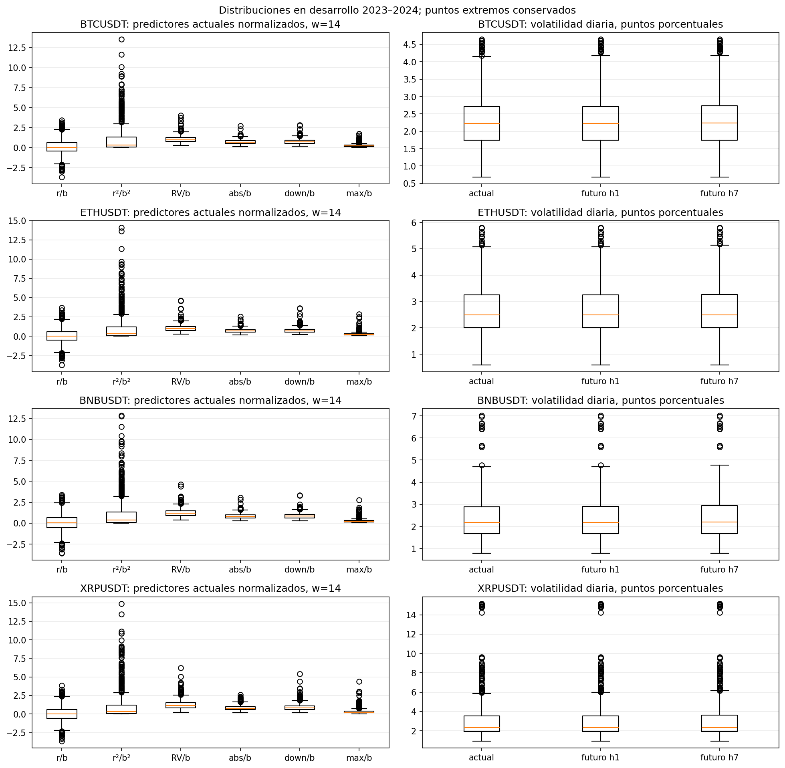
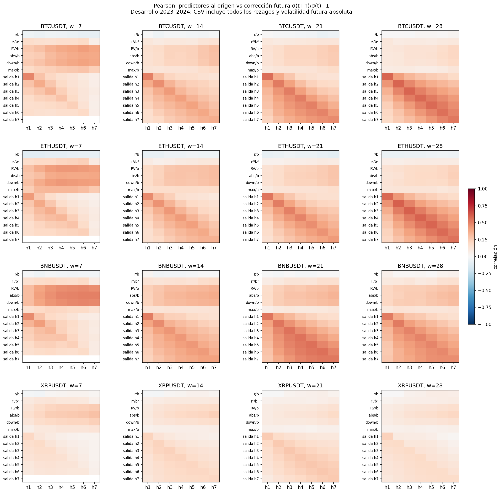
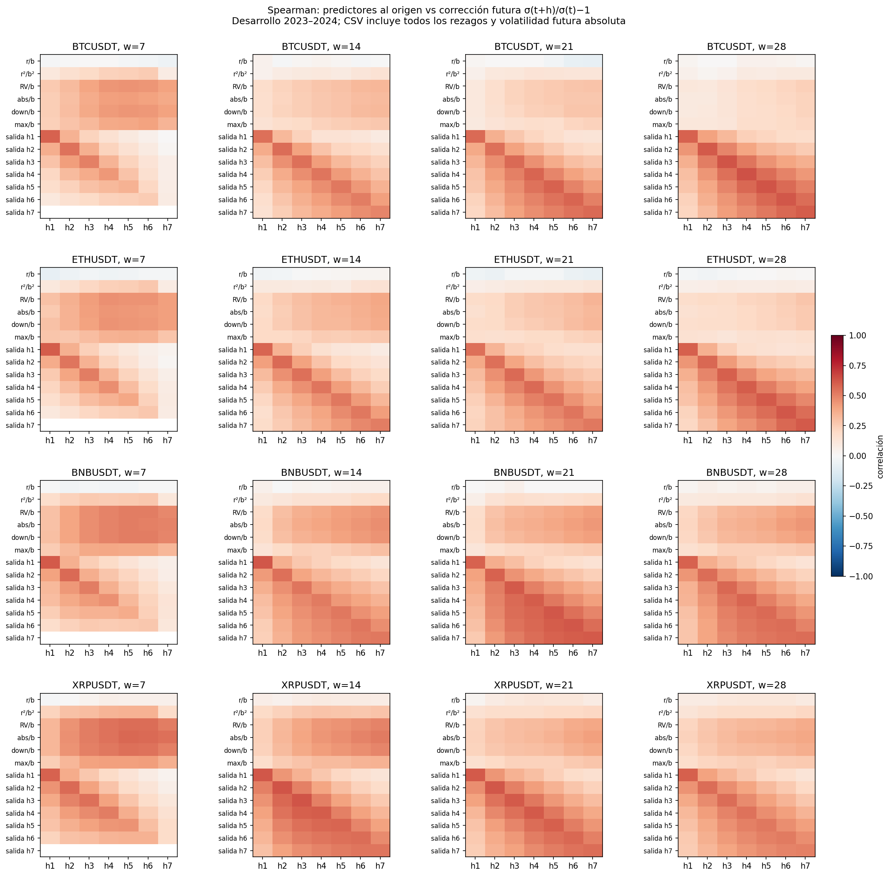
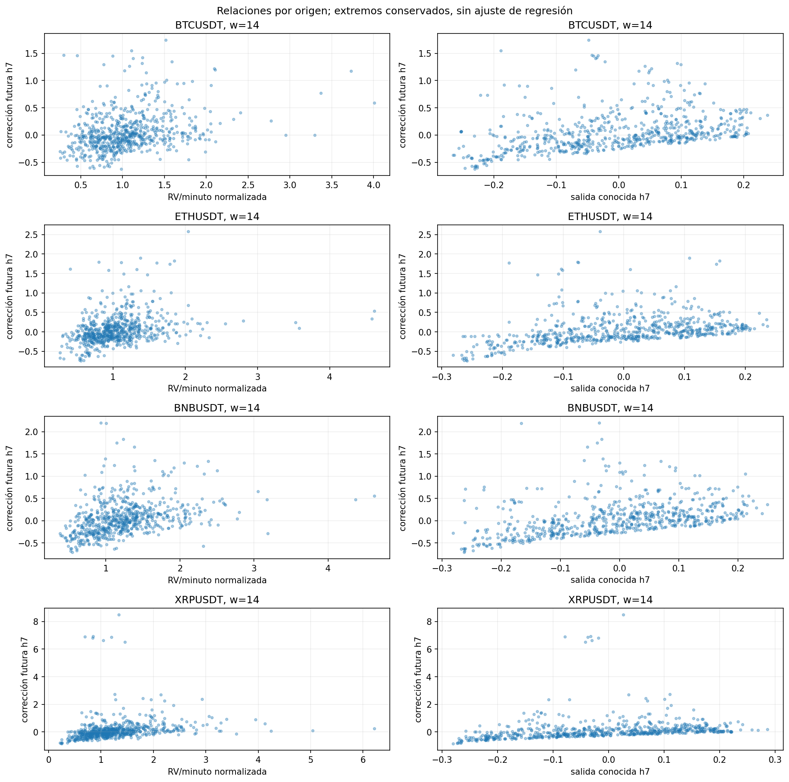
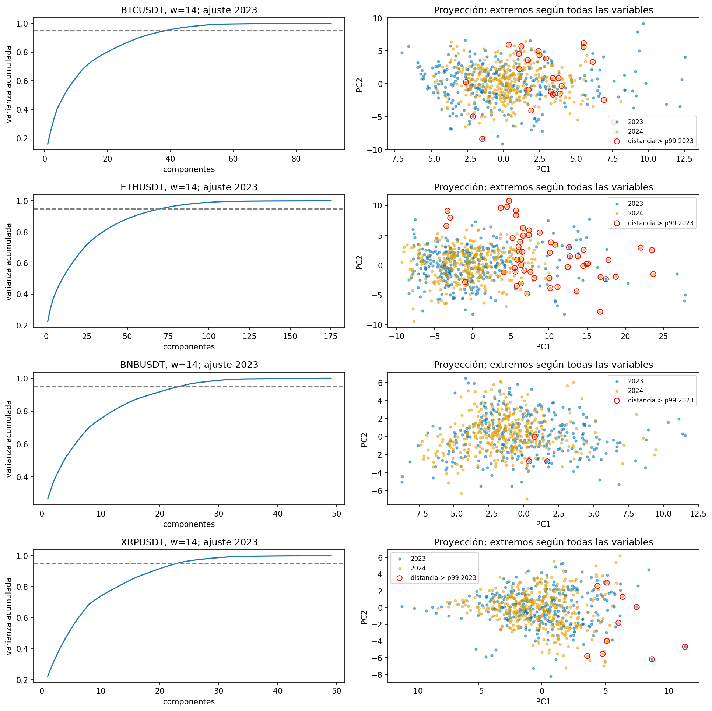
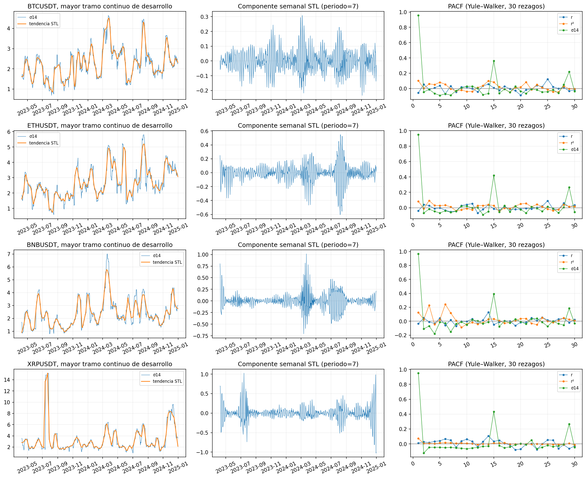
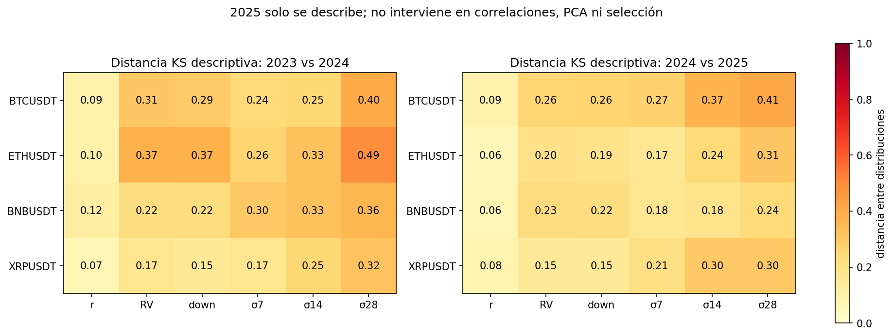

# 2. Análisis Exploratorio de Datos (EDA)

Este capítulo usa exclusivamente los datos de un minuto de **2023–2025** y
la representación vigente de `optimize_minute_svr.features/minute_features`.
Las distribuciones supervisadas y asociaciones se calculan en desarrollo
2023–2024; todas sus etiquetas terminan antes de 2025. El PCA y sus
escaladores se ajustan solo con 2023. La comparación con 2025 del apartado
2.6 es descriptiva y retrospectiva, sin selección de variables ni ajuste
de modelos.

La auditoría contiene **660 orígenes por activo y ventana**, desde el
29/01/2023 hasta el 24/12/2024, con últimas etiquetas el 31/12/2024. Conserva
el calendario y las exclusiones comunes del experimento. Se examinan las
16 configuraciones ya seleccionadas por validación de 2024; este EDA
documenta el ajuste existente y no constituye una exploración previa
a esa selección. [Calendario y dimensiones](../../results/current_delivery_audit/eda/coverage.csv),
[alcance, hashes y métodos](../../results/current_delivery_audit/eda/metadata.json).

(reserva-test)=

**Orden de trabajo:** Reserva del test y alcance de la evaluación

2025 ya se exploró en experimentos anteriores y el EDA publicado incluye 2023–2025. Por ello, no se acredita una reserva inicial intacta del test. La selección programada utiliza 2024 y el escalado se ajusta dentro de cada entrenamiento, pero estos controles no revierten el conocimiento previo de 2025. Los resultados de ese año se presentan como retrospectivos.

Se ejecutó una evaluación adicional de **enero–agosto de 2026** mediante un
procedimiento fijado antes de descargar ese periodo: los 16 modelos guardados,
sus ventanas e hiperparámetros, las métricas y las exclusiones se conservan.
El [protocolo y su fecha de congelación](../../results/current_delivery_audit/holdout/protocol.json)
preceden a la descarga de los 32 archivos oficiales. Se evaluaron una sola vez
236 orígenes con siete objetivos completos, sin reentrenamiento ni selección
según sus resultados; la [sección 4](14_evaluacion.md) publica las métricas
y los intervalos temporales.

Los datos de 2026 no estaban presentes en los artefactos del proyecto
auditados. No se certifica que ese periodo nunca se haya explorado fuera
de esos archivos. Esta comprobación adicional no recupera retrospectivamente
la reserva original de 2025 ni garantiza independencia entre los orígenes
de un objetivo móvil. El estudio compara persistencia con el SVR lineal.

## 2.1 Análisis de la Variable Objetivo

El objetivo es volatilidad no anualizada a siete horizontes diarios, con
ventanas de 7, 14, 21 y 28 días. Cada ventana define un objetivo distinto.
La variabilidad de los retornos motiva estudiar volatilidad; no demuestra
que el SVR pueda predecirla. Se comparan RMSE y MAE para mostrar la
sensibilidad a extremos, y R² frente a persistencia en el mismo calendario.

### 2.1.1 Retornos, volatilidad y salidas

Sean $P_t$ el último cierre del día y $r_t=\ln(P_t/P_{t-1})$. El objetivo es

$$
\sigma_t^{(w)}=100\sqrt{\frac{1}{w}\sum_{j=0}^{w-1}(r_{t-j}-\bar r_t)^2},\qquad w\in\{7,14,21,28\}.
$$

Se usa `rolling(w).std(ddof=0)`, sin anualizar. Cada salida es
$(\sigma_{t+1}^{(w)},\ldots,\sigma_{t+7}^{(w)})$. La volatilidad realizada de
los retornos por minuto es una característica; el objetivo sigue siendo
la volatilidad de retornos diarios. Son definiciones diferentes.
El SVR aprende la corrección relativa $z_{t,h}=\sigma_{t+h}^{(w)}/b_t-1$,
con $b_t=\max(\sigma_t^{(w)},10^{-8})$. Se auditan tanto la salida en puntos
porcentuales como esta corrección.

## 2.2 Análisis unidimensional

### 2.2.1 Distribuciones de las variables derivadas y del objetivo

Se calculan media, desviación, mínimo, máximo, percentiles 1, 5, 25, 50, 75,
95 y 99, asimetría y **exceso de curtosis** —cero corresponde a la normal—
para todas las columnas de las 16 entradas seleccionadas, los siete
objetivos futuros y sus correcciones relativas. Las 1.612 filas de
[estadísticas unidimensionales](../../results/current_delivery_audit/eda/univariate.csv.gz)
incluyen todos los rezagos, no solo el día actual.

Una columna con rango menor o igual que $10^{-12}$ por el máximo entre
uno y su valor absoluto máximo se marca como numéricamente constante.
Su asimetría, curtosis y correlaciones se dejan sin definir y no se
marcan outliers de redondeo. Es el caso de la referencia de salida h7
cuando w=7, matemáticamente igual a cero. Las entradas del modelo se
conservan tal como las genera el script original.

Como comparación legible, la siguiente tabla usa **w=14, h=1**, 660
orígenes por activo, en puntos porcentuales:

| Activo | Mediana | p5 | p95 | p99 | Asimetría | Exceso de curtosis |
| --- | ---: | ---: | ---: | ---: | ---: | ---: |
| BTCUSDT | 2,233 | 1,136 | 3,891 | 4,455 | 0,639 | 0,365 |
| ETHUSDT | 2,491 | 1,229 | 4,789 | 5,513 | 0,762 | 0,579 |
| BNBUSDT | 2,190 | 1,145 | 4,226 | 6,518 | 1,360 | 2,706 |
| XRPUSDT | 2,357 | 1,498 | 7,950 | 14,861 | 2,975 | 10,683 |

Las colas difieren incluso después de normalizar. Para w=14, el máximo
retorno intradía absoluto dividido por $b_t$ tiene exceso de curtosis
16,34 en BTC, 43,28 en ETH, 25,87 en BNB y 34,89 en XRP. El retorno diario
al cuadrado normalizado presenta asimetría entre 2,67 y 3,01. Estos
resultados documentan observaciones influyentes y motivan acompañar RMSE
con MAE; no justifican eliminar automáticamente movimientos reales.



Los boxplots muestran w=14, las seis familias en el origen, la volatilidad
actual y las salidas h1/h7. `r/b` y `r²/b²` son retorno diario y cuadrado;
`RV/b`, `abs/b`, `down/b` y `max/b` son los cuatro resúmenes de todos los
retornos por minuto, normalizados por la volatilidad conocida. Los puntos
fuera de los bigotes se conservan. Los CSV también cuentan observaciones
fuera de 1,5 rangos intercuartílicos, sin tratarlas como errores de calidad.

### 2.2.2 Exploración y calidad

Los cierres y las distribuciones de retornos de las figuras anteriores de
esta **misma versión 2023–2025** se mantienen como contexto retrospectivo.
No se usan sus estadísticas para declarar una reserva intacta de 2025.
La [auditoría de calidad del capítulo 1](11_base_datos.md) documenta
archivos fuente, faltantes y exclusiones. Los
[resúmenes diarios por año](../../results/current_delivery_audit/eda/raw_daily_summary_by_year.csv)
permiten distinguir escala nominal, retornos y volatilidad derivada.

La evidencia distingue **80 minutos ausentes del RAW y una fila presente
excluida por cierre parcial**, que dejan 81 cierres de minuto no válidos
por activo el 24/03/2023. La interrupción simultánea no permite identificar
MCAR, MAR o MNAR sin información adicional del proceso de captura y los
valores ausentes. Es una limitación identificada, no una propiedad
verificada. Se enlazan [huecos y causas](../../results/current_delivery_audit/quality/missing_spans.csv)
y [propagación a variables derivadas](../../results/current_delivery_audit/quality/derived_missingness_counts.csv).


## 2.3 Análisis bidimensional

Se alinean las características conocidas al cierre UTC de $t$ con cada
salida **futura** h1–h7. Pearson cuantifica asociación lineal y Spearman
asociación monótona. Las 38.864 filas del
[informe de asociaciones](../../results/current_delivery_audit/eda/future_associations.csv.gz)
cubren todos los predictores, activos, ventanas, horizontes, métodos y
los dos objetivos: volatilidad futura y corrección relativa futura.
Se añade $b_t$ como referencia descriptiva; el CSV lo identifica como
`current_volatility`, no como una columna adicional del SVR.

Para w=14, la relación entre volatilidad actual y futura es fuerte en h1
y menor en h7:

| Activo | Pearson h1 | Pearson h7 | Spearman h7 | $r^2$ h7 |
| --- | ---: | ---: | ---: | ---: |
| BTCUSDT | 0,953 | 0,620 | 0,605 | 0,384 |
| ETHUSDT | 0,949 | 0,606 | 0,654 | 0,367 |
| BNBUSDT | 0,966 | 0,647 | 0,608 | 0,418 |
| XRPUSDT | 0,952 | 0,574 | 0,537 | 0,330 |

$r$ y $r^2$ son tamaños de asociación descriptivos. Este $r^2$ equivale a
la proporción de variación explicada por una regresión lineal simple con
intercepto **en la misma muestra**; no es el R² fuera de muestra del SVR.
La superposición de los retornos que definen los objetivos produce parte
de esta persistencia. No se informan p-valores de correlación bajo una
suposición incorrecta de orígenes independientes.

Las matrices visibles muestran las seis características del día actual
y las siete referencias de salida de retornos antiguos, frente a
$z_{t,h}$. El archivo descargable contiene además todos los rezagos y
las matrices frente a la volatilidad futura absoluta.





La referencia de salida `known_decay_h7` frente a la corrección relativa
h7, con w=14, tiene Pearson 0,362/0,351/0,404/0,205 y Spearman
0,485/0,512/0,528/0,538 para BTC/ETH/BNB/XRP. La diferencia en XRP muestra
que extremos y relaciones no lineales pueden cambiar la asociación;
esta comparación no prueba causalidad ni mejora predictiva incremental.



Se examina también redundancia entre todas las columnas del SVR. Con
w=14, el número de pares con $|r|\geq0,90$ es 43, 78, 22 y 8
para BTC, ETH, BNB y XRP; según Spearman es 42, 84, 21 y 21. Las
dimensiones respectivas son 91, 175, 49 y 49, de modo que los conteos no
se comparan como tasas. Los
[pares redundantes](../../results/current_delivery_audit/eda/redundant_pairs.csv.gz)
identifican cada familia y rezago. No se eliminan columnas con este
diagnóstico: hacerlo exigiría repetir la validación dentro de desarrollo.

## 2.4 Análisis multivariado

Se ajustan `StandardScaler` y PCA por activo y configuración con **294
orígenes de 2023**, cuyas siete etiquetas terminan antes del 01/01/2024.
Las observaciones de 2024 se proyectan usando ese ajuste fijo. PCA es
exploratorio; no se inserta en el Pipeline del SVR ni se selecciona
una dimensión mediante resultados de 2025.

Para w=14:

| Activo | Variables | Componentes para 95 % | Varianza PC1+PC2 | Orígenes de 2024 sobre umbral multivariado |
| --- | ---: | ---: | ---: | ---: |
| BTCUSDT | 91 | 39 | 25,57 % | 22 |
| ETHUSDT | 175 | 71 | 27,62 % | 51 |
| BNBUSDT | 49 | 24 | 37,45 % | 0 |
| XRPUSDT | 49 | 23 | 31,62 % | 7 |

Los dos primeros componentes no resumen toda la variación. Se publican
[dimensiones y cortes de ajuste](../../results/current_delivery_audit/eda/pca_summary.csv),
[varianza por componente](../../results/current_delivery_audit/eda/pca_variance.csv) y
[cargas de PC1 y PC2](../../results/current_delivery_audit/eda/pca_loadings.csv)
para las 16 configuraciones.



Para extremos multivariados se ajusta una covarianza regularizada
`LedoitWolf` sobre las mismas entradas estandarizadas de 2023. Se calcula
la distancia de Mahalanobis al cuadrado en desarrollo y se marca cuando
supera el percentil 99 empírico del entrenamiento. El umbral se fija en
2023 y se conserva para 2024; no se interpreta como una probabilidad
exacta de anomalía ni demuestra errores de mercado. La regularización
evita invertir directamente una covarianza con columnas redundantes.
Los [resultados por origen](../../results/current_delivery_audit/eda/multivariate_distances.csv.gz)
incluyen fecha, distancia, umbral y característica con mayor desviación
estandarizada. Los círculos rojos de la proyección corresponden a esa
distancia en todas las variables. Ninguna observación se elimina.

## 2.5 Auditoría de fuga de datos

Los cierres y resúmenes intradía se conocen al cierre UTC del origen.
Los objetivos futuros no entran como predictores. Las referencias de
salida de la ventana utilizan únicamente retornos pasados. Los escaladores
del modelo se ajustan con cada entrenamiento; las etiquetas terminan
antes de la validación. El [capítulo del modelo](13_modelo_base_svr.md)
documenta los cortes y sus verificaciones.

La auditoría EDA verifica que cambiar minutos posteriores a un origen
no altera sus entradas y sí puede alterar su objetivo. También comprueba
la alineación exacta h1–h7, el corte por **última etiqueta** y el rechazo
de calendarios comprimidos alrededor de un hueco. Las asociaciones usan
únicamente 2023–2024; PCA, escala y umbral multivariado usan 2023.
Estas verificaciones no borran el conocimiento previo del test de 2025.

## 2.6 Componente temporal

### 2.6.1 Dependencia y estacionariedad

La adquisición tiene frecuencia de un minuto UTC y la muestra supervisada
es diaria. Hay 81 cierres de minuto no válidos por activo el 24/03/2023:
80 minutos ausentes del RAW y una fila excluida por cierre parcial.
Se mantienen los huecos y se excluyen ventanas afectadas. ADF, KPSS,
PACF y STL usan el **mayor tramo diario continuo de desarrollo** de cada
variable, sin juntar los extremos del hueco ni interpolar. Para retornos
son 647 días, 26/03/2023–31/12/2024; para $\sigma^{(14)}$ son 634 días,
08/04/2023–31/12/2024.

ADF prueba raíz unitaria; KPSS prueba estacionariedad. Se usa constante
para retornos, sus cuadrados y las cuatro volatilidades, y constante más
tendencia para logprecios. ADF elige rezagos por AIC; KPSS usa `nlags=auto`.
El [informe completo](../../results/current_delivery_audit/eda/stationarity.csv)
incluye estadístico, p-valor, rezagos, fechas y avisos sobre los límites de
las tablas de KPSS. Para $\sigma^{(14)}$:

| Activo | p ADF | p KPSS | Lectura a 5 % |
| --- | ---: | ---: | --- |
| BTCUSDT | 0,0107 | 0,0116 | Ambos rechazan sus hipótesis nulas |
| ETHUSDT | 0,0213 | ≤0,01 | Ambos rechazan sus hipótesis nulas |
| BNBUSDT | 0,0136 | 0,0313 | Ambos rechazan sus hipótesis nulas |
| XRPUSDT | 0,0056 | ≥0,10 | Compatible con estacionariedad bajo estas pruebas |

En logprecios ADF no rechaza raíz unitaria y KPSS rechaza estacionariedad
alrededor de tendencia para los cuatro activos. En retornos diarios ADF
rechaza raíz unitaria y KPSS no rechaza estacionariedad. La discrepancia
en varias volatilidades y cuadrados impide afirmar estacionariedad
general: son diagnósticos con hipótesis diferentes, sensibles a cambios
de régimen, colas y elección de rezagos. Los p-valores no se corrigen por
multiplicidad y no se emplean como regla de selección.

La PACF de primer rezago de $\sigma^{(14)}$ es
0,956/0,949/0,967/0,951 para BTC/ETH/BNB/XRP; la del retorno diario es
−0,057/−0,040/−0,034/0,012. La gran continuidad del objetivo es compatible
con el suavizado y la superposición de ventanas. La
[PACF hasta 30 rezagos](../../results/current_delivery_audit/eda/pacf.csv)
usa Yule–Walker y complementa la ACF ya disponible; no demuestra por sí
sola un orden óptimo de modelo.

### 2.6.2 Descomposición y estacionalidad

Se ejecuta STL robusto con periodo semanal de siete días sobre retornos
y volatilidad w=14 de desarrollo. Su descomposición utiliza información
a ambos lados del día y sirve únicamente para descripción. No es una
característica de pronóstico. La fuerza estacional
$\max(0,1-\operatorname{Var}(residuo)/\operatorname{Var}(residuo+estacional))$
es 0,114/0,074/0,142/0,106 en retornos y 0,062/0/0/0 en volatilidad w=14.
La variación entre medias por día de la semana explica solo
0,38–0,82 % de la variación de retornos y menos de 0,016 % de volatilidad
w=14. Esto describe una señal semanal pequeña en este periodo; no
establece ausencia de otras estacionalidades ni una pauta estable fuera
de la muestra.



Se publican [componentes STL por fecha](../../results/current_delivery_audit/eda/stl_components.csv.gz),
[medidas de estacionalidad](../../results/current_delivery_audit/eda/seasonality.csv) y
[resúmenes por día de la semana](../../results/current_delivery_audit/eda/weekday_summary.csv).

### 2.6.3 Deriva entre periodos

Se comparan 2023 con 2024 y, **solo retrospectivamente**, 2024 con 2025
mediante medianas, diferencia de medias estandarizada y distancia entre
distribuciones KS. Se informa el estadístico KS, sin un p-valor que
asumiría observaciones independientes. Las variables son las seis
familias sin normalizar y las cuatro volatilidades; no se reentrena ni se
ajustan decisiones con estas comparaciones.

| Activo | Mediana σ14 en 2023 | En 2024 | En 2025 | KS 2023–2024 | KS 2024–2025 |
| --- | ---: | ---: | ---: | ---: | ---: |
| BTCUSDT | 2,009 | 2,432 | 1,894 | 0,253 | 0,371 |
| ETHUSDT | 2,173 | 2,868 | 3,262 | 0,326 | 0,243 |
| BNBUSDT | 1,883 | 2,423 | 2,224 | 0,327 | 0,184 |
| XRPUSDT | 2,260 | 2,673 | 3,638 | 0,253 | 0,303 |

Son series contemporáneas por año, con 336/366/365 valores de σ14
respectivamente; no son las 660 filas supervisadas de los apartados
anteriores. La dirección del cambio difiere por activo. Esta deriva
limita extrapolar una sola evaluación histórica a regímenes futuros.
Los [resultados de deriva](../../results/current_delivery_audit/eda/period_drift.csv)
incluyen tamaños de muestra y todas las variables.



## 2.7 Componente Espacial

**No aplica:** el dataset no contiene latitud, longitud ni unidades
geográficas. Los activos financieros constituyen un panel temporal.

## 2.8 Componente Espacio-Temporal

**No aplica:** el dataset contiene tiempo, pero no coordenadas ni zonas
geográficas. Las comparaciones entre activos corresponden al componente
temporal del apartado 2.6.

## 2.9 Preprocesamiento

| Hallazgo | Decisión aplicada |
| --- | --- |
| Minutos faltantes | Mantener huecos y excluir ventanas afectadas; no interpolar. |
| Escalas diferentes | Retornos relativos y normalización respecto a volatilidad conocida. |
| Colas y extremos de retorno | Conservarlos y reportar MAE junto con RMSE. |
| Dependencia temporal y objetivos superpuestos | Validación creciente y separación de etiquetas. |
| Continuidad de volatilidad | Comparar explícitamente con persistencia. |
| Redundancia y extremos multivariados | Documentar; no eliminar columnas ni observaciones con este EDA. |
| Deriva entre años | Declarar el alcance retrospectivo y la incertidumbre de extrapolación. |

La construcción exacta de características y el escalado se presentan en
el [capítulo del modelo](13_modelo_base_svr.md). Los diagnósticos aquí
añadidos no modifican las predicciones publicadas.

(hallazgos-decisiones)=
### 2.9.1 Relación entre hallazgos y decisiones

Los huecos motivan mantener el calendario y excluir muestras afectadas.
Las colas univariadas y las distancias multivariadas motivan informar
errores absolutos junto con errores cuadrados, sin eliminar movimientos
reales por resultar extremos. La dependencia y la superposición temporal
motivan validación creciente y separación de etiquetas. La correlación
con la volatilidad actual explica por qué persistencia es una referencia
exigente; solo la evaluación temporal del modelo determina si las otras
características aportan una mejora fuera de muestra.

La auditoría descriptiva cierra los informes unidimensional, bidimensional,
multivariado y temporal del dataset vigente. La prueba retrospectiva de
2025 mantiene sus limitaciones; las nuevas evaluaciones se documentan
por separado en el [capítulo de evaluación](14_evaluacion.md).
Estos informes no certifican independencia de los orígenes, el mínimo de
20.000 muestras supervisadas ni el mecanismo de ausencia de los minutos.

### 2.9.2 Reproducción del informe

El [script de auditoría](../../src/audit_current_eda.py) lee únicamente el
dataset procesado vigente y las configuraciones seleccionadas existentes.
Registra hashes de entrada, separa periodos, genera tablas y figuras y no
ajusta el SVR. Desde la raíz del repositorio, con el entorno reproducible:

```powershell
$env:OPENBLAS_NUM_THREADS='1'
$env:OMP_NUM_THREADS='1'
$env:MKL_NUM_THREADS='1'
.venv-repro/Scripts/python.exe src/audit_current_eda.py --check
.venv-repro/Scripts/python.exe src/audit_current_eda.py
```

`--check` verifica alineación futura, causalidad de entradas, corte por
última etiqueta y manejo de huecos. El informe completo repite esas
verificaciones antes de calcular resultados. Todos los CSV comprimidos
enlazados son descargables y conservan identificadores de activo, ventana
y variable para evitar mezclar poblaciones o versiones.
