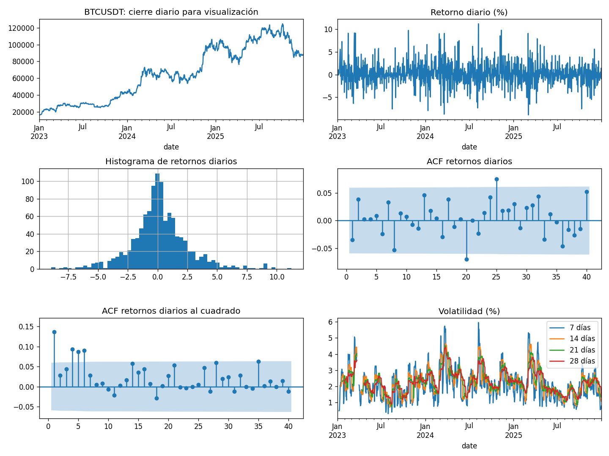
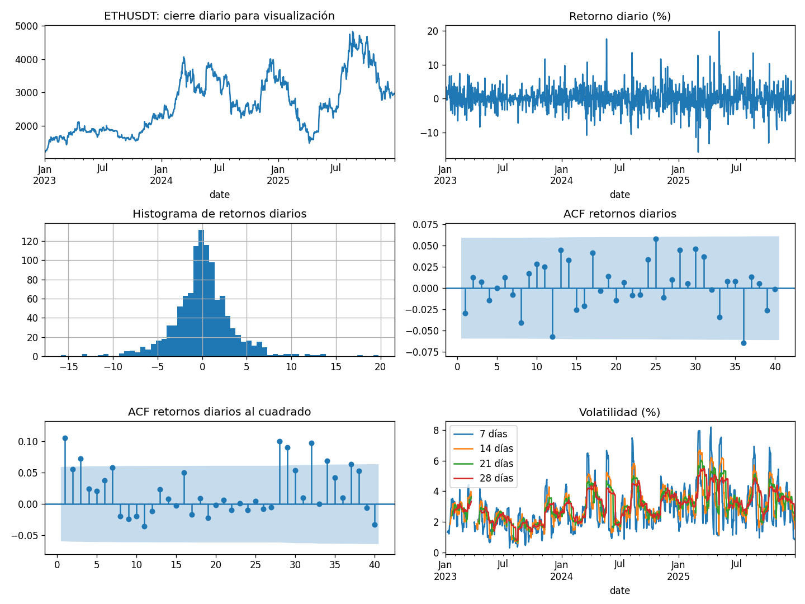
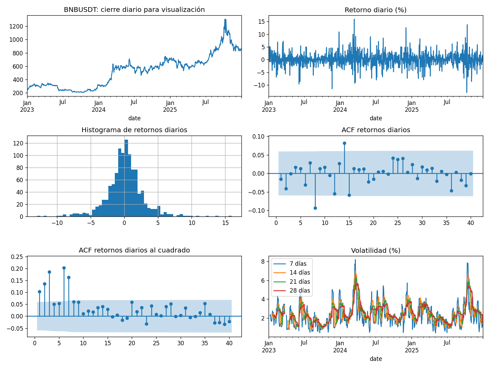
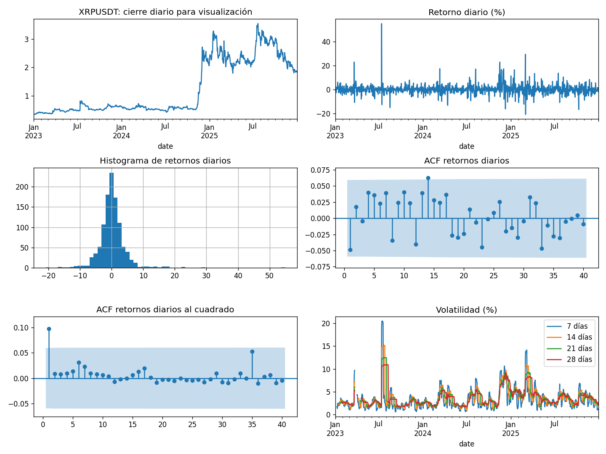

# 2. Análisis Exploratorio de Datos (EDA)

Este capítulo corresponde exclusivamente al dataset 2023–2025 utilizado por
el SVR lineal. No se mezclan estadísticas de versiones históricas.
El EDA disponible es descriptivo y retrospectivo: 2025 ya se examinó.
Los requisitos sin evidencia específica se indican como pendientes.

## Retornos, volatilidad y salidas

Sean $P_t$ el último cierre del día y $r_t=\ln(P_t/P_{t-1})$. El objetivo es

$$
\sigma_t^{(w)}=100\sqrt{\frac{1}{w}\sum_{j=0}^{w-1}(r_{t-j}-\bar r_t)^2},\qquad w\in\{7,14,21,28\}.
$$

Se usa `rolling(w).std(ddof=0)`, sin anualizar. Cada salida es $(\sigma_{t+1}^{(w)},\ldots,\sigma_{t+7}^{(w)})$. La volatilidad realizada de los retornos por minuto se emplea como característica; el objetivo sigue siendo la volatilidad de retornos diarios. Son definiciones diferentes.

## Exploración y calidad

descriptive_statistics.csv contiene estadísticas de cierres y retornos de un minuto y de retornos diarios.
Las figuras usan cierres diarios para legibilidad y la frecuencia diaria del objetivo para los diagnósticos.
Los huecos se mantienen; la ACF usa tratamiento conservador de faltantes. La ACF de cuadrados permite inspeccionar
dependencia en la magnitud de los retornos, sin demostrar por sí sola un modelo de heterocedasticidad.

- **BTCUSDT:** 1,578,159 cierres de minuto válidos y 81 faltantes. Los retornos logarítmicos diarios tienen desviación estándar de 2.42 %, mínimo -8.93 % y máximo 11.23 %. Los extremos justifican comparar errores cuadrados con MAE, menos sensible a valores extremos.
- **ETHUSDT:** 1,578,159 cierres de minuto válidos y 81 faltantes. Los retornos logarítmicos diarios tienen desviación estándar de 3.28 %, mínimo -15.85 % y máximo 19.79 %. Los extremos justifican comparar errores cuadrados con MAE, menos sensible a valores extremos.
- **BNBUSDT:** 1,578,159 cierres de minuto válidos y 81 faltantes. Los retornos logarítmicos diarios tienen desviación estándar de 2.71 %, mínimo -12.99 % y máximo 15.96 %. Los extremos justifican comparar errores cuadrados con MAE, menos sensible a valores extremos.
- **XRPUSDT:** 1,578,159 cierres de minuto válidos y 81 faltantes. Los retornos logarítmicos diarios tienen desviación estándar de 4.25 %, mínimo -20.81 % y máximo 54.87 %. Los extremos justifican comparar errores cuadrados con MAE, menos sensible a valores extremos.

La exploración de 2023–2025 es descriptiva y retrospectiva. Los extremos y la dependencia en retornos al cuadrado motivan estudiar volatilidad y comparar contra persistencia, pero no garantizan capacidad predictiva. Los escaladores y la selección del modelo utilizan únicamente los periodos de desarrollo correspondientes a cada corte.

(hallazgos-decisiones)=
### Relación entre hallazgos y decisiones

Los huecos motivan mantener el calendario y excluir muestras afectadas, sin interpolar precios. Los extremos de retorno motivan informar MAE junto con errores cuadrados, sin eliminar automáticamente movimientos de mercado reales. La dependencia temporal motiva validación creciente y separación de etiquetas; las correlaciones son descriptivas y no justifican causalidad. La comparación con persistencia mide si las características aportan información frente a la continuidad del nivel actual.

La descarga implementa controles de orden, duplicados, precios finitos positivos, alineación de timestamps y días completos. Un control implementado no sustituye un informe de ejecución sobre todos los archivos vigentes. Para cerrar la auditoría de calidad falta consolidar esos resultados por activo y archivo, con conteos antes y después de cada exclusión y análisis de sensibilidad a extremos. No se atribuyen al dataset de minuto los diagnósticos de versiones históricas de otra frecuencia.

(reserva-test)=

## 2.1 Variable objetivo

El objetivo es volatilidad no anualizada a siete horizontes diarios, con
ventanas de 7, 14, 21 y 28 días. Cada ventana define un objetivo distinto.
La dependencia de retornos al cuadrado motiva estudiar la variabilidad;
no demuestra que el SVR pueda predecirla. Se comparan RMSE y MAE para mostrar
la sensibilidad a extremos, y R² frente a persistencia en el mismo calendario.

## 2.2 Análisis unidimensional

Las figuras anteriores muestran cierres, distribuciones de retornos y
dependencia temporal por activo. Los conteos y extremos documentan escalas
heterogéneas. No se eliminan automáticamente movimientos reales del mercado.
Falta consolidar para las variables derivadas y el objetivo los percentiles,
asimetría, curtosis y boxplots sobre el periodo de desarrollo.

## 2.3 Análisis bidimensional

Las variables son numéricas salvo el identificador del activo. Las relaciones
predictor–objetivo deben usar objetivos futuros alineados con su origen y
compararse por activo, ventana y horizonte. No se atribuyen al dataset vigente
las correlaciones de estudios anteriores. Quedan pendientes una matriz
Pearson/Spearman, scatter plots, tamaños de efecto y evaluación de redundancia
de las características del SVR.

## 2.4 Análisis multivariado

La dimensión crece con la ventana de entrada; rezagos próximos pueden ser
redundantes. Falta documentar PCA exploratorio y diagnóstico de extremos
multivariados sobre desarrollo. No se presenta reducción de dimensión ni
eliminación de variables como procedimiento ya aplicado.

## 2.5 Auditoría de fuga de datos

Los cierres y resúmenes intradía se conocen al cierre UTC del origen. Los
objetivos futuros no entran como predictores. Las características de salida
de la ventana utilizan únicamente retornos pasados. Los escaladores se ajustan
con cada entrenamiento; las etiquetas terminan antes de la validación.
El capítulo del modelo documenta los cortes y sus verificaciones.

## Reserva del test y alcance de la evaluación

2025 ya se exploró en experimentos anteriores y el EDA publicado incluye 2023–2025. Por ello, no se acredita una reserva inicial intacta del test. La selección programada utiliza 2024 y el escalado se ajusta dentro de cada entrenamiento, pero estos controles no revierten el conocimiento previo de 2025. Los resultados de ese año se presentan como retrospectivos.

Para cerrar este requisito se debe fijar previamente el procedimiento completo —activos, variables, ventanas, hiperparámetros, métricas y exclusiones— y evaluarlo una sola vez en un periodo con objetivos completos que nunca haya intervenido en exploración o decisiones. No se declara aquí un periodo nuevo como independiente ni una evaluación realizada. El estudio compara el modelo base de persistencia con el SVR lineal.

## 2.6 Componente temporal

La adquisición es de un minuto UTC y la muestra supervisada tiene frecuencia
diaria. Hay 81 minutos faltantes por activo, en un día incompleto; se mantiene
el calendario y se excluyen ventanas afectadas. La ACF de retornos y cuadrados
describe dependencia; la superposición de objetivos exige validación temporal.
STL, ADF/KPSS, PACF, estacionalidad y deriva entre periodos quedan pendientes
de un informe específico del dataset vigente.

## 2.7–2.8 Componente espacial y espacio-temporal

No aplican: el dataset no contiene latitud, longitud ni unidades geográficas.
Los activos financieros constituyen un panel temporal, no regiones espaciales.

## 2.9 Preprocesamiento guiado por el EDA

| Hallazgo | Decisión aplicada |
| --- | --- |
| Minutos faltantes | Mantener huecos y excluir ventanas afectadas; no interpolar. |
| Escalas diferentes | Retornos relativos y normalización respecto a volatilidad conocida. |
| Extremos de retorno | Conservarlos y reportar MAE junto con RMSE. |
| Dependencia temporal | Validación creciente y separación de etiquetas. |
| Continuidad de volatilidad | Comparar explícitamente con persistencia. |

La construcción exacta de características y el escalado se presentan en el
capítulo del modelo. Los pendientes anteriores no se consideran cumplidos
por disponer de scripts o por haber analizado otra versión del dataset.
