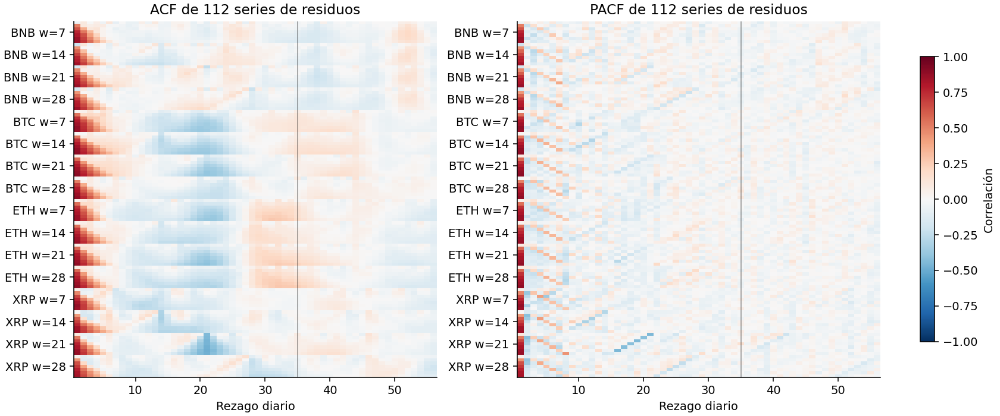
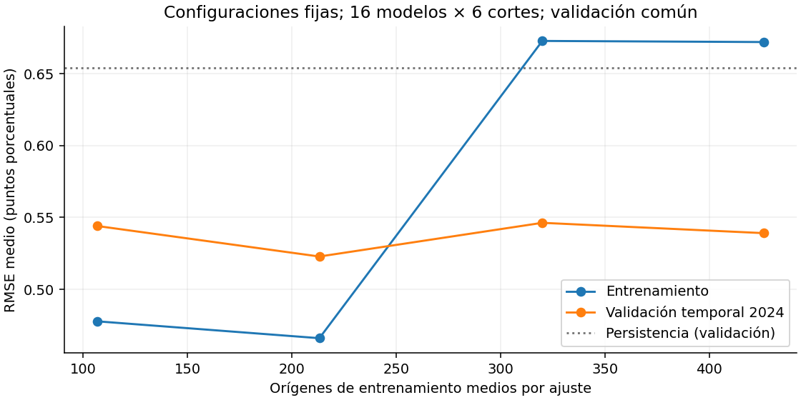
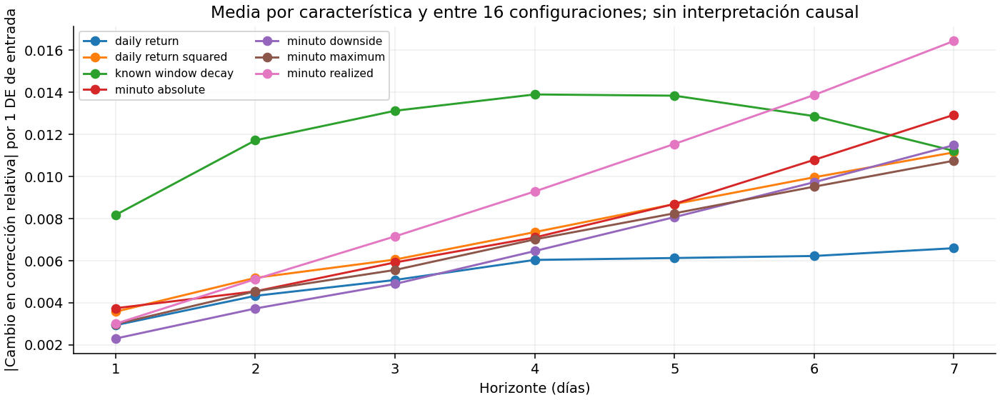

# 3. Modelo base y SVR lineal

Los apartados 3.1–3.8 siguen los requisitos de la guía para el modelo base.
El problema es de regresión temporal; el modelo entrenado es un SVR lineal
y su referencia mínima es persistencia. La auditoría complementaria usa
los 16 modelos y las predicciones guardadas del ajuste vigente. Sus hashes
confirman que los originales permanecen intactos.

## 3.1 Definición de la variable objetivo

Se pronostica la volatilidad no anualizada de los retornos logarítmicos
diarios de BTC, ETH, BNB y XRP, en puntos porcentuales. Para cada ventana
$w\in\{7,14,21,28\}$ días, la salida en el origen $t$ es
$(\sigma_{t+1}^{(w)},\ldots,\sigma_{t+7}^{(w)})$: siete horizontes diarios.
Cada ventana define un objetivo distinto.

La fórmula y el uso de `rolling(w).std(ddof=0)` se documentan en
[2.1.1 Retornos, volatilidad y salidas](12_eda.md).
Los datos de un minuto aportan características; el objetivo se calcula
con retornos diarios.

## 3.2 Línea base trivial: persistencia

Para cada origen, activo y ventana, la referencia repite la volatilidad
actual en los siete horizontes: $\hat y_{t,h}=\sigma_t^{(w)}$.
No requiere entrenamiento y utiliza únicamente información conocida.
El único modelo entrenado de esta entrega es el SVR lineal.

## 3.3 División temporal y validación con tsxv

Se usa `timeseries-cv==0.1.5`, desarrollado con la coautoría de Filipe Roberto Ramos. Se ejecutan las funciones nativas `split_train_val_forwardChaining`, `split_train_val_kFold` y `split_train_val_groupKFold` sobre índices diarios del calendario de 2023–2024. Los índices se vinculan a características de datos por minuto y objetivos diarios; no se interpretan siete minutos como siete días.

La auditoría conserva los cortes nativos:

| method | cortes | cortes_con_futuro |
| --- | --- | --- |
| forwardChaining | 668 | 0 |
| groupKFold | 5 | 5 |
| kFold | 668 | 640 |

K-Fold y Group K-Fold contienen entrenamiento posterior a algunas fechas de validación. Se documentan como diagnóstico y se excluyen de la selección del pronóstico. No se convierten mediante agrupación en una copia de Forward Chaining ni se presentan como tres evaluaciones temporales equivalentes.

El método principal conserva seis cortes de entrenamiento nativos de Forward Chaining, con inicio de validación en enero, marzo, mayo, julio, septiembre y noviembre de 2024. Cada validación se extiende a dos meses; este adaptador se declara explícitamente. El entrenamiento crece y sus etiquetas terminan antes del inicio de cada validación. Se mantienen las restricciones conservadoras de separación de la biblioteca. Los últimos siete días de 2024 no se usan como orígenes de validación porque sus objetivos entrarían en 2025.

| fold | split | n | first | last |
| --- | --- | --- | --- | --- |
| 1 | train | 274 | 2023-01-29 00:00:00+00:00 | 2023-12-04 00:00:00+00:00 |
| 1 | validation | 60 | 2024-01-01 00:00:00+00:00 | 2024-02-29 00:00:00+00:00 |
| 2 | train | 334 | 2023-01-29 00:00:00+00:00 | 2024-02-02 00:00:00+00:00 |
| 2 | validation | 61 | 2024-03-01 00:00:00+00:00 | 2024-04-30 00:00:00+00:00 |
| 3 | train | 395 | 2023-01-29 00:00:00+00:00 | 2024-04-03 00:00:00+00:00 |
| 3 | validation | 61 | 2024-05-01 00:00:00+00:00 | 2024-06-30 00:00:00+00:00 |
| 4 | train | 456 | 2023-01-29 00:00:00+00:00 | 2024-06-03 00:00:00+00:00 |
| 4 | validation | 62 | 2024-07-01 00:00:00+00:00 | 2024-08-31 00:00:00+00:00 |
| 5 | train | 518 | 2023-01-29 00:00:00+00:00 | 2024-08-04 00:00:00+00:00 |
| 5 | validation | 61 | 2024-09-01 00:00:00+00:00 | 2024-10-31 00:00:00+00:00 |
| 6 | train | 579 | 2023-01-29 00:00:00+00:00 | 2024-10-04 00:00:00+00:00 |
| 6 | validation | 54 | 2024-11-01 00:00:00+00:00 | 2024-12-24 00:00:00+00:00 |

Se seleccionan C, epsilon y entrada por el RMSE conjunto de las predicciones fuera de muestra de 2024, promediando los siete RMSE por horizonte. Se fijan las 16 configuraciones antes de evaluar 2025. El ajuste final usa todas las muestras elegibles cuyas etiquetas terminan antes de 2025 y permanece fijo durante la prueba. La prueba contiene **358 orígenes diarios** y **40.096 valores pronosticados**.

La partición determina qué muestras pueden intervenir en cada ajuste del
preprocesamiento. **2025 ya se había explorado** en experimentos anteriores;
por ello, esta prueba es retrospectiva y no acredita una reserva inicial
intacta del conjunto de prueba.

## 3.4 Entrenamiento mediante Pipeline

`src/optimize_minute_svr.py` construye cada ajuste con
`make_pipeline(StandardScaler(), estimator(C, epsilon))`.
El estimador incluye `TransformedTargetRegressor`, un escalador de objetivos
y `MultiOutputRegressor` con siete `LinearSVR`. Los escaladores se ajustan
solo con el entrenamiento de cada corte; la selección utiliza la validación
temporal del apartado 3.3.

### 3.4.1 Preprocesamiento y características

Se prueban ventanas de entrada de **7, 14, 21 y 28 días**. Para cada día de la ventana se incluyen seis características: retorno diario, su cuadrado, raíz de la suma de cuadrados de todos los retornos por minuto, suma absoluta de retornos por minuto dividida por la raíz de 1.440, semivolatilidad negativa y máximo retorno absoluto por minuto. Se normalizan por la volatilidad actual conocida, o su cuadrado según la unidad.

Se añaden siete características que describen el efecto de la salida de retornos antiguos de la ventana objetivo. Para horizonte $h$, se conservan los $w-h$ retornos diarios más recientes y se supone varianza futura igual a la actual para construir una referencia. Esta operación usa únicamente retornos ya observados; no utiliza el valor futuro del objetivo.

En unidades porcentuales, con $b_t=\max(\sigma_t^{(w)},10^{-8})$, suma $S$ y suma de cuadrados $Q$ de esos retornos retenidos, la característica es

$$
\frac{\sqrt{\max((Q+h b_t^2)/w-(S/w)^2,0)}}{b_t}-1.
$$

La dimensión es **6L+7**: 49, 91, 133 o 175 características según la ventana. Este cambio sustituye las 10.080–40.320 columnas de precios del experimento original por características derivadas de los datos de un minuto. La volatilidad actual y las características de salida de la ventana requieren además la historia de la definición objetivo, de hasta 28 retornos diarios. El calendario común exige suficiente historia para la ventana máxima y siete objetivos completos.

### 3.4.2 Modelo y justificación

Se mantienen siete regresores **LinearSVR**, uno por horizonte, mediante `MultiOutputRegressor`. Cada uno aprende la corrección relativa $z_{t,h}=\sigma_{t+h}/b_t-1$; la predicción final es $\max(b_t(1+\hat z_{t,h}),0)$. El recorte a cero forma parte del procedimiento evaluado. La persistencia repite la volatilidad actual en las siete salidas.

Esta representación reduce la dependencia del nivel nominal del precio y permite al SVR aprender cuándo corregir persistencia. Se ajustan los escaladores de entradas y objetivos exclusivamente dentro de cada entrenamiento. El modelo es lineal respecto a las características transformadas; el procesamiento completo incorpora transformaciones no lineales.

Se usa pérdida `squared_epsilon_insensitive`, `dual=False`, tolerancia 1e-6, máximo 50.000 iteraciones y semilla 42. La búsqueda evalúa C en {0,0001; 0,001; 0,01; 0,1; 1} y epsilon en {0,01; 0,1}, además de las cuatro entradas: **640 candidatos**, cada uno evaluado en seis cortes. Las advertencias de falta de convergencia interrumpen el ajuste.

### 3.4.3 Selección y contraste en validación

| symbol | volatility_window | input_window | C | epsilon | validation_rmse |
| --- | --- | --- | --- | --- | --- |
| BTCUSDT | 7 | 14 | 0.001 | 0.01 | 0.72018 |
| BTCUSDT | 14 | 14 | 0.001 | 0.01 | 0.38693 |
| BTCUSDT | 21 | 21 | 0.001 | 0.01 | 0.27354 |
| BTCUSDT | 28 | 7 | 0.1 | 0.01 | 0.20782 |
| ETHUSDT | 7 | 21 | 0.001 | 0.01 | 0.92546 |
| ETHUSDT | 14 | 28 | 0.001 | 0.01 | 0.57944 |
| ETHUSDT | 21 | 7 | 0.01 | 0.01 | 0.39737 |
| ETHUSDT | 28 | 7 | 0.01 | 0.01 | 0.31532 |
| BNBUSDT | 7 | 21 | 0.001 | 0.01 | 0.82457 |
| BNBUSDT | 14 | 7 | 0.01 | 0.01 | 0.48086 |
| BNBUSDT | 21 | 21 | 0.001 | 0.01 | 0.32762 |
| BNBUSDT | 28 | 7 | 0.001 | 0.01 | 0.24959 |
| XRPUSDT | 7 | 14 | 0.001 | 0.01 | 1.35439 |
| XRPUSDT | 14 | 7 | 0.001 | 0.01 | 0.84652 |
| XRPUSDT | 21 | 7 | 0.0001 | 0.01 | 0.63939 |
| XRPUSDT | 28 | 7 | 0.001 | 0.01 | 0.51241 |

| symbol | volatility_window | svr_rmse | persistence_rmse |
| --- | --- | --- | --- |
| BTCUSDT | 7 | 0.72018 | 0.92859 |
| BTCUSDT | 14 | 0.38693 | 0.47452 |
| BTCUSDT | 21 | 0.27354 | 0.35376 |
| BTCUSDT | 28 | 0.20782 | 0.28442 |
| ETHUSDT | 7 | 0.92546 | 1.2107 |
| ETHUSDT | 14 | 0.57944 | 0.74367 |
| ETHUSDT | 21 | 0.39737 | 0.50431 |
| ETHUSDT | 28 | 0.31532 | 0.41457 |
| BNBUSDT | 7 | 0.82457 | 1.00883 |
| BNBUSDT | 14 | 0.48086 | 0.64359 |
| BNBUSDT | 21 | 0.32762 | 0.44948 |
| BNBUSDT | 28 | 0.24959 | 0.32945 |
| XRPUSDT | 7 | 1.35439 | 1.5476 |
| XRPUSDT | 14 | 0.84652 | 0.98402 |
| XRPUSDT | 21 | 0.63939 | 0.7044 |
| XRPUSDT | 28 | 0.51241 | 0.56346 |

Las entradas elegidas cambian con el activo y la definición de volatilidad; una ventana más larga no mejora necesariamente el pronóstico. Los C seleccionados favorecen regularización fuerte, coherente con limitar el sobreajuste.

## 3.5 Evaluación y comparación con la línea base

Las tablas y su interpretación se presentan en
[4. Evaluación, interpretación y limitaciones](14_evaluacion.md).
Se reportan R², RMSE, MAE, MSE y MAPE sobre las mismas fechas y objetivos
para persistencia y SVR lineal. El SVR obtiene R² macro **0,70073** frente
a **0,53773** de persistencia y RMSE **0,59808** frente a **0,74770**.
La comparación es retrospectiva y las métricas macro promedian
configuraciones y horizontes.

Se calcularon **intervalos del 95 % mediante bootstrap temporal por bloques**:
2.000 réplicas, bloques circulares de 35 días y sensibilidad a 56 y 70 días.
Cada réplica toma los mismos orígenes para ambos modelos y para las 112
series activo–ventana–horizonte. Así se conserva el emparejamiento y la
dependencia entre activos y salidas, en vez de tratarlas como 40.096
observaciones independientes. Se recalculan las métricas por horizonte y
después se aplica la misma media macro de las tablas originales.

La longitud principal cubre los 28 días de la ventana objetivo más los
siete horizontes; no garantiza eliminar dependencias más largas. La
sección 4 publica los intervalos y su sensibilidad. Son intervalos de las
métricas de estos pronósticos fijos en 2025, condicionados al periodo
observado y a una aproximación de estabilidad temporal. **No son bandas
de predicción individual**, ni incluyen la incertidumbre de seleccionar
hiperparámetros o reajustar modelos. Las métricas de clasificación de la
guía no aplican al objetivo continuo de este estudio.

## 3.6 Diagnóstico de residuos según la estructura de los datos

Se diagnosticaron las **112 series** de residuos $e_{t,h}=y_{t,h}-\hat y_{t,h}$,
con 358 orígenes diarios por serie. Los cálculos corresponden al SVR vigente,
sin concatenar activos ni horizontes:

| Diagnóstico | Procedimiento y resultado al 5 % |
| --- | --- |
| Normalidad | Jarque–Bera y asimetría/curtosis descriptivas; prueba conjunta de asimetría y exceso de curtosis con covarianza HAC de Bartlett a 35 rezagos y ajuste Holm de 112 contrastes: 112 rechazos. |
| Heterocedasticidad | Regresión de $e^2$ sobre volatilidad predicha estandarizada, su cuadrado y volatilidad actual estandarizada. Wald conjunto de pendientes con HAC(35), Holm de 112 contrastes: 22 rechazos. |
| Autocorrelación | ACF y PACF de rezagos 1–56; Ljung–Box a 7, 14, 28, 35 y 56. A 35 rezagos, 101 de 112 series rechazan ruido blanco después de Holm sobre los 560 contrastes. |

El diagnóstico HAC de normalidad usa las funciones de influencia de los
momentos, incluyendo la estimación de media y varianza. Evalúa dos
condiciones necesarias de normalidad; aceptar esas condiciones no
demostraría una distribución normal. Jarque–Bera conserva su p nominal
solo como referencia: su aproximación asintótica y la dependencia temporal
limitan su uso aislado con 358 observaciones.

La regresión de residuos cuadrados evalúa el **segundo momento condicional**.
Su asociación con los niveles de volatilidad es compatible con varianza
no constante; también puede reflejar sesgo en la media condicional. HAC y
Holm mejoran el tratamiento de dependencia y comparaciones múltiples,
pero siguen siendo aproximaciones con un periodo corto y posibles cambios
de régimen. No rechazar no demuestra homocedasticidad.

Ljung–Box evalúa correlación serial, con `model_df=0` porque los modelos
permanecen fijos durante 2025 y no se estiman sobre estos residuos. La
superposición del objetivo induce parte de esa dependencia: un rechazo
no identifica su causa ni prueba por sí solo fuga de datos. La ACF a un
día promedia entre 0,584 y 0,668 según el activo. Se publica también
Ljung–Box de residuos centrados al cuadrado para describir agrupación
temporal de errores grandes.

Descargas: [diagnósticos y p ajustados](../../results/current_delivery_audit/model/residual_diagnostics.csv),
[ACF/PACF por serie y rezago](../../results/current_delivery_audit/model/residual_acf_pacf.csv)
y [Ljung–Box completo](../../results/current_delivery_audit/model/residual_ljung_box.csv).
Las definiciones de [Ljung–Box](https://www.statsmodels.org/stable/generated/statsmodels.stats.diagnostic.acorr_ljungbox.html)
y [Jarque–Bera](https://docs.scipy.org/doc/scipy/reference/generated/scipy.stats.jarque_bera.html)
se pueden consultar en la documentación de las bibliotecas.

El diagnóstico espacial mediante I de Moran **no aplica**: no hay coordenadas
ni unidades geográficas en el dataset, como se explica en el apartado 2.7.

## 3.7 Curva de aprendizaje

Se realizaron **384 ajustes de diagnóstico**: 16 configuraciones fijas,
seis cortes temporales de 2024 y cuatro tamaños de entrenamiento. Se usa
el 25, 50, 75 y 100 % de los orígenes más recientes disponibles en cada
entrenamiento; son conjuntos anidados que conservan el mismo último
origen. Cada tamaño se evalúa en las mismas fechas de validación de ese
corte. Las etiquetas de entrenamiento terminan antes de la validación,
y ninguna etiqueta usada en ajuste o validación entra en 2025.

Se mantienen C, epsilon y ventana de entrada elegidos para el modelo
vigente. Cada ajuste aprende sus propios escaladores exclusivamente en
su entrenamiento. Estos modelos auxiliares no sustituyen los artefactos
publicados ni hacen una nueva selección con 2025.

| Fracción de entrenamiento | Orígenes medios por ajuste | RMSE entrenamiento | RMSE validación |
| --- | ---: | ---: | ---: |
| 25 % | 106,8 | 0,47771 | 0,54402 |
| 50 % | 213,2 | 0,46598 | 0,52281 |
| 75 % | 320,0 | 0,67281 | 0,54626 |
| 100 % | 426,0 | 0,67204 | 0,53909 |

Las métricas promedian configuraciones y cortes, cada uno con el mismo
peso; la persistencia de validación tiene RMSE medio 0,65424 en esta
agregación. Este resumen no es el RMSE de la validación concatenada usado
para seleccionar en 3.4.3. La curva no mejora de forma monótona. Incorporar
historia más antigua cambia también el régimen observado: el aumento del
error de entrenamiento al 75 % no se interpreta como efecto causal del
tamaño. Un error de validación menor que el de entrenamiento al 100 %
puede reflejar esa diferencia entre periodos y no demuestra ausencia de
sobreajuste.

Se conserva además la vista de los seis entrenamientos completos crecientes
(274 a 579 orígenes) y el calendario de validación acumulada (60 a 359
orígenes). Los hiperparámetros se seleccionaron con esos mismos cortes
de 2024: la curva es un diagnóstico condicionado a la selección, no una
nueva validación independiente.

Descargas: [384 ajustes y fechas de corte](../../results/current_delivery_audit/model/learning_curve.csv),
[resumen por tamaño](../../results/current_delivery_audit/model/learning_curve_summary.csv)
y [calendario creciente](../../results/current_delivery_audit/model/learning_forward_calendar.csv).

## 3.8 Interpretación de coeficientes y métricas

La [sección 4](14_evaluacion.md) interpreta las métricas, sus unidades,
la agregación entre activos, ventanas y horizontes y las mejoras frente
a persistencia.

Los coeficientes de cada horizonte se extrajeron de los 16 modelos
guardados y se deshicieron **ambos escaladores**. Si $a_{j,h}$ y $c_h$
son los coeficientes e intercepto del regresor estandarizado, y
$(\mu_{X,j},s_{X,j})$, $(\mu_{z,h},s_{z,h})$ son las medias y escalas
aprendidas en entrenamiento, entonces

$$
\beta_{j,h}=\frac{s_{z,h}a_{j,h}}{s_{X,j}},\qquad
\beta_{0,h}=\mu_{z,h}+s_{z,h}c_h-\sum_j\mu_{X,j}\beta_{j,h}.
$$

Así, $\hat z_h=\beta_{0,h}+\sum_j\beta_{j,h}X_j$ está en unidades de
**corrección relativa a persistencia**. La predicción sigue siendo
$\hat\sigma_{t+h}=\max(b_t(1+\hat z_h),0)$. La reconstrucción reproduce
las 40.096 predicciones guardadas dentro de la tolerancia numérica de
$10^{-10}$, respetando el recorte a cero.

Para comparar magnitudes se publica $\beta_{j,h}s_{X,j}$: el cambio en
$\hat z_h$ ante una desviación estándar de esa entrada de entrenamiento,
manteniendo las demás entradas. Antes del recorte y con $b_t$ fijo, el
cambio en volatilidad sería $b_t\beta_{j,h}\Delta X_j$. Es una lectura
algebraica del modelo, no una intervención posible sobre los precios.
Las entradas están correlacionadas y comparten denominadores; sus
coeficientes no representan efectos marginales físicos ni causales.

La figura promedia la magnitud absoluta **por característica** dentro de
cada grupo y luego entre configuraciones, para no favorecer grupos con
más columnas. Las características de salida conocida de la ventana tienen
la mayor magnitud media en horizontes 1–5; la volatilidad realizada por
minuto la tiene en 6–7. Esto describe los pesos del ajuste regularizado,
sin atribuir importancia independiente ni significancia a cada entrada.

Por ejemplo, BTC con ventana de 28 días y horizonte 7 asigna 0,21379 a
`minute_realized_lag6`; una desviación estándar de esa entrada corresponde
a 0,09001 de corrección relativa. Con $b_t=2$ puntos porcentuales y las
demás entradas fijas, serían aproximadamente 0,18002 puntos porcentuales
antes del recorte. Los signos y magnitudes varían por activo y horizonte.

Descargas: [coeficientes por característica y horizonte](../../results/current_delivery_audit/model/coefficients_engineered_units.csv),
[interceptos reconstruidos](../../results/current_delivery_audit/model/intercepts_engineered_units.csv),
[resumen por grupos](../../results/current_delivery_audit/model/coefficient_groups.csv)
y [verificación de predicciones](../../results/current_delivery_audit/model/coefficient_prediction_verification.csv).
La inversión del escalado de objetivos sigue el comportamiento documentado
de [TransformedTargetRegressor](https://scikit-learn.org/stable/modules/generated/sklearn.compose.TransformedTargetRegressor.html).

## 3.9 Nota crítica ante un desempeño alto

En BNB con ventana de 28 días el SVR alcanza R² **0,94272**, mientras
persistencia ya obtiene **0,88655**. Este resultado debe revisarse junto
con los controles y limitaciones de la guía:

- Verificar fuga de datos y disponibilidad de los predictores, conforme
  a los apartados 2.5 y 3.3–3.4.
- Comparar siempre con persistencia sobre las mismas fechas y objetivos.
- Respetar la estructura temporal en la validación. Las ventanas móviles
  comparten retornos y pueden favorecer un R² alto en ambos métodos.
- Revisar la dificultad del objetivo: aumentar la ventana cambia y suaviza
  la variable pronosticada; un R² mayor no demuestra por sí solo una mejor
  capacidad predictiva para otro objetivo.
- Considerar los diagnósticos de 3.6–3.8 y la evaluación adicional de
  enero–agosto de 2026 documentada en la sección 4. Se aplicaron los
  mismos modelos a un periodo ausente de los artefactos previos auditados;
  no se ha establecido su uso externo anterior. El conocimiento previo
  de 2025 impide presentarlo como una prueba inicialmente intacta.

