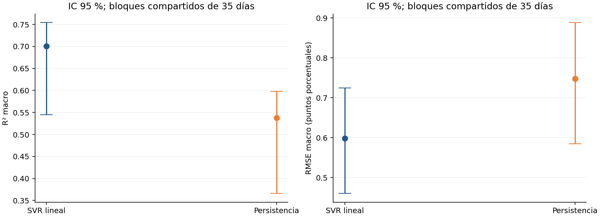
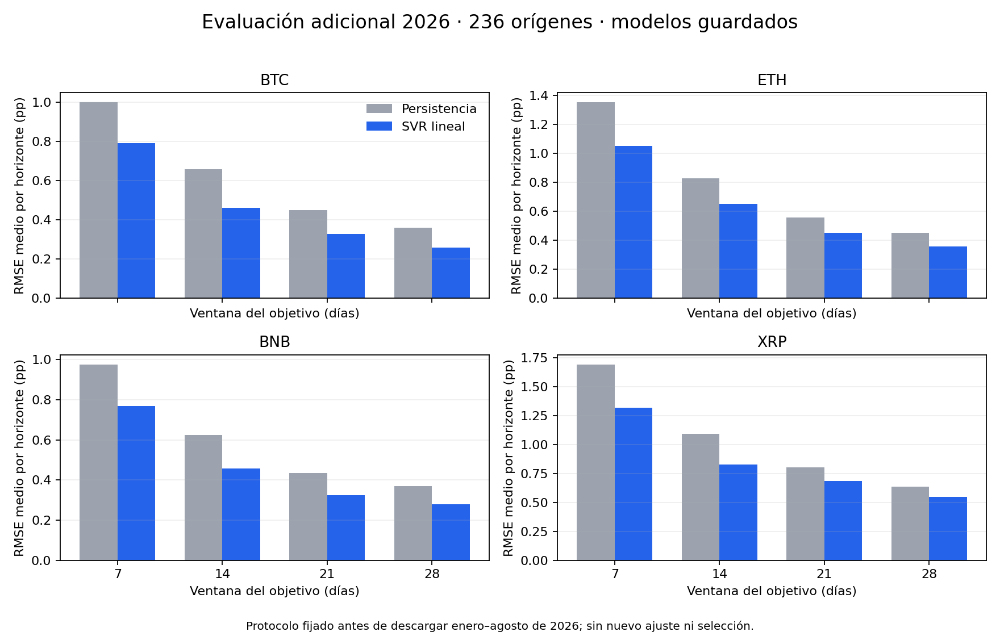

# 4. Evaluación, interpretación y limitaciones

## 4.1 Resultados de prueba de 2025

### 4.1.1 Tabla comparativa global: persistencia y SVR lineal

| Métrica | Persistencia | SVR lineal | Mejora del SVR |
| --- | --- | --- | --- |
| R² ↑ | 0.53773 | 0.70073 | +0.1630 puntos de R² |
| RMSE ↓ | 0.7477 | 0.59808 | 20.01 % menos error |
| MAE ↓ | 0.49719 | 0.41403 | 16.73 % menos error |
| MSE ↓ | 0.8282 | 0.53717 | 35.14 % menos error |
| MAPE (%) ↓ | 18.80771 | 15.63947 | 16.85 % menos error |

### 4.1.2 Comparación por criptomoneda

| Criptomoneda | Modelo | R² ↑ | RMSE ↓ | MAE ↓ | MSE ↓ | MAPE (%) ↓ |
| --- | --- | --- | --- | --- | --- | --- |
| BNBUSDT | Persistencia | 0.67199 | 0.56963 | 0.40284 | 0.43591 | 19.38251 |
| BNBUSDT | SVR lineal | 0.81556 | 0.41915 | 0.2983 | 0.24935 | 13.72312 |
| BTCUSDT | Persistencia | 0.59362 | 0.43642 | 0.3069 | 0.25727 | 16.96313 |
| BTCUSDT | SVR lineal | 0.70947 | 0.36444 | 0.27228 | 0.18567 | 15.69366 |
| ETHUSDT | Persistencia | 0.34257 | 0.89615 | 0.61315 | 1.0904 | 19.56662 |
| ETHUSDT | SVR lineal | 0.59317 | 0.70407 | 0.50192 | 0.66455 | 16.03942 |
| XRPUSDT | Persistencia | 0.54275 | 1.0886 | 0.66589 | 1.5292 | 19.31856 |
| XRPUSDT | SVR lineal | 0.68474 | 0.90466 | 0.58362 | 1.04911 | 17.10168 |

## 4.2 Análisis de R²

Para cada activo, ventana y horizonte, el coeficiente de determinación se
calcula sobre las mismas fechas de evaluación:

$$
R^2=1-\frac{\sum_t(y_t-\hat y_t)^2}{\sum_t(y_t-\bar y)^2}.
$$

Aquí $\bar y$ es la media del objetivo observado en esas fechas. Es una
referencia matemática para calcular la métrica, no el pronóstico operativo
de persistencia. Un R² de 1 indica coincidencia perfecta; 0 corresponde al
error cuadrático de esa media; un valor negativo indica un error mayor.
R² puede ser negativo y no equivale al cuadrado de una correlación ni a un
porcentaje de predicciones correctas.

### 4.2.1 Mejora global y por activo

El R² macro del SVR es **0,70073**, frente a **0,53773** de persistencia:
una mejora de **0,16300 puntos de R²**. Se promedian primero los siete
horizontes de cada configuración y después las 16 configuraciones; por ello,
no se interpreta como el porcentaje de variación explicado en una única
serie concatenada. La mejora muestra una reducción del error normalizado
por la variabilidad de cada objetivo en esta evaluación retrospectiva.

| Activo | R² de persistencia | R² del SVR lineal | Diferencia |
| --- | ---: | ---: | ---: |
| BTC | 0,59362 | 0,70947 | +0,11585 |
| ETH | 0,34257 | 0,59317 | +0,25060 |
| BNB | 0,67199 | 0,81556 | +0,14357 |
| XRP | 0,54275 | 0,68474 | +0,14199 |

BNB alcanza el mayor R² medio. ETH obtiene el menor R² final, pero la mayor
ganancia frente a persistencia. Son dos comparaciones diferentes: el nivel
final y la mejora sobre una referencia. Los valores de cada activo promedian
cuatro ventanas y siete horizontes.

### 4.2.2 Variación según la ventana del objetivo

| Ventana de volatilidad | R² de persistencia | R² del SVR lineal | Diferencia |
| --- | ---: | ---: | ---: |
| 7 días | 0,10009 | 0,40616 | +0,30607 |
| 14 días | 0,56114 | 0,72849 | +0,16734 |
| 21 días | 0,68845 | 0,81314 | +0,12469 |
| 28 días | 0,80125 | 0,85515 | +0,05390 |

Estos valores promedian cuatro activos y siete horizontes. El R² aumenta con
la ventana en ambos métodos, mientras la ventaja del SVR disminuye. Una
interpretación compatible con el objetivo móvil es que las ventanas largas
suavizan la volatilidad y comparten más retornos entre fechas próximas,
favoreciendo también a persistencia. Es una interpretación, no una prueba
causal. Cambiar la ventana cambia el objetivo: un R² mayor a 28 días no
demuestra que esa configuración sea mejor para pronosticar volatilidad a 7 días.

En ETH con ventana de 7 días, persistencia obtiene **−0,14698** y el SVR
**0,29526**: la referencia tiene más error cuadrático que la media del objetivo,
y el SVR mejora ese comportamiento. En BNB a 28 días, el SVR alcanza
**0,94272**, pero persistencia ya obtiene **0,88655**. El valor alto debe
interpretarse junto con la referencia y la superposición temporal.

### 4.2.3 Alcance y precauciones

El R² medio mejora en las 16 combinaciones de activo y ventana, lo que no
implica mejorar cada horizonte ni cada fecha. R² no mide calibración,
significancia estadística ni ausencia de fuga; debe acompañarse de RMSE,
MAE y diagnóstico de residuos. Los intervalos y el contraste pareado por
bloques se publican más adelante. La exploración previa de 2025 y la dependencia de
los objetivos impiden presentar estos resultados como evidencia independiente
de generalización futura.

Fuente de los cálculos: `results/optimized_minute_2023_2025/selected_metrics.csv`
y `macro_metrics.csv`; no se modificaron predicciones ni modelos.

### 4.2.4 Interpretación de las métricas

La comparación utiliza las mismas 358 fechas de prueba de 2025 y los mismos objetivos. Persistencia repite la última volatilidad observada durante los siete horizontes; el SVR lineal optimizado aprende una corrección relativa a esa referencia. ↑ indica que un valor mayor es mejor y ↓ que un valor menor es mejor.

El R² macro aumenta de 0,5377 a 0,7007: una diferencia de 0,1630 puntos. El SVR explica mejor la variación de los objetivos, en promedio entre horizontes, ventanas y activos. Este R² no representa un 70,07 % de pronósticos correctos ni es el R² calculado sobre todas las series concatenadas.

El RMSE disminuye aproximadamente un 20,01 %, el MAE un 16,73 % y el MSE un 35,14 %. La reducción conjunta indica menores errores absolutos y cuadrados en esta evaluación. El MSE penaliza más los errores grandes. El RMSE publicado promedia los RMSE de los horizontes y configuraciones, por lo que no coincide necesariamente con la raíz del MSE macro.

El MAPE baja de 18,81 % a 15,64 %, aproximadamente un 16,85 % de reducción relativa. Describe el error relativo a la volatilidad real y puede amplificar los errores cuando esta es pequeña. Debe interpretarse junto con MAE y RMSE, no como porcentaje de aciertos.

El SVR mejora las cinco métricas agregadas en las cuatro criptomonedas. BNB alcanza el mayor R² (0,8156); ETH conserva el menor (0,5932), aunque mejora frente a persistencia (0,3426). XRP mantiene el mayor RMSE absoluto (0,9047): las escalas de volatilidad difieren entre activos, por lo que este orden no equivale por sí solo a una comparación de dificultad.

El SVR supera a persistencia en RMSE en las 16 combinaciones seleccionadas de activo y ventana objetivo. Esto no implica ganar en todos los días ni en cada horizonte. La evaluación es retrospectiva y los objetivos móviles se superponen; la incertidumbre de estas mejoras se evalúa mediante el bootstrap pareado publicado más adelante, sin garantizar resultados futuros.

RMSE y MAE están en puntos porcentuales de volatilidad no anualizada; MSE está en puntos porcentuales al cuadrado; MAPE está en porcentaje. Se seleccionó con validación de 2024 y se reajustó con etiquetas anteriores a 2025. Las mejoras aquí comparan el SVR optimizado con persistencia; la comparación con el SVR original combina cambios de características, validación y periodo de ajuste.

El SVR supera a persistencia en RMSE en **16 de 16 configuraciones seleccionadas**. El R² macro es **0,7007**, frente a **0,5377**; el RMSE macro baja de **0,7477 a 0,5981**, una reducción aproximada del **20 %**. BNB presenta el mayor R² y ETH el menor entre los cuatro activos. Una mejora media no implica ganar en todos los días ni en cada horizonte individual.

R² se promedia entre siete horizontes; por activo se promedian las cuatro definiciones de volatilidad y el global es la media de las 16 configuraciones. No es el R² de series concatenadas. RMSE es la media de los RMSE por horizonte, no la raíz de un MSE agrupado. RMSE y MAE se expresan en puntos porcentuales de volatilidad, MSE en su cuadrado y MAPE en porcentaje.

### 4.2.5 Detalle por ventana objetivo

| symbol | volatility_window | input_window | model | r2 | rmse | mae |
| --- | --- | --- | --- | --- | --- | --- |
| BTCUSDT | 7 | 14 | SVR_optimized | 0.37268 | 0.66401 | 0.50199 |
| BTCUSDT | 7 | 14 | Persistence | 0.14987 | 0.78241 | 0.57793 |
| BTCUSDT | 14 | 14 | SVR_optimized | 0.73231 | 0.35873 | 0.27066 |
| BTCUSDT | 14 | 14 | Persistence | 0.63124 | 0.42637 | 0.28527 |
| BTCUSDT | 21 | 21 | SVR_optimized | 0.84566 | 0.24527 | 0.18027 |
| BTCUSDT | 21 | 21 | Persistence | 0.74221 | 0.31804 | 0.21627 |
| BTCUSDT | 28 | 7 | SVR_optimized | 0.88722 | 0.18974 | 0.13621 |
| BTCUSDT | 28 | 7 | Persistence | 0.85117 | 0.21887 | 0.14811 |
| ETHUSDT | 7 | 21 | SVR_optimized | 0.29526 | 1.25382 | 0.91216 |
| ETHUSDT | 7 | 21 | Persistence | -0.14698 | 1.59385 | 1.15404 |
| ETHUSDT | 14 | 28 | SVR_optimized | 0.63371 | 0.69118 | 0.47602 |
| ETHUSDT | 14 | 28 | Persistence | 0.35857 | 0.90986 | 0.60183 |
| ETHUSDT | 21 | 7 | SVR_optimized | 0.70169 | 0.49607 | 0.35853 |
| ETHUSDT | 21 | 7 | Persistence | 0.48374 | 0.65686 | 0.42966 |
| ETHUSDT | 28 | 7 | SVR_optimized | 0.74203 | 0.3752 | 0.26097 |
| ETHUSDT | 28 | 7 | Persistence | 0.67495 | 0.42405 | 0.26708 |
| BNBUSDT | 7 | 21 | SVR_optimized | 0.56385 | 0.77062 | 0.55515 |
| BNBUSDT | 7 | 21 | Persistence | 0.28788 | 0.9975 | 0.7428 |
| BNBUSDT | 14 | 7 | SVR_optimized | 0.84032 | 0.41339 | 0.29538 |
| BNBUSDT | 14 | 7 | Persistence | 0.695 | 0.5741 | 0.39619 |
| BNBUSDT | 21 | 21 | SVR_optimized | 0.91533 | 0.27915 | 0.19695 |
| BNBUSDT | 21 | 21 | Persistence | 0.81851 | 0.40809 | 0.28327 |
| BNBUSDT | 28 | 7 | SVR_optimized | 0.94272 | 0.21345 | 0.14574 |
| BNBUSDT | 28 | 7 | Persistence | 0.88655 | 0.29884 | 0.18908 |
| XRPUSDT | 7 | 14 | SVR_optimized | 0.39285 | 1.50685 | 0.98796 |
| XRPUSDT | 7 | 14 | Persistence | 0.10959 | 1.82771 | 1.20897 |
| XRPUSDT | 14 | 7 | SVR_optimized | 0.70761 | 0.90086 | 0.57768 |
| XRPUSDT | 14 | 7 | Persistence | 0.55976 | 1.10505 | 0.65579 |
| XRPUSDT | 21 | 7 | SVR_optimized | 0.78987 | 0.68381 | 0.43105 |
| XRPUSDT | 21 | 7 | Persistence | 0.70934 | 0.80157 | 0.44701 |
| XRPUSDT | 28 | 7 | SVR_optimized | 0.84863 | 0.52712 | 0.33779 |
| XRPUSDT | 28 | 7 | Persistence | 0.79232 | 0.62005 | 0.35179 |

## 4.3 Incertidumbre temporal de las métricas de 2025

La auditoría complementaria conserva los modelos, métricas y predicciones
originales. Recalcula cada métrica sobre 2.000 remuestras de los 358
orígenes de prueba, con **bloques diarios circulares compartidos** por
ambos modelos y las 112 series de activo–ventana–horizonte. Primero
calcula cada horizonte y después aplica la agregación macro original.
No remuestrea de forma independiente activos, horizontes o modelos.

| Métrica macro | Persistencia, IC 95 % | SVR lineal, IC 95 % | Diferencia SVR − persistencia, IC 95 % |
| --- | --- | --- | --- |
| R² | 0,53773 [0,36575; 0,59811] | 0,70073 [0,54471; 0,75447] | +0,16300 [0,10050; 0,26200] |
| RMSE | 0,74770 [0,58443; 0,88831] | 0,59808 [0,45983; 0,72439] | −0,14962 [−0,21377; −0,08293] |
| MAE | 0,49719 [0,41283; 0,58816] | 0,41403 [0,33939; 0,49600] | −0,08316 [−0,12447; −0,04088] |
| MSE | 0,82820 [0,51115; 1,21441] | 0,53717 [0,30906; 0,82325] | −0,29102 [−0,46479; −0,14956] |
| MAPE (%) | 18,80771 [16,82057; 21,31244] | 15,63947 [13,79569; 17,71104] | −3,16824 [−4,67711; −1,42687] |

Son intervalos percentiles con bloques de **35 días**. La diferencia de
MAPE está en puntos porcentuales de MAPE; RMSE y MAE conservan las unidades
del objetivo. Los intervalos de diferencias usan las mismas remuestras
pareadas: no se obtienen restando los extremos de intervalos individuales.

### 4.3.1 Sensibilidad y contraste de pérdida pareado

El contraste evalúa la diferencia diaria de pérdidas cuadradas,
$(y-\hat y_{SVR})^2-(y-\hat y_{persistencia})^2$, promediada sobre las
112 series. La hipótesis nula es diferencia media cero. Se centra la
distribución bootstrap respecto a la diferencia observada para construir
un contraste bilateral. Un valor negativo favorece al SVR.

| Longitud del bloque | Diferencia MSE macro | IC 95 % | p bilateral bootstrap |
| --- | ---: | --- | ---: |
| 35 días | −0,29102 | [−0,46479; −0,14956] | 0,00350 |
| 56 días | −0,29102 | [−0,48283; −0,14584] | 0,00250 |
| 70 días | −0,29102 | [−0,48605; −0,14829] | 0,00150 |

La ventaja macro conserva el signo con las tres longitudes examinadas.
El bloque principal cubre hasta 28 días de ventana objetivo más siete
horizontes; no garantiza que toda dependencia se extinga allí. La
inferencia supone una aproximación de estabilidad de la serie de
objetivos y errores y se condiciona a estos modelos fijos. Los 358
orígenes representan pocos bloques largos, y 2.000 réplicas tienen
resolución Monte Carlo limitada. No se incluye la incertidumbre de
selección o reajuste del modelo ni se construyen intervalos individuales
de volatilidad futura.

También se contrastó cada una de las 16 configuraciones, ajustando p
mediante **Holm** dentro de cada longitud. Con 35 días solo BNB a ventanas
7 y 21 rechaza igualdad de pérdida al 5 % después del ajuste. Por tanto,
**mejorar los 16 RMSE puntuales no significa demostrar una mejora
estadísticamente distinguible en las 16 configuraciones**. Esta evidencia
retrospectiva no convierte 2025 en una reserva inicialmente intacta.

Descargas: [intervalos macro y por configuración, las tres longitudes](../../results/current_delivery_audit/model/metric_confidence_intervals.csv),
[contrastes pareados y p ajustados](../../results/current_delivery_audit/model/paired_loss_bootstrap.csv),
[procedimiento, supuestos y hashes](../../results/current_delivery_audit/model/provenance.json)
y [paquete completo reproducible](../../results/current_delivery_audit/model/model_audit_evidence.zip).

## 4.4 Evaluación adicional de enero–agosto de 2026

Se evaluaron los **mismos 16 modelos guardados**, sin reajuste ni nueva
selección, en 236 orígenes del 1 de enero al 24 de agosto de 2026:
**26.432 valores pronosticados**. Los objetivos de los siete horizontes
terminan antes del 1 de septiembre. El protocolo fijó previamente las
fechas, configuraciones, exclusiones, métricas y comparación con
persistencia; su SHA-256 es
`e927c726413773e1145b68a8613736eb51b0a3ca4f6289bb2e757e2627af793e`.
La revisión de las cuatro series por minuto no encontró minutos ausentes
en los meses descargados de este periodo.

| Métrica macro | Persistencia | SVR lineal |
| --- | ---: | ---: |
| R² | 0,54600 | 0,72386 |
| RMSE | 0,76778 | 0,59764 |
| MAE | 0,43452 | 0,36252 |
| MSE | 0,79514 | 0,48881 |
| MAPE (%) | 18,17378 | 15,57733 |

El RMSE macro es aproximadamente **22,16 % menor** que persistencia.
La diferencia pareada de RMSE es −0,17014, con intervalo bootstrap del
95 % [−0,28731; −0,06186] usando el mismo procedimiento de bloques
compartidos de 35 días y 2.000 réplicas. Con 56 y 70 días los intervalos
son [−0,28028; −0,06176] y [−0,27791; −0,06443]. Se conservan las
predicciones exportadas: este cálculo adicional únicamente las remuestrea,
sin volver a ejecutar ni modificar los modelos.

Es un periodo **ausente de los artefactos previos auditados del proyecto**.
No se ha establecido si fue explorado fuera de esos artefactos; por ello
no se certifica una reserva externa completamente intacta. El resultado
añade evidencia temporal sin corregir retroactivamente la exploración
previa de 2025. La superposición de objetivos, los posibles cambios de
régimen y el menor número de bloques en 236 orígenes siguen limitando
la precisión y la generalización. Los intervalos corresponden a las
métricas de estos modelos fijos en este periodo observado.

Descargas: [protocolo congelado](../../results/current_delivery_audit/holdout/protocol.json),
[resumen y comprobaciones](../../results/current_delivery_audit/holdout/summary.json),
[métricas por configuración](../../results/current_delivery_audit/holdout/metrics.csv),
[predicciones](../../results/current_delivery_audit/holdout/predictions.csv.gz),
[intervalos y sensibilidad](../../results/current_delivery_audit/holdout/metric_confidence_intervals.csv)
y [procedencia del bootstrap](../../results/current_delivery_audit/holdout/bootstrap_provenance.json).

## 4.5 Conclusiones y límites

La ingeniería de características, la corrección de persistencia, la regularización y la validación creciente permiten una mejora observada frente al baseline. El modelo anterior obtuvo R² macro −16,0817 y RMSE 4,0266 en las mismas fechas y objetivos; se conserva como referencia histórica.

La comparación cambia varias decisiones simultáneamente, incluido el ajuste final con 2023–2024 frente al ajuste anterior solo con 2023. No permite atribuir toda la mejora a una decisión aislada. **2025 ya se había examinado**: es una evaluación retrospectiva, aunque la nueva selección no usa sus métricas. Los horizontes y objetivos móviles se superponen; no son observaciones estadísticamente independientes. El bootstrap pareado respalda una ventaja macro condicionada al periodo, con diferencias no concluyentes para varias configuraciones tras ajustar comparaciones múltiples. No se garantiza rendimiento futuro.

Se verificaron hashes de los datos, elección de hiperparámetros, predicciones de modelos guardados, métricas recalculadas y coincidencia de fechas y objetivos con el experimento original. La auditoría complementaria verifica además el emparejamiento de los bloques, el cálculo macro, la inversión de ambos escaladores y las etiquetas de los cortes de aprendizaje. El informe anterior de BDS corresponde al modelo original; no se atribuye al modelo optimizado.

## 4.6 Diagnósticos completados y alcance

Los apartados [3.5–3.8](13_modelo_base_svr.md) aportan intervalos temporales,
normalidad y segundo momento condicional con corrección por dependencia,
ACF/PACF y Ljung–Box, curva de aprendizaje con configuraciones fijas e
interpretación de coeficientes en unidades reconstruidas. Los residuos
conservan asimetría, colas pesadas y dependencia temporal; 22 de 112 series
presentan asociación del segundo momento con el nivel de volatilidad
tras el ajuste descrito. El SVR no exige residuos normales para producir
pronósticos puntuales, pero estos resultados limitan supuestos simples
para inferir incertidumbre. La curva de aprendizaje no demuestra ausencia
de sobreajuste y los pesos de variables correlacionadas no son causales.

Un R² alto requiere revisar fuga, superposición temporal y comparación con
persistencia; no acredita por sí solo generalización. La evaluación
adicional de 2026 aplica el procedimiento congelado a un periodo nuevo
para los artefactos auditados. Su alcance se limita al periodo observado
y a la información de uso previo disponible.
